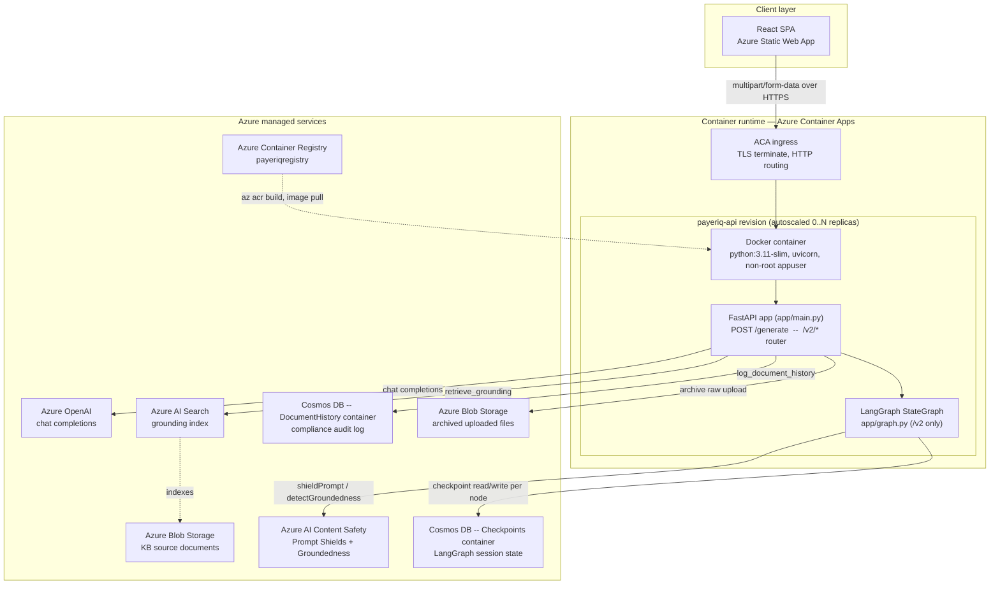
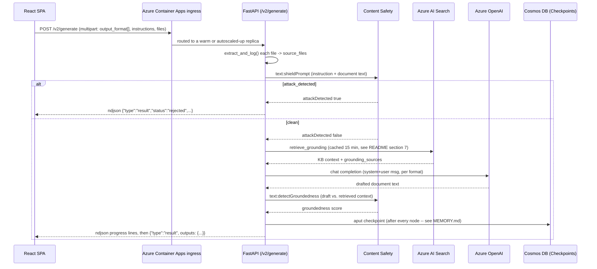
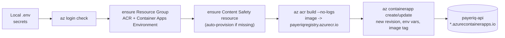

# System Architecture — PayerIQ (React → FastAPI → Azure) 

End-to-end view of the whole stack this backend belongs to: the ReactJS
frontend, this FastAPI service, its container/runtime layer, and every Azure
service it talks to — with actual request/response JSON at each hop. Deep
dives on two specific slices already exist and are linked rather than
repeated: [MEMORY.md](MEMORY.md) (session persistence) and
[CONTENT_SAFETY.md](CONTENT_SAFETY.md) (guardrails). This doc is the map that
shows where those two slices sit relative to everything else.

> **Scope note**: this repository (`payeriq_backend`) is the FastAPI service
> only. The React frontend lives in a separate repo and is documented here
> only as a client of this API's contract (verified from `app/main.py`'s CORS
> `origins` list and `routergenerator.py`'s docstrings, which name it as an
> Azure Static Web App). Everything under [1](#1-layers) through
> [6](#6-deployment--infrastructure) below is verified against this repo's
> actual code (`app/`, `Dockerfile`, `deploy.ps1`) — nothing here is
> aspirational.

## 1. Layers



| Layer | Technology | What runs here |
|---|---|---|
| Client | ReactJS, hosted on Azure Static Web Apps | Upload UI (project name, instructions, output-format checkboxes, files), consumes streamed NDJSON, renders/downloads the finalized `.xlsx`/`.docx` |
| Container image | Docker (`python:3.11-slim`) | Single image; `requirements.txt` installed before source copy for layer caching; runs as non-root `appuser`; `CMD uvicorn app.main:app --host 0.0.0.0 --port 8000` |
| Container runtime | **Azure Container Apps** (not a self-managed Kubernetes cluster — see [note](#a-note-on-kubernetes)) | Hosts the `payeriq-api` revision, handles TLS/ingress/autoscaling; provisioned by [`deploy.ps1`](deploy.ps1) |
| API / orchestration | FastAPI (`app/main.py`), LangGraph (`app/graph.py`) | Two coexisting pipelines — `POST /generate` (v1, direct) and `/v2/*` (LangGraph, stateful, streamed) — see [section 3](#3-two-api-pipelines-on-one-app) |
| AI services | Azure OpenAI, Azure AI Search, Azure AI Content Safety | Generation, retrieval grounding, and safety guardrails |
| Persistence | Cosmos DB (two containers), Azure Blob Storage (two containers) | Session memory, compliance audit log, KB source docs, archived uploads |
| Registry | Azure Container Registry | Holds built images; `deploy.ps1` builds and pushes via `az acr build` |

### A note on Kubernetes

Azure Container Apps *is* built on Kubernetes and KEDA under the hood, but
it's a **managed, serverless** layer on top of that — this repo has no
Deployment/Service/Ingress YAML, no Helm chart, and no direct `kubectl`
interaction anywhere in `deploy.ps1` or the codebase. If a separate AKS
cluster exists elsewhere in the org's broader estate, it isn't part of what
this repository provisions or documents; everything below reflects the
actual `az containerapp` path in [`deploy.ps1`](deploy.ps1).

## 2. Request lifecycle, start to finish



## 3. Two API pipelines on one app

| | `POST /generate` (v1) | `/v2/*` (LangGraph) |
|---|---|---| 
| Response shape | One JSON body | Streamed NDJSON (`application/x-ndjson`) |
| State | None — stateless, one-shot | Persisted per `session_id::format` thread in Cosmos (see [MEMORY.md](MEMORY.md)) |
| Guardrails | None | Prompt Shields (input) + Groundedness Detection (output) — see [CONTENT_SAFETY.md](CONTENT_SAFETY.md) |
| Self-correction | None | Deterministic repair (`draft_repair.py`) + optional retry loop |
| Multi-format handling | Sequential, one completion call per format | Concurrent — each format on its own LangGraph thread |
| Used by | Legacy frontend contract, kept for compatibility | The frontend's active integration |

Both share the same `retrieve_grounding()` helper and the same prompt
templates, so retrieval and prompt-construction rules never diverge between
the two.

## 4. Request/response JSON — every hop

### 4.1 `POST /generate` (v1)

**Request** (`multipart/form-data`):

```
project_name: "Acme Health Plan"
prompt: "Generate the STTM for the new enrollment feed"
formats: STTM
formats: FRD
files: vendor_spec.pdf
model: (optional, defaults to AZURE_OPENAI_DEPLOYMENT_NAME)
```

**Response** (`200 OK`, single JSON body):

```json
{
  "project": "Acme Health Plan",
  "outputs": {
    "STTM": "## Source-to-Target Mapping\n| Source Field | Target Field | ... |",
    "FRD": "## Functional Requirements Document\n1. GROUNDING ..."
  },
  "grounding_sources": [
    "sample_adjudication_rules.docx: chunk text ...",
    "data_dictionary.xlsx: chunk text ..."
  ]
}
```

### 4.2 `POST /v2/generate` (new session)

**Request** (`multipart/form-data`):

```
output_format: STTM
output_format: FRD
instructions: "Generate the STTM and FRD for the enrollment feed"
project_name: "Acme Health Plan"
files: vendor_spec.pdf
```

**Response** — streamed NDJSON, one line at a time:

```json
{"type":"progress","format":"STTM","node":"input_guardrail","message":"Checking your instructions for safety issues..."}
{"type":"progress","format":"STTM","node":"retrieve","message":"Retrieving relevant knowledge-base content..."}
{"type":"progress","format":"STTM","node":"generate","message":"Drafting the STTM document..."}
{"type":"progress","format":"STTM","node":"groundedness_check","message":"Checking that every mapping is traceable to your source material..."}
{"type":"progress","format":"STTM","node":"finalize","message":"Finalizing the STTM document..."}
{"type":"progress","format":"FRD","node":"input_guardrail","message":"Checking your instructions for safety issues..."}
```

```json
{"type":"progress","format":"FRD","node":"finalize","message":"Finalizing the FRD document..."}
{"type":"result","session_id":"3f1c9a2e-...","status":"completed","outputs":{"STTM":"## Source-to-Target Mapping...","FRD":"## Functional Requirements Document..."},"groundedness_score":0.91,"groundedness_scores":{"STTM":0.93,"FRD":0.91},"retry_count":0,"retry_counts":{"STTM":0,"FRD":0},"output_path":"generated_outputs/3f1c9a2e-....xlsx","source_filenames":["vendor_spec.pdf"]}
```

**Rejected by Prompt Shields** — the stream ends early, no `generate`/`groundedness_check` lines ever appear for that format:

```json
{"type":"progress","format":"STTM","node":"input_guardrail","message":"Checking your instructions for safety issues..."}
{"type":"progress","format":"STTM","node":"reject","message":"Request blocked by the safety guardrail."}
{"type":"result","session_id":"3f1c9a2e-...","status":"rejected","outputs":{"STTM":""},"groundedness_score":0.0,"groundedness_scores":{"STTM":0.0},"retry_count":0,"retry_counts":{"STTM":0},"output_path":"","source_filenames":["vendor_spec.pdf"]}
```

**Failure mid-stream**:

```json
{"type":"error","message":"400 Bad Request\nResponse body: {\"error\":{\"code\":\"InvalidRequestBody\",\"message\":\"The text length exceeds limit, the max length is 7500 unicode characters.\"}}"}
```

### 4.3 `POST /v2/refine/{session_id}`

**Request**: same shape as `/v2/generate` but without `project_name` (it's
already known from the session), path carries `session_id`. Same streamed
NDJSON contract and final `result` line shape as 4.2.

**Cold-starting a new format mid-session** — `output_format: Agile` added for
the first time — produces the same line shapes as a fresh `/v2/generate` run
for that format, just nested inside an existing session:

```json
{"type":"progress","format":"Agile","node":"input_guardrail","message":"Checking your instructions for safety issues..."}
```

**Unknown session** (no requested format has ever run under this
`session_id`) — this is a plain HTTP error, not a stream line, because the
check happens before streaming starts:

```json
{"detail":"Unknown session"}
```

### 4.4 `GET /v2/status/{session_id}?output_format=STTM`

```json
{"status":"completed","session_id":"3f1c9a2e-..."}
```

### 4.5 `GET /health`

```json
{
  "status": "healthy",
  "deployments": {
    "default": {"name": "gpt-4.1-mini", "reachable": true},
    "fallback": {"name": "gpt-4.1-mini-fallback", "reachable": true}
  }
}
```

## 5. Content Safety in the flow

Full reference: [CONTENT_SAFETY.md](CONTENT_SAFETY.md). Summary of the two
calls as they sit in the request lifecycle above:

**Prompt Shields** — runs first, before any retrieval or generation:

```json
// request -> POST {CONTENT_SAFETY_ENDPOINT}/contentsafety/text:shieldPrompt?api-version=2024-09-01
{
  "userPrompt": "Generate the STTM for the new enrollment feed",
  "documents": ["<extracted text of vendor_spec.pdf>"]
}
```
```json
// response
{
  "userPromptAnalysis": {"attackDetected": false},
  "documentsAnalysis": [{"attackDetected": false}]
}
```

**Groundedness Detection** — runs after generation, scores the draft against
what was actually retrieved:

```json
// request -> POST {CONTENT_SAFETY_ENDPOINT}/contentsafety/text:detectGroundedness?api-version=2024-09-15-preview
{
  "domain": "Generic",
  "task": "Summarization",
  "text": "## Source-to-Target Mapping\n| Source Field | Target Field | ... |",
  "groundingSources": ["<retrieved KB context>"],
  "reasoning": false
}
```
```json
// response
{"ungroundedPercentage": 0.07, "ungroundedDetails": []}
```
`groundedness_score = 1.0 - ungroundedPercentage = 0.93`, compared against
`GROUNDEDNESS_THRESHOLD = 0.85`. With `MAX_RETRIES = 0` the score is recorded
either way and does **not** block finalization by default — see
[CONTENT_SAFETY.md section 3](CONTENT_SAFETY.md#3-groundedness-detection-check_groundedness).

## 6. Deployment & infrastructure



- **Image**: `python:3.11-slim` base, dependencies installed before source
  copy for cache-friendly rebuilds, runs as non-root `appuser`, `EXPOSE 8000`.
  `.dockerignore` excludes `.env`, `.git`, `.venv`, `__pycache__`, and
  `generated_outputs` — without it, live API keys from `.env` would be baked
  into an image layer.
- **Resource footprint**: one Resource Group (`rg-foundry`), one Container
  Registry (`payeriqregistry`), one Container Apps Environment
  (`rg-foundry-env`), one Content Safety resource
  (`payeriq-contentsafety`), and the `payeriq-api` Container App. Cosmos DB,
  Azure AI Search, and Azure OpenAI are **not** provisioned by `deploy.ps1` —
  they're expected to already exist.
- **Revisions**: `az containerapp update` creates a new revision on every
  deploy (`activeRevisionsMode: Single`, 100% traffic to latest) — no
  blue/green or canary step today.
- **Scaling**: Azure Container Apps' built-in autoscaler (KEDA-based) scales
  replica count for the `payeriq-api` app; there's no custom autoscaling
  logic in this repo — whatever scale rule is set on the Container App
  resource itself governs it.
- Full narrative walkthrough (including the `az acr build --no-logs`
  Windows-console workaround and why Cosmos env-var pushing was split from
  the blob-storage check): [README.md section 12](README.md#12-deployment--infrastructure).

## 7. Configuration surface

Full table with every variable: [README.md section 14](README.md#14-configuration).
Grouped by what breaks without each:

| Missing | Effect |
|---|---|
| `AZURE_OPENAI_*` | Whole app fails to boot — `validate_startup_config()` runs at import time |
| `AZURE_SEARCH_*` | Retrieval falls back to an unfiltered blended query; if Search itself is unreachable, grounding degrades but generation still runs |
| `AZURE_COSMOS_ENDPOINT` / `KEY` | `/v2/*` returns `503` (no checkpointer); `/generate` (v1) unaffected |
| `CONTENT_SAFETY_ENDPOINT` / `KEY` | `/v2/*` raises immediately — refuses to run ungated rather than skipping guardrails |
| `AZURE_DOCS_STORAGE_CONNECTION_STRING` | Compliance document-history logging silently disabled (`HISTORY_ENABLED=False`); generation unaffected |

## 8. Cross-references

- [MEMORY.md](MEMORY.md) — how `/v2` session state is persisted and resumed across turns, checkpoint-by-checkpoint.
- [CONTENT_SAFETY.md](CONTENT_SAFETY.md) — Prompt Shields and Groundedness Detection in full detail, including length limits and error surfacing.
- [README.md](README.md) — the original, most exhaustive reference; this doc is the cross-cutting map, README is the per-topic depth.
