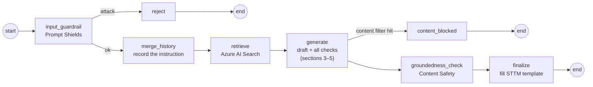
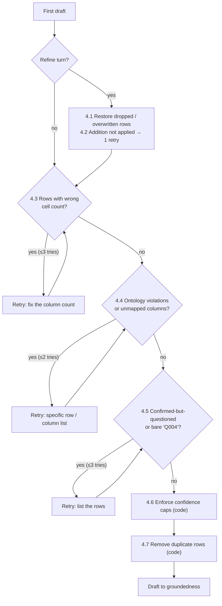

# BA Assist: How a Draft Is Produced and Checked

**Purpose:** Explain, step by step and at code level, how BA Assist turns an uploaded vendor file into an STTM: what goes into the prompt, what the model is asked to do, and every check the code runs on the result before it reaches the user.
**Audience:** Engineering, architects and technical reviewers. For the business-level picture, see [ontology.md](ontology.md) ("The complete cycle, step by step").
**Scope:** The `/v2` LangGraph pipeline ([app/graph.py](app/graph.py)) for STTM. FRD and Agile Artifacts use the same pipeline; the ontology and STTM-table checks apply only where noted.
**Status:** As built on 2026-10-04.

---

## 1. The pipeline at a glance

The plan is **fixed in code** (a LangGraph state graph); there is no planning agent. Only one node, `generate`, calls the language model to write content. Everything after it is deterministic code.



| Node | Function | Uses AI? | Output written to session state |
|---|---|---|---|
| `input_guardrail` | `input_guardrail_node` | Azure Prompt Shields (classifier) | `attack_detected` |
| `reject` | `reject_node` | — | `status = rejected`, reason in `feedback` |
| `merge_history` | `merge_history_node` | — | `instruction_history` (appended), retry counters reset |
| `retrieve` | `retrieve_node` | Azure AI Search (hybrid) | `retrieved_context`, `grounding_sources` |
| `generate` | `generate_node` | **Azure OpenAI gpt-4.1-mini** (drafting), then code | `current_draft` |
| `content_blocked` | `content_blocked_node` | — | `status = rejected` |
| `groundedness_check` | `groundedness_node` | Azure Content Safety groundedness | `groundedness_score`, `draft_history` |
| `finalize` | `finalize_node` | — | `output_path` (the filled .xlsx), `status = completed` |

Each session (one per user request, one LangGraph thread per output format) is checkpointed to **Cosmos DB** after every node, so a later **refine** call resumes with the full instruction history, every source file, and the previous draft.

---

## 2. Inputs: what the drafting step receives

| Input | Where it comes from | Content |
|---|---|---|
| **Instruction history** | The user's instruction for this turn plus earlier turns in the session | e.g. "Create STTM for the attached vendor file layout" |
| **Source files** | Every file uploaded in the session, extracted by `file_extraction.extract_text` | Excel: **every sheet**, one line per row, cells joined by `, ` (data sheet, the vendor's Data Dictionary sheet, README …). Word / PDF / text: plain text. |
| **Retrieved context** | `azure_search_service.retrieve_grounding` | For every indexed document visible to the project (container root + the project's own folder): the **2 best chunks**, found by hybrid keyword + vector search on `"<project>: <instruction>"`. Typically the STTM template, the instruction document's rules, the data dictionary, the mapping standards. |
| **Project ontology** | `ontology_service.get_ontology(project_id)` | The project's whole `ontology.json` (Blob `<project>/ontology.json`, repo copy as fallback), rendered as a ~38,700-character text block |
| **Prior draft** | Session state (`draft_history[-1]`) | Present on a refine turn, and on every correction attempt |
| **Correction feedback** | Generated by the checks (sections 4–5) | Present only on a correction attempt |

---

## 3. Drafting: how the prompt is built

Built by `openai_service.generate_document` with the helpers in [app/services/prompt_templates.py](app/services/prompt_templates.py). Two messages, **temperature 0.2**, deployment `gpt-4.1-mini` (one automatic retry on the fallback deployment if the primary is throttled or missing).

### 3.1 System message (`build_system_message`)

In this order:

| # | Block | What it tells the model |
|---|---|---|
| 1 | **Role** | Expert healthcare-payer business analyst drafting FRD / STTM / Agile artifacts, grounded only in the material below |
| 2 | **Guardrails 1–7** | 1 Grounding: base every claim on the sources; label anything else an Assumption, Candidate / Needs SME Review mapping, or Open Question. 2 Treat knowledge-base excerpts as binding rules. 3 Never invent tables, fields, joins, calculations. 4 Scope test with a fixed refusal text. 5 Single source → no comparative analysis; "shall/must" wording. 6 Follow the output format exactly. 7 Every `|` row has exactly as many cells as its header; write `N/A`, never drop a cell. |
| 3 | **`=== CANONICAL ONTOLOGY ===`** (STTM and FRD only) | The project ontology block (3.2) |
| 4 | **`=== KNOWLEDGE BASE CONTEXT ===`** | The retrieved chunks, each labelled `[Source: <file> | relevance <score>]` |

Without the knowledge-base context, the system message for Payment Integrity is about 41,600 characters, almost all of it the ontology.

### 3.2 The ontology block (`ontology_service.prompt_context`)

| Part | Example line |
|---|---|
| Header | `BA Assist Ontology - Payment Integrity (project payment-integrity, version 0.1.0-draft)` |
| **How to use** (binding) | Target Table must be an ENTITY spelled exactly; Target Field an attribute of it; type / required / privacy / definition come from the attribute. Use ALIASES for vendor names. Every source column must appear; one file usually feeds several entities. `[proposed]` items: Candidate or Needs SME Review only. No matching attribute → Open Question, never an invented name. Use VALUE SETS and RULES (cite rule id) in Validation Rule. Follow every PROJECT GUARDRAIL. |
| **Project guardrails** | `- PI-G2 [proposed]: Never invent source tables, source fields, physical joins, exact calculations or database structures.` |
| **Entities and attributes** | `Claim Header -- Claims` then `  - Total_Paid_Amount DECIMAL(12,2) NOT NULL -- Total paid amount` |
| **Relationships** | `- PI Opportunity -> Claim Header via Claim_Header_Key (many-to-one) [proposed]` |
| **Roles** | `- Billing Provider = Provider via Claim Header.Billing_Provider_Key` |
| **Aliases** | `- Total Refund Amount, Overpayment Amount, Refund Amt -> PI Opportunity.Identified_Overpayment_Amount [proposed]` |
| **Value sets** | `- Audit Type [proposed]: Clinical Coding Review, Contract Compliance, …` |
| **Rules** | `- PI-R1 [error] [proposed]: Corrected paid amount equals paid amount minus identified overpayment. … (tolerance 0.01)` |

### 3.3 User message (`build_user_message`)

```
Project: …
Instructions from analyst:
  Earlier instructions this session: …          (refine turns only)
  Current instruction: <this turn's instruction>
  You previously produced this draft: <draft>   (refine / correction only)
  Revise it per this feedback: <feedback>       (correction attempts)
     – or –
  Revise that draft according to the current instruction … change only what
  the instruction asks for … add a new row exactly once.     (refine turns)
Uploaded source material:
  --- <file name> ---
  <every sheet of the file>
Output requirement: <FORMAT_INSTRUCTIONS['sttm']>
```

**The STTM output requirement** (`FORMAT_INSTRUCTIONS['sttm']`) says: reproduce the STTM template's sections in order as `## N. <Title>` headings, with the template's own columns; the summary as `Attribute | Detail` rows; one `|`-delimited row per record, no markdown tables; `N/A` for empty cells; Validation Rule never `N/A`; an Open Question written in full (never "Q004"); a target with no source → "Set as Default Value" + Needs SME Review; Candidate for inferred mappings; a field with an Assumption / Open Question can't be Confirmed.

### 3.4 How the model picks a target

The model has, side by side, the **vendor's description** of each column (from the file's Data Dictionary sheet) and the **definition** of every target attribute (from the ontology). It pairs them by meaning; aliases are a shortcut for well-known names, not a requirement.

| Live test (2026-10-04) | Result |
|---|---|
| "Total Paid Amount" renamed **"rajneesh"**, description kept ("Original amount paid for the claim") | Mapped to `Claim Header.Total_Paid_Amount`, Candidate, note "represents original paid amount per data dictionary" |
| Same rename, Data Dictionary sheet removed | Not guessed; raised as an Open Question ("numeric but no matching target attribute found") |

---

## 4. Checks after the draft, in the exact order they run

All inside `generate_node`, after the first draft comes back. Each check that fails sends a **correction attempt**: the same prompt, plus the failing draft as "previous draft", plus specific feedback. A correction attempt that fails (exception, content filter) never loses the draft; the code keeps the last good one.



### 4.1 Restore dropped or overwritten rows (refine turns only)
`draft_repair.restore_dropped_rows(prior, new, instruction)`

- **Problem:** a refine is a full rewrite; the model can silently drop rows or overwrite an existing row with a new one.
- **How it works:** matches rows across the prior and new draft by each table's key column (e.g. Mapping ID). A row missing from the new draft is put back. If the instruction reads as an addition ("add", "one more", "new field" …), the row count didn't grow, and a changed row now describes a **different subject** (different Target Field Name), the old row is restored and the new content appended as a new row with the next ID.
- **Same-subject edits are kept:** "Add a validation rule to the Units row" changes the Units row in place (fixed 2026-10-03; it previously reverted the edit and added a duplicate).
- Skipped when the instruction says remove / delete / rename / replace.

### 4.2 Addition not applied (refine turns only)
`draft_repair.addition_not_applied` → **one** extra attempt
- Instruction asks to add something, but no table grew. The model is told: "Add it now as a new row; do not just repeat the existing rows." The retry is used only if it actually added a row.

### 4.3 Malformed rows
`draft_repair.has_malformed_rows` → up to **3** attempts (`MAX_MALFORMED_ROW_RETRIES`)
- **Detects:** any `|` row whose cell count differs from its header's. One missing `|` shifts every later cell left (e.g. Mapping Confidence lands in Privacy Classification).
- **Feedback:** "Rewrite so every data row has exactly as many cells as its header, using N/A for empty cells; only fix the malformed rows."
- **If still malformed:** shipped as is, event `malformed_rows_unresolved`.

### 4.4 Ontology and coverage
`ontology_service.find_violations` + `find_unmapped_source_columns` → up to **2** attempts (`MAX_ONTOLOGY_RETRIES`)

Runs after 4.3 because it reads cells by column name. A correction that reintroduces malformed rows is discarded.

| Check | Detects | Kind |
|---|---|---|
| **Entity** | Target Table not in the project's ontology. With a close match (≥ 0.75 similarity), always flagged with "did you mean 'Claim Header'?"; with no match, flagged only if marked Confirmed | `unknown_entity` |
| **Attribute** | Target Field not an attribute of that entity; same rule as above | `unknown_attribute` |
| **Unapproved target** | Entity or attribute is `proposed` but marked Confirmed | `proposed_confirmed` |
| **Data type** | Target Data Type differs from the attribute's (synonyms allowed: INT = INTEGER, NUMERIC = DECIMAL, TIMESTAMP = DATETIME …) | `datatype_mismatch` |
| **Confidence value** | Mapping Confidence isn't exactly Confirmed / Candidate / Needs SME Review | `invalid_confidence` |
| **Coverage** | A vendor column appears neither in a Source Field cell nor in the Assumptions / Open Questions section. **First draft only**: on a refine the analyst may have dropped a column on purpose. | unmapped column |

**Details that make it robust:**
- Names are compared normalised ("Claim_Header" = "claim header"); a schema prefix (`gold.`) or note in brackets is ignored.
- If the mapping has **no Target Table column**, the entity is taken from the summary's "Target Entity" row (seen live when the template wasn't retrieved).
- Vendor columns are read from the uploaded file's text: the first of the first 15 lines with ≥ 5 short, non-numeric cells (title rows above the header are skipped).
- Projects without an ontology skip the ontology checks; coverage still runs.

**Example: the actual feedback sent in the first live Payment Integrity run**
```
These STTM Mapping rows disagree with the CANONICAL ONTOLOGY in the system message:
- PI Opportunity.Vendor_Key: Mapping Confidence is 'Confirm vendor key for Cotiviti', but must be
  exactly one of Confirmed, Candidate or Needs SME Review. Put any question in the Open Question column.
- PI Opportunity.Opportunity_Status: Mapping Confidence is 'Confirm default Opportunity_Status value
  for new vendor opportunities', but must be exactly one of … .
Fix exactly these rows.

These columns of the uploaded source file appear nowhere in the STTM: Total Paid Amount, Total
Allowed Amount, Subscriber ID, Dependent Number, Servicing Provider Name. Add a mapping row for each
one, using the ontology's ALIASES to find its target entity and attribute (a file often feeds several
entities, e.g. Claim Header, Member and Provider as well as the main one). If a column has no target,
raise it as an Open Question instead of dropping it.

Keep every other row and every other column's value exactly as it was.
```
After the fix, the same file produced 25 rows across PI Opportunity, Claim Header, Member and Provider, covering 14 of 14 columns.

- **If still failing:** event `ontology_violations_unresolved` with project, ontology version, each violation, and the unmapped columns.

### 4.5 Confidence contradictions and placeholder questions
`draft_repair.find_confirmed_confidence_contradictions` + `find_placeholder_open_questions` → up to **3** attempts
- **Contradiction:** a row marked Confirmed that has its own Open Question, or whose field name appears in the Assumptions / Open Questions statements. Feedback asks to change exactly those rows to Candidate / Needs SME Review.
- **Placeholder:** an Open Question cell that is a bare ID (`Q004`, `A1`) instead of the question in full. Feedback asks to write it out.
- **If still failing:** event `confidence_contradiction_unresolved`.

### 4.6 Enforce confidence caps (code, no AI)
`ontology_service.enforce_confidence` (when the project has an ontology)

Guarantees the outcome whatever the model did:

| Situation | Mapping Confidence becomes | Open Question (if empty) |
|---|---|---|
| Value isn't one of the three | Needs SME Review (any text in the cell moves to Open Question) | the moved text |
| Target is `proposed` | at most **Candidate** | "Confirm <target>: it is a proposed ontology item awaiting SME approval." |
| Target isn't in the ontology | at most **Needs SME Review** | "Confirm target <target>: it is not in the canonical ontology." |

Names and data types are **not** changed in code: guessing a replacement name could silently map a field to the wrong place.

### 4.7 Remove duplicate rows (code)
`draft_repair.dedupe_repeated_rows`: drops rows that are identical except for their ID (a model quirk when asked to add one field).

### Worst case and typical cost

| | Model calls |
|---|---|
| First draft | 1 |
| Refine: addition retry | +1 |
| Malformed rows | +3 |
| Ontology / coverage | +2 |
| Contradictions | +3 |
| **Worst case** | **10** |
| Typical (live runs) | 1–3 |

Each call re-sends the full prompt (ontology block ≈ 9,500 tokens).

---

## 5. Groundedness (`groundedness_node`)

- **Service:** Azure AI Content Safety, groundedness detection.
- **Sources passed:** for STTM / FRD, first an **ontology excerpt** with only the entities the draft targets (the full block would crowd out everything else), then the retrieved knowledge-base context. The sources are capped at 50,000 characters combined.
- **Text checked:** the first **7,000 characters** of the draft (service limit), i.e. the summary and the first mapping rows.
- **Threshold:** 0.85. `MAX_RETRIES = 0`, so a low score is **recorded, not retried**: testing showed retries didn't reliably raise it, and each costs 20–25 s.
- **Reading the score:** indicative only. The same file scored between 0.14 and 0.58 across runs. The ontology and coverage checks (section 4) are the real quality gate.

---

## 6. Finalize: filling the template (`finalize_node`)

1. `template_service.get_template()` fetches `STTM_Data_Ingestion_Template.xlsx` from the Blob container root (10 s timeout), or the repo copy in `templates/`.
2. `xlsx_builder.fill_template()` maps each `## N. Title` section to the template sheet with the same title (numbers, case and spacing ignored):
   - **Summary sheet:** each `Attribute | Detail` row goes next to the template's own label in column A; attributes the template doesn't list are added below in the same style; a date in "Version / Date" is replaced with today's date (the model has no clock).
   - **Table sheets** (Mapping, Assumptions, SME Checklist): each value goes into the template column **with the same header name**, so a reordered or extra generated column can't shift data; a generated column the template lacks is appended. Row banding continues from the template's pre-formatted rows.
   - A section with no matching sheet gets its own plain sheet, so nothing is lost.
3. Saved to `generated_outputs/<session>_STTM.xlsx`; downloaded via `GET /v2/download/{session}?output_format=STTM` (owner or admin only).

Formats without a template (FRD, Agile today) get a plain workbook with one sheet per section.

---

## 7. Guardrails before and around drafting

| Layer | Where | What |
|---|---|---|
| Project access | `/v2/generate`, `/v2/refine`, `/v2/download`, `/v2/ontology` | User must be assigned to the client / project (admins exempt); sessions are owner-only |
| Prompt Shields | `input_guardrail_node` | Jailbreak / prompt-injection detection on the instruction and uploaded files (first 9,500 characters combined) |
| Model content filter | `generate_node` | Azure OpenAI's own filter; a hit ends the run as `rejected` with a reason |
| Scope test | System message guardrail 4 | Out-of-scope requests get a fixed refusal |
| Grounding rules | System message guardrails 1–3, project guardrails | Never invent; label assumptions and open questions |
| Code checks | Section 4 | Structure, ontology, coverage, confidence |

---

## 8. Telemetry (Azure Monitor custom events)

| Event | When |
|---|---|
| `node_completed` | After every node, with its duration |
| `guardrail_rejected` | Prompt Shields or content filter blocked a request |
| `malformed_rows_unresolved` | 4.3 still failing after 3 attempts |
| `ontology_violations_unresolved` | 4.4 still failing after 2 attempts (lists violations and unmapped columns) |
| `confidence_contradiction_unresolved` | 4.5 still failing after 3 attempts |
| `groundedness_scored` | Every groundedness check |

The rate of the `…_unresolved` events per project is the production measure of draft quality.

---

## 9. Known limits

| Limit | Effect | Mitigation |
|---|---|---|
| Groundedness reads only the first 7,000 characters | Score swings between runs | Treat as indicative; rely on section 4 |
| Prompt Shields checks the first 9,500 characters of instruction + files | A very large file is only partly screened | Acceptable for vendor layouts; revisit for large documents |
| Coverage needs a recognisable header row in the first 15 lines | Unusual layouts (header far down, pivoted sheets) aren't checked | Still mapped by the model; only the coverage check is skipped |
| Mapping by meaning needs a description per column | A renamed column without one becomes an open question | Ask vendors for a Data Dictionary sheet |
| Generated files live on the instance's disk | Lost on restart or on another replica; the UI falls back to building the workbook in the browser | Store outputs in Blob if they must persist |
| The Payer Data Dictionary is also retrieved through search | Redundant with the ontology | Recommended: exclude it from search |

---

## 10. Code map

| File | Role |
|---|---|
| [app/graph.py](app/graph.py) | LangGraph pipeline; `generate_node` holds the check loops in the order above |
| [app/services/openai_service.py](app/services/openai_service.py) | Prompt assembly (`generate_document`), model call with failover |
| [app/services/prompt_templates.py](app/services/prompt_templates.py) | System-message guardrails, ontology section, format instructions |
| [app/services/ontology_service.py](app/services/ontology_service.py) | Per-project ontology loading, prompt block, target / confidence / coverage checks, enforcement, grounding excerpt |
| [app/services/draft_repair.py](app/services/draft_repair.py) | Row restore, malformed rows, contradictions, placeholders, duplicates |
| [app/services/azure_search_service.py](app/services/azure_search_service.py) | Project-scoped hybrid retrieval |
| [app/services/content_safety_service.py](app/services/content_safety_service.py) | Prompt Shields, groundedness |
| [app/services/template_service.py](app/services/template_service.py), [app/xlsx_builder.py](app/xlsx_builder.py) | Template fetch and fill |
| [tests/test_ontology_service.py](tests/test_ontology_service.py), [tests/test_draft_repair.py](tests/test_draft_repair.py), [tests/test_xlsx_template.py](tests/test_xlsx_template.py) | 47 unit tests covering the checks and the template fill |
