# LangGraph internals — why it's here, and exactly how the StateGraph runs

This doc answers two questions in depth: **why does `/v2` need LangGraph at
all** (instead of more Python like `/generate` v1 already has), and **what
actually happens, function by function, node by node**, between a request
landing on `/v2/generate` and a result streaming back. [ARCHITECTURE.md](ARCHITECTURE.md)
shows where this sits in the whole system; [MEMORY.md](MEMORY.md) covers what
gets persisted; this doc is the missing middle piece — the orchestration
engine itself.

## 1. Why LangGraph — what it buys over plain Python

`POST /generate` (v1, `app/main.py`) already does retrieve → generate for
each format, in a plain `for fmt in formats:` loop with no framework at all.
`/v2` needs several things that loop structurally cannot give it without
turning into its own bespoke state machine:

| Requirement | Why plain imperative code struggles | What LangGraph's `StateGraph` gives |
|---|---|---|
| **Branch on a safety check** (reject vs. continue) | Needs an `if/else` that skips retrieval/generation entirely — fine once, but multiplied across every future guardrail/step it becomes nested `if` pyramids | A **conditional edge** (`route_after_guardrail`) — the branch logic is one small function, the graph shape shows the branch visually |
| **A bounded retry loop** (regenerate on low groundedness) | A `while` loop with a manually tracked counter, re-entrant across HTTP calls if the loop needs to survive a request boundary | A **cycle in the graph** (`prepare_retry → generate`) gated by a router function reading `retry_count` from state — the loop *is* graph structure, not ad hoc control flow |
| **Resume a run days later, from an arbitrary point, across HTTP calls** | Would require hand-rolling "serialize everything relevant, key it, reload it, figure out which step to resume from" | A **checkpointer** (`BaseCheckpointSaver`) — LangGraph already defines the save/resume contract; this project just had to implement the Cosmos DB backend (`AsyncCosmosDBSaver`, see [MEMORY.md](MEMORY.md)) |
| **Per-step progress visibility** (streamed to the frontend) | Would need manual instrumentation at every call site to emit a progress event | `graph.astream(..., stream_mode="updates")` yields one event **per completed node**, for free, from the graph structure itself |
| **State that's just "the current values"**, not a diff/log the caller must reconstruct | Passing a growing bag of variables through a chain of function calls, or threading a mutable object through | A **typed state schema** (`PayerIQState`) that every node reads from and writes partial updates to; LangGraph merges those updates for you |

The underlying trade: v1's loop is simpler to read for exactly what it does
today (one deterministic pass), but every one of the five rows above was a
concrete requirement for `/v2` (see [README.md section 1](README.md#1-architecture-pattern)),
and each one bolted onto a plain loop would have made that loop into an
informal, undocumented version of what `StateGraph` already is. LangGraph
was chosen to make that structure explicit and inspectable instead of
implicit and accumulated.

## 2. LangGraph vocabulary, as used in this codebase

| Term | What it means here |
|---|---|
| **State schema** | `PayerIQState`, a `TypedDict` (`app/graph.py`) — the complete shape of "everything this graph run knows." Every node function receives the *current* state and returns a **partial dict** of just the keys it changed. |
| **Channel** | Internally, each key in the state schema is a channel. `PayerIQState` uses no `Annotated[..., <reducer>]` types, so every channel defaults to **`LastValue`**: a node's returned value for a key *replaces* the old value outright — it is not merged, appended, or summed automatically. This is why nodes that need to "add to a list" (e.g. `instruction_history`) explicitly read the old list, append, and return the whole new list — see [section 5](#5-nodes-one-by-one). |
| **Node** | A plain async (or sync) Python function, `(state) -> dict`. Registered with `g.add_node("name", fn)`. |
| **Edge** | An unconditional `A → B` transition, `g.add_edge("A", "B")`. |
| **Conditional edge** | A router function `(state) -> str` whose return value is looked up in a `{return_value: node_name}` dict to decide the next node, `g.add_conditional_edges("A", router_fn, {...})`. |
| **`START` / `END`** | Sentinel nodes marking graph entry and termination. |
| **Compile** | `g.compile(checkpointer=...)` turns the node/edge graph definition into a runnable object with a persistence backend wired in. |
| **Thread** | One independent, resumable run of the compiled graph, identified by `config={"configurable": {"thread_id": ...}}`. This project uses one thread per `(session_id, output_format)` pair — see [MEMORY.md section 2](MEMORY.md#2-the-core-idea-langgraphs-basecheckpointsaver). |
| **Superstep** | LangGraph's execution engine (Pregel-style, borrowed from the bulk-synchronous-parallel graph processing model) runs in rounds: each round executes every node whose inputs are ready, collects their returned partial updates, merges them into the channels, checkpoints the result, then determines which nodes are ready for the *next* round based on which edges fire. This graph is a simple linear/branching chain, so in practice each superstep here runs exactly one node — but it's the same engine that would run several in parallel if the graph fanned out. |

## 3. `PayerIQState` — the schema, field by field

```python
class PayerIQState(TypedDict):
    session_id: str
    output_format: Literal["STTM", "FRD", "Agile"]
    source_files: list[SourceFile]
    project_name: str
    instruction_history: list[dict]
    draft_history: list[DraftAttempt]
    current_instruction: str
    retrieved_context: str
    grounding_sources: list[str]
    current_draft: str
    attack_detected: bool
    groundedness_score: float
    grounded: bool
    retry_count: int
    feedback: str
    status: Literal["in_progress", "completed", "rejected"]
    output_path: str
```

| Field | Set by | Overwrite or manual-accumulate? |
|---|---|---|
| `session_id`, `output_format` | `_initial_state()` in `routergenerator.py`, once | Fixed for the thread's lifetime |
| `source_files` | `_initial_state()`, then `generate_node`'s caller (`refine`'s `make_input`) when new files arrive | **Manual-accumulate** — callers explicitly do `old_source_files + new_files` before returning it; the field itself has no reducer |
| `project_name` | `_initial_state()`, or borrowed from another format's snapshot on cold-start | Overwrite, but set once in practice |
| `instruction_history` | `merge_history_node` | **Manual-accumulate** — reads `state.get("instruction_history", [])`, appends, returns the whole list |
| `draft_history` | `groundedness_node` | **Manual-accumulate** — same pattern, one entry per generation attempt across the whole session |
| `current_instruction` | Caller input each turn | Overwrite — only the latest instruction; history lives in `instruction_history` |
| `retrieved_context`, `grounding_sources` | `retrieve_node` | Overwrite each turn — retrieval is re-run every turn, not cached in state |
| `current_draft` | `generate_node` | Overwrite — always the latest draft; prior drafts live in `draft_history` |
| `attack_detected` | `input_guardrail_node` | Overwrite |
| `groundedness_score`, `grounded` | `groundedness_node` | Overwrite |
| `retry_count` | `merge_history_node` (reset to `0`), `prepare_retry_node` (increment) | Overwrite, but the *value written* is computed from the old value each time |
| `feedback` | `merge_history_node` (reset to `""`), `prepare_retry_node` (set) | Overwrite |
| `status`, `output_path` | `reject_node` or `finalize_node` | Overwrite, written once per turn by whichever terminal node runs |

The "manual-accumulate" pattern is the single most important internal-flow
detail to understand: **nothing in this graph merges lists for you**. If a
node needs history, it must read the current list out of `state`, mutate a
copy, and return the entire new list — returning just the new item would
silently discard everything before it, because `LastValue` channels replace,
not append.

## 4. The graph wiring — `build_graph()`

```python
def build_graph(checkpointer: BaseCheckpointSaver):
    g = StateGraph(PayerIQState)

    g.add_node("input_guardrail", input_guardrail_node)
    g.add_node("reject", reject_node)
    g.add_node("content_blocked", content_blocked_node)
    g.add_node("merge_history", merge_history_node)
    g.add_node("retrieve", retrieve_node)
    g.add_node("generate", generate_node)
    g.add_node("groundedness_check", groundedness_node)
    g.add_node("prepare_retry", prepare_retry_node)
    g.add_node("finalize", finalize_node)

    g.add_edge(START, "input_guardrail")
    g.add_conditional_edges("input_guardrail", route_after_guardrail, {
        "retrieve": "merge_history",
        "rejected": "reject",
    })
    g.add_edge("reject", END)
    g.add_edge("merge_history", "retrieve")
    g.add_edge("retrieve", "generate")
    g.add_conditional_edges("generate", route_after_generate, {
        "groundedness_check": "groundedness_check",
        "content_blocked": "content_blocked",
    })
    g.add_edge("content_blocked", END)
    g.add_conditional_edges("groundedness_check", route_after_groundedness, {
        "finalize": "finalize",
        "retry": "prepare_retry",
    })
    g.add_edge("prepare_retry", "generate")
    g.add_edge("finalize", END)

    return g.compile(checkpointer=checkpointer)
```

Called once, at startup, from `init_graph_resources()` in
`routergenerator.py` — the compiled graph object (`_graph`) is reused for
every request; only the `thread_id` in each call's `config` changes which
session/format it's operating on.

```mermaid
flowchart TD
    START(("START")) --> IG["input_guardrail_node<br/>Prompt Shields"]
    IG -->|"attack_detected -> route returns &#39;rejected&#39;"| RJ["reject_node<br/>status = rejected"]
    IG -->|"clean -> route returns &#39;retrieve&#39;"| MH["merge_history_node<br/>(mapped to this node<br/>despite the &#39;retrieve&#39; label)"]
    RJ --> END1(("END"))
    MH --> RT["retrieve_node<br/>Azure AI Search"]
    RT --> GN["generate_node<br/>Azure OpenAI + draft_repair"]
    GN -->|"Azure OpenAI content filter fires<br/>-> route returns &#39;content_blocked&#39;"| CB["content_blocked_node<br/>status = rejected"]
    GN -->|"clean -> route returns &#39;groundedness_check&#39;"| GC["groundedness_node<br/>Groundedness Detection"]
    CB --> END3(("END"))
    GC -->|"grounded, or retries exhausted<br/>-> route returns &#39;finalize&#39;"| FN["finalize_node<br/>xlsx_builder, status = completed"]
    GC -->|"not grounded and<br/>retry_count < MAX_RETRIES<br/>-> route returns &#39;retry&#39;"| PR["prepare_retry_node<br/>retry_count += 1, sets feedback"]
    PR --> GN
    FN --> END2(("END"))
```



**A naming trap worth flagging**: `route_after_guardrail`'s clean-path return
value is the *string* `"retrieve"`, but in the conditional-edges mapping
`"retrieve"` points at the **`merge_history`** node, not the `retrieve` node
— the actual `retrieve_node` only runs afterward, via the plain edge
`merge_history → retrieve`. The router's return value is just a label picked
to read naturally in `route_after_guardrail`'s own code (`"rejected" if
attack else "retrieve"`); it is **not** the name of the node that runs next.
Reading `build_graph()`'s edge dictionary, not the router function's return
value in isolation, is the only reliable way to know what actually executes
next.

## 5. Nodes, one by one

### `input_guardrail_node(state) -> dict`

```python
async def input_guardrail_node(state: PayerIQState) -> dict:
    result = await content_safety_service.check_prompt_shields(
        user_prompt=state["current_instruction"],
        documents=[f["text"] for f in state.get("source_files", [])],
    )
    return {"attack_detected": result.attack_detected}
```

First node after `START`, every turn. Calls Prompt Shields with the current
instruction and the full text of every uploaded source file (not just new
ones this turn — `source_files` already carries the whole accumulated list).
Returns only `attack_detected`; nothing else in state changes here. Full
Prompt Shields mechanics: [CONTENT_SAFETY.md section 2](CONTENT_SAFETY.md#2-prompt-shields-check_prompt_shields).

### `reject_node(state) -> dict`

```python
def reject_node(state: PayerIQState) -> dict:
    return {
        "status": "rejected",
        "feedback": "Request blocked: Prompt Shields detected a jailbreak or "
        "prompt-injection attempt in the instruction or an uploaded document.",
    }
```

Terminal node for a flagged request. Synchronous (no I/O). Exists purely so
`status` actually gets recorded as `"rejected"` in the checkpoint — routing
`input_guardrail` straight to `END` on a detected attack would leave
`status` at whatever it was left at by a *previous* turn (e.g. `"completed"`
from turn 1, misleadingly persisting through a rejected turn 2).

### `merge_history_node(state) -> dict`

```python
def merge_history_node(state: PayerIQState) -> dict:
    history = state.get("instruction_history", [])
    history.append({
        "instruction": state["current_instruction"],
        "timestamp": datetime.now(timezone.utc).isoformat(),
    })
    return {
        "instruction_history": history,
        "retry_count": 0,
        "feedback": "",
    }
```

Runs once per turn, only on the clean path. Three jobs in one node: records
this turn's instruction into the running history (the manual-accumulate
pattern from section 3), and resets `retry_count`/`feedback` to zero/empty
so a previous turn's retry bookkeeping never leaks into this turn's
`route_after_groundedness` decision.

### `retrieve_node(state) -> dict`

```python
async def retrieve_node(state: PayerIQState) -> dict:
    context, sources = await azure_search_service.retrieve_grounding(
        prompt=state["current_instruction"],
        project=state.get("project_name") or "Untitled Project",
    )
    return {"retrieved_context": context, "grounding_sources": sources}
```

Calls the same `retrieve_grounding()` helper v1 uses (see
[README.md section 7](README.md#7-azure-ai-search--retrieval-and-caching)),
keyed on the current instruction and project name. Runs **every** turn, even
a refine turn with an unchanged project — retrieval isn't cached in graph
state, only inside `azure_search_service`'s own process-local TTL cache.

### `generate_node(state) -> dict`

The most involved node — one LLM call, plus up to one extra corrective call,
plus two deterministic repair passes:

```python
async def generate_node(state: PayerIQState) -> dict:
    prior_draft = (
        state["draft_history"][-1]["draft"] if state.get("draft_history") else None
    )
    draft = await openai_service.generate_document(
        output_format=state["output_format"],
        instruction_history=state["instruction_history"],
        retrieved_context=state["retrieved_context"],
        source_files=state.get("source_files", []),
        prior_draft=prior_draft,
        correction_feedback=state.get("feedback", ""),
    )
    if prior_draft:
        draft = draft_repair.restore_dropped_rows(
            prior_draft, draft, state["current_instruction"]
        )
        if draft_repair.addition_not_applied(prior_draft, draft, state["current_instruction"]):
            retry_draft = await openai_service.generate_document(..., correction_feedback="...")
            retry_draft = draft_repair.restore_dropped_rows(prior_draft, retry_draft, state["current_instruction"])
            if not draft_repair.addition_not_applied(prior_draft, retry_draft, state["current_instruction"]):
                draft = retry_draft
    draft = draft_repair.dedupe_repeated_rows(draft)
    return {"current_draft": draft}
```

Step by step:

1. **`prior_draft`** — the most recent entry in `draft_history`, or `None` on
   a first turn. This is what makes a refine turn a *revision* rather than a
   from-scratch regeneration.
2. **`openai_service.generate_document(...)`** — one Azure OpenAI chat
   completion. Receives the *entire* `instruction_history` (context) but the
   model is told only the latest instruction drives this specific draft;
   `correction_feedback` (from `state["feedback"]`) is empty on a normal
   turn and non-empty when this call is actually a groundedness-triggered
   retry (see `prepare_retry_node` below).
3. **`draft_repair.restore_dropped_rows(prior_draft, draft, instruction)`** —
   only runs when a prior draft exists. Parses both drafts' tables
   section-by-section, finds each table's unique key column (e.g. "Mapping
   ID"), and for any row present in `prior_draft` but missing or changed in
   the new draft **when the instruction reads as an addition and the row
   count didn't grow**, restores that row to its prior content and
   re-appends the model's replacement content as a genuinely new row with a
   fresh id. This is the fix for the specific bug described in
   `draft_repair.py`'s module docstring: an instruction like "add one more
   column status1" getting misread as an edit to an existing "Status" row
   instead of a new row.
4. **`draft_repair.addition_not_applied(prior_draft, draft, instruction)`** —
   a *different* failure signature: the instruction asked for an addition,
   but no section's row count grew at all (the model just echoed the prior
   draft back, changed nothing). When true, `generate_node` pays for exactly
   one extra `generate_document()` call with a sharper corrective
   `correction_feedback`, then runs `restore_dropped_rows` on *that* result
   too, and only adopts it if the retry actually worked
   (`not addition_not_applied(...)` the second time). This one extra call is
   the only retry inside `generate_node` itself — separate from, and
   cheaper than, the graph-level `prepare_retry → generate` cycle.
5. **`draft_repair.dedupe_repeated_rows(draft)`** — runs unconditionally, on
   every generation (not just refine turns). Collapses rows that are
   identical except for their own id column — a model quirk where a single
   requested addition sometimes comes out as two near-duplicate rows.

Only `current_draft` is returned; `draft_history` isn't updated here — that
happens next, in `groundedness_node`, alongside the score.

**A step 1.5 not shown above**: the primary `generate_document()` call (and,
separately, the optional retry call in step 4) is wrapped in a
`try/except` checking `openai_service.is_content_filter_error(e)`. This
catches Azure OpenAI's *own* content filter — a second, independent safety
layer from Prompt Shields (`input_guardrail_node`), which inspects the
*prompt actually sent to the model*, not just the raw instruction text. A
phrasing that scores clean on Prompt Shields can still be refused here once
embedded in the full generation prompt. If the **primary** call is refused
this way, `generate_node` returns `{"current_draft": "", "content_filtered":
True}` immediately — no repair/dedupe, since there's no draft to repair —
and `route_after_generate` (see section 6) sends the run to
`content_blocked_node` instead of `groundedness_check`. If only the
**optional retry** call (step 4) is refused, that failure is swallowed and
the primary draft is kept as-is, since that retry is best-effort and
shouldn't cost a working document. On success, `generate_node` explicitly
returns `"content_filtered": False` — needed to clear a `True` a *previous*
turn's checkpoint may have left behind (channels are `LastValue`; see
section 2 — nothing resets this field for you).

### `content_blocked_node(state) -> dict`

```python
def content_blocked_node(state: PayerIQState) -> dict:
    return {
        "status": "rejected",
        "feedback": "Request blocked: Azure OpenAI's content safety filter flagged "
        "this request as unsafe before a document could be drafted. No document "
        "was generated.",
    }
```

Terminal node on this second rejection path, structurally identical in
purpose to `reject_node` (same `status: "rejected"` shape, different
`feedback` text) — deliberately reused rather than differentiated further,
so the frontend's per-format `statuses` handling (see
[CONTENT_SAFETY.md section 7](CONTENT_SAFETY.md#7-manual-verification--proving-each-check-actually-ran))
covers both without knowing which safety layer actually fired.

### `groundedness_node(state) -> dict`

```python
async def groundedness_node(state: PayerIQState) -> dict:
    result = await content_safety_service.check_groundedness(
        text=state["current_draft"],
        grounding_sources=[state["retrieved_context"]],
    )
    history = state.get("draft_history", [])
    history.append({
        "draft": state["current_draft"],
        "groundedness_score": result.score,
        "retry_index": state.get("retry_count", 0),
    })
    return {
        "groundedness_score": result.score,
        "grounded": result.score >= content_safety_service.GROUNDEDNESS_THRESHOLD,
        "draft_history": history,
    }
```

Scores the draft against `retrieved_context`, appends the attempt to
`draft_history` (the manual-accumulate pattern again — this is the field's
*only* writer in the whole graph), and computes the boolean `grounded` the
router below branches on. Full mechanics:
[CONTENT_SAFETY.md section 3](CONTENT_SAFETY.md#3-groundedness-detection-check_groundedness).

### `prepare_retry_node(state) -> dict`

```python
def prepare_retry_node(state: PayerIQState) -> dict:
    return {
        "retry_count": state.get("retry_count", 0) + 1,
        "feedback": (
            f"Your previous draft scored {state['groundedness_score']:.2f} on "
            f"groundedness (threshold {content_safety_service.GROUNDEDNESS_THRESHOLD}). "
            "Revise it so every field mapping and rule is directly traceable to the "
            "retrieved source content — remove or flag anything not supported by it."
        ),
    }
```

Synchronous, no I/O — purely bookkeeping. Increments the per-turn counter
and writes a specific corrective instruction into `feedback`, which the next
`generate_node` pass reads back out as `correction_feedback`. This is the
graph's cycle edge (`prepare_retry → generate`): with `MAX_RETRIES = 0` (see
`app/graph.py`'s module-level constant and its docstring — real testing
showed scores often not improving across retries, so the cost stopped being
worth it), `route_after_groundedness` never actually returns `"retry"` in
the current configuration, so this node and the cycle it feeds are wired but
dormant. Raising `MAX_RETRIES` above `0` is the only thing needed to
reactivate the loop.

### `finalize_node(state) -> dict`

```python
def finalize_node(state: PayerIQState) -> dict:
    path = xlsx_builder.build_output(
        output_format=state["output_format"],
        content=state["current_draft"],
        session_id=state["session_id"],
    )
    return {"status": "completed", "output_path": path}
```

Terminal node on the success path. Synchronous, but does local file I/O
(writes the `.xlsx` to `GENERATED_OUTPUT_DIR`, default `generated_outputs/`)
— the only node in the graph that touches the filesystem rather than a
network call.

## 6. The three router functions

```python
def route_after_guardrail(state: PayerIQState) -> str:
    return "rejected" if state["attack_detected"] else "retrieve"
```
Pure function of one boolean. See the naming-trap callout in section 4 for
what its `"retrieve"` return value actually maps to.

```python
def route_after_generate(state: PayerIQState) -> str:
    return "content_blocked" if state.get("content_filtered") else "groundedness_check"
```
Same shape as `route_after_guardrail` — one boolean, one branch. `.get(...)`
rather than `state["content_filtered"]` is deliberate: it defaults to
"not blocked" if the field is ever absent, so a missing field fails toward
*continuing* the pipeline rather than wrongly discarding a good draft.

```python
def route_after_groundedness(state: PayerIQState) -> str:
    if state["grounded"]:
        return "finalize"
    if state.get("retry_count", 0) < MAX_RETRIES:
        return "retry"
    return "finalize"
```
Three-way logic collapsed to two edges: a grounded draft finalizes; an
ungrounded draft finalizes too **once retries are exhausted** — there's no
third "hold for human review" path anymore (see the constant's docstring in
`app/graph.py`: that pause was deliberately removed). With `MAX_RETRIES = 0`,
every draft satisfies `retry_count (0) < MAX_RETRIES (0) == False` on its
first pass, so this function always returns `"finalize"` on the first try
today, regardless of `grounded`.

## 7. Execution mechanics — what `astream` actually does

`routergenerator.py`'s `_run_format_stream()` drives each format's run:

```python
async for update in graph.astream(graph_input, config=config, stream_mode="updates"):
    for node_name, node_output in update.items():
        state_acc.update(node_output)
        ...
```

Internally, for this linear/branching (non-fan-out) graph, each `update`
yielded corresponds to one superstep = one node completing:

1. LangGraph determines which node(s) are ready to run next given the
   current channel values and the edges/conditional-edges out of the
   previously-run node.
2. It calls that node function with the current merged state.
3. The node returns a partial dict.
4. LangGraph merges that dict into the channels (`LastValue` — overwrite per
   key, see section 2) **and calls the checkpointer's `aput`/`aput_writes`**
   to persist the new full state before moving on — this is the exact link
   to [MEMORY.md section 4](MEMORY.md#4-end-to-end-walkthrough): every
   `update` `astream` yields here corresponds to one Cosmos `upsert_item`
   that already happened.
5. `astream` yields `{node_name: partial_dict}` for that step.
6. The loop repeats until a node transitions to `END`.

`routergenerator.py` never calls `graph.ainvoke()` (which would block for
the whole run and return only the final state) — it uses `astream(...,
stream_mode="updates")` specifically so each step 5 can be turned into one
`{"type": "progress", ...}` NDJSON line for the frontend, and
`state_acc.update(node_output)` reconstructs the equivalent of what
`ainvoke()` would have returned by replaying the same overlay-merge logic
LangGraph does internally, one step at a time.

**Concurrency note**: when a request asks for multiple formats,
`_run_formats_concurrently()` runs one **separate** `graph.astream(...)`
call per format, each against its own `thread_id`, scheduled concurrently
via `asyncio.create_task`. There is no fan-out *inside* one graph run in this
codebase — the concurrency lives entirely at the `routergenerator.py` layer,
one independent linear graph execution per format, per [MEMORY.md section 2](MEMORY.md#2-the-core-idea-langgraphs-basecheckpointsaver).

## 8. A traced example

**Turn 1**, `/v2/generate`, `output_format=["STTM"]`, a clean instruction,
no prior draft, groundedness scores well:

| Step | Node | Reads | Returns | Cosmos write |
|---|---|---|---|---|
| 1 | `input_guardrail` | `current_instruction`, `source_files` | `{attack_detected: false}` | checkpoint #1 |
| 2 | *(router: `route_after_guardrail` → `"retrieve"` → maps to `merge_history`)* | | | |
| 3 | `merge_history` | `instruction_history` (empty) | `{instruction_history: [...1 entry], retry_count: 0, feedback: ""}` | checkpoint #2 |
| 4 | `retrieve` | `current_instruction`, `project_name` | `{retrieved_context: "...", grounding_sources: [...]}` | checkpoint #3 |
| 5 | `generate` | `draft_history` (empty → `prior_draft=None`), `instruction_history`, `retrieved_context`, `source_files` | `{current_draft: "..."}` | checkpoint #4 |
| 6 | `groundedness_check` | `current_draft`, `retrieved_context` | `{groundedness_score: 0.93, grounded: true, draft_history: [...1 entry]}` | checkpoint #5 |
| 7 | *(router: `route_after_groundedness` → `grounded=true` → `"finalize"`)* | | | |
| 8 | `finalize` | `current_draft`, `output_format`, `session_id` | `{status: "completed", output_path: "generated_outputs/....xlsx"}` | checkpoint #6 |

**Turn 2**, `/v2/refine/{session_id}`, same format, new instruction, no new
files — `make_input()` in `routergenerator.py` supplies only
`{"current_instruction": "..."}`; everything else below comes back from
checkpoint #6 above via `aget_tuple`:

| Step | Node | Notable difference from Turn 1 |
|---|---|---|
| 1 | `input_guardrail` | Checks *all* `source_files` again (same list as before, since none were added) |
| 3 | `merge_history` | `instruction_history` now has **2** entries; `retry_count`/`feedback` reset again |
| 5 | `generate` | `prior_draft` is now Turn 1's `current_draft` (from `draft_history[-1]`) — this call is a **revision**, not a fresh draft; `restore_dropped_rows`/`addition_not_applied` actually get exercised this time since `prior_draft is not None` |
| 6 | `groundedness_check` | `draft_history` now has **2** entries |

## 9. Gotchas worth internalizing

- **Channels overwrite, they don't merge.** Every "accumulating" field
  (`instruction_history`, `draft_history`, `source_files`) is accumulated by
  application code inside the node/caller, not by LangGraph. Returning just
  a new item from a node would silently erase everything accumulated
  before it.
- **A router's return string is a label for the edge-mapping dict, not a
  node name.** See section 4's naming trap — always cross-check
  `build_graph()`'s conditional-edges dict, not just the router function.
- **The retry cycle is real graph structure but currently dormant.**
  `MAX_RETRIES = 0` means `prepare_retry`/the `prepare_retry → generate`
  edge never fires today; the code path is tested by existing behavior only
  in the sense that `route_after_groundedness` always takes the "exhausted"
  branch immediately.
- **One compiled graph object, reused across all requests.** `build_graph()`
  runs once at startup; every request just supplies a different `thread_id`
  in `config` — the graph's *definition* (nodes/edges) is shared and
  stateless, only the checkpointed *data* per thread differs.
- **Concurrency is per-format, not per-node.** Multiple formats in one
  session run as fully independent graph executions in parallel; a single
  format's own run through the graph is always strictly sequential (this
  graph has no fan-out edges).

## 10. Cross-references

- [ARCHITECTURE.md](ARCHITECTURE.md) — where this orchestration layer sits relative to the frontend, Docker/Azure Container Apps, and the Azure AI services.
- [MEMORY.md](MEMORY.md) — the checkpointer this graph is compiled with, and exactly how/when it persists to Cosmos DB.
- [CONTENT_SAFETY.md](CONTENT_SAFETY.md) — full detail on the two Content Safety calls made from `input_guardrail_node` and `groundedness_node`.
- [README.md section 3](README.md#3-langgraph-state-machine-v2) — the original condensed version of this graph's shape.
