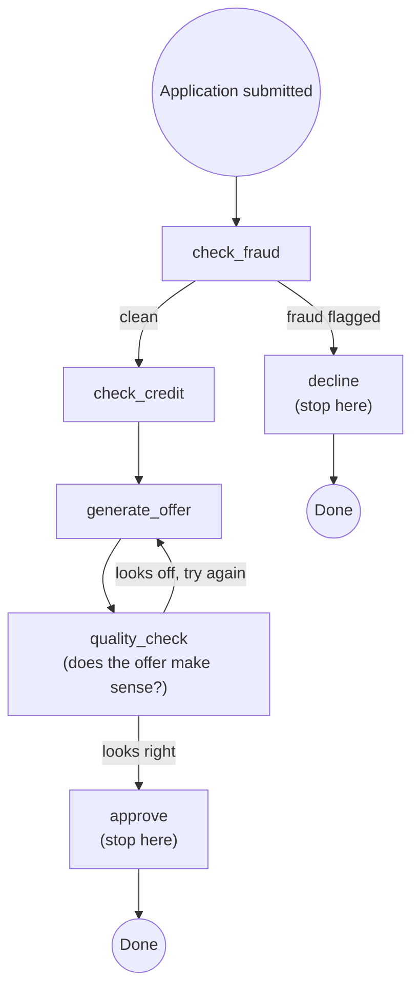
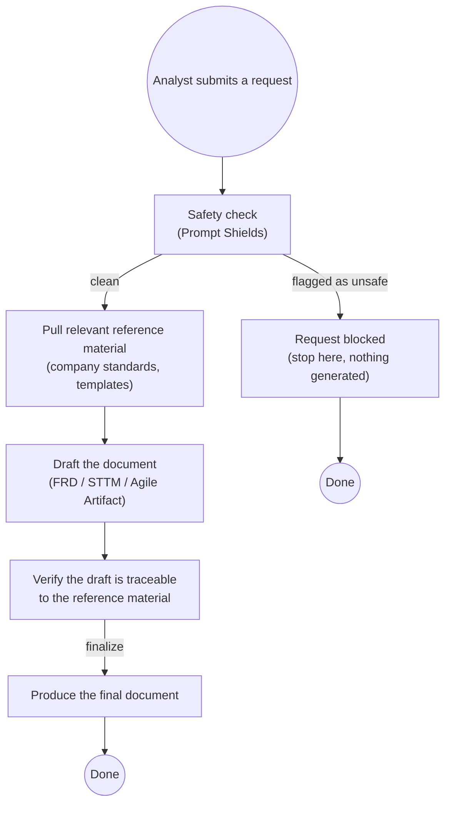

# LangGraph, Explained — and how PayerIQ uses it

A customer-facing walkthrough: first the framework itself (what a "graph"
even means here, with a generic example that has nothing to do with
PayerIQ), then a direct mapping of that same pattern onto PayerIQ's actual
document-generation pipeline. For the full engineering reference — every
function, every field — see [LANGGRAPH.md](LANGGRAPH.md).

## 1. What LangGraph is, in one paragraph

LangGraph is a framework for building a workflow as a **graph** instead of a
single long script. You describe the individual steps ("check this,"
"generate that," "verify the result") as separate, small pieces, describe
the rules for which step follows which, and the framework runs it — keeping
track of exactly where the workflow is, what's been decided so far, and
making it possible to pause and resume later. It's the same idea as a
flowchart on a whiteboard, except the flowchart is also the running system,
not just a diagram someone drew once and the code drifted away from.

## 2. The three building blocks — a generic example first

Every LangGraph workflow is built from exactly three ingredients. Here's
what they mean, using a small example unrelated to PayerIQ — reviewing a
loan application:

| Building block | What it is | In the loan example |
|---|---|---|
| **State** | The shared record every step reads from and updates. It's the single source of truth for "everything known about this run so far." | `{applicant_name, requested_amount, fraud_check_passed, credit_score, decision}` |
| **Node** | One self-contained step — a function that looks at the current state and does one job. | `check_fraud`, `check_credit`, `generate_offer`, `human_review` |
| **Edge** | The rule for which node runs next. A plain edge always goes the same way; a **conditional edge** branches based on what's in the state. | "After `check_fraud`, go to `check_credit` — unless fraud was flagged, then go straight to `decline`." |

### What it looks like end to end

Two details worth noticing, because they're exactly the two things that make
a graph more powerful than a plain top-to-bottom script:

- **The branch after `check_fraud`** — a flagged application never reaches
  `check_credit` or `generate_offer` at all. The workflow enforces that,
  structurally — it isn't something a person has to remember to check.
- **The loop between `generate_offer` and `quality_check`** — if the
  generated offer doesn't hold up, the workflow can go back and try again,
  automatically, without needing to restart the whole application from
  scratch or lose the applicant's original data.

And because the **state** is the one thing every node reads and writes,
nothing is lost between steps — `check_credit`'s result is still sitting
there in state when `generate_offer` runs three steps later, and it's still
there if the whole thing pauses and picks back up an hour later.

## 3. Now — how PayerIQ fits this exact pattern

PayerIQ's document-generation pipeline (`/v2`) is built from the same three
ingredients, just with different nodes:

| Generic building block | PayerIQ's version |
|---|---|
| **State** | Everything about one document request — the instructions given so far, every uploaded file, the current draft, its safety/quality scores |
| **Nodes** | Safety check → retrieve reference material → draft the document → verify it's accurate → finalize |
| **Edges** | "If the safety check flags the request, stop — don't generate anything." "If the draft isn't well-supported by the source material, revise it." |

This is the *identical shape* as the loan example above — a safety gate up
front that can stop everything, a main path that does the real work, and a
verification step positioned to catch a bad result before it reaches
anyone. Nothing here was invented specially for document generation; it's
the same graph pattern applied to a different problem.

## 4. What this means for you, concretely

- **The safety check always runs, for every request, with no exceptions.**
  It isn't a step someone could forget to call — it's the very first node in
  the graph, structurally impossible to skip.
- **A request never partially generates.** If the safety check flags it, the
  workflow stops there — no draft, no output, nothing sent downstream.
- **Every draft is checked against your actual reference material before
  it's called final** — not just generated and handed over on faith.
- **Nothing is lost between turns.** Ask for a revision an hour later, or
  add a new document format to an existing request days later — the
  workflow picks up exactly where it left off, with the full history of
  what was asked for and what was already produced.
- **Multiple document formats generate at the same time, not one after
  another** — each format runs its own independent copy of this graph in
  parallel, so asking for three formats doesn't take three times as long.
- **The workflow's shape is inspectable.** The diagram above isn't a
  separate document that can go stale — it's a direct picture of the actual
  code path every request takes, which is why it's possible to state with
  confidence exactly what does and doesn't happen to a given request.

## 5. Going deeper

- [LANGGRAPH.md](LANGGRAPH.md) — the full engineering reference: every node's
  actual code, the two router functions, execution internals, and a
  traced example of real state changing step by step.
- [CONTENT_SAFETY.md](CONTENT_SAFETY.md) — exactly what the safety check and
  the accuracy check do under the hood.
- [MEMORY.md](MEMORY.md) — exactly how "nothing is lost between turns" is
  implemented (the Cosmos DB checkpointer).
- [ARCHITECTURE.md](ARCHITECTURE.md) — where this workflow sits in the whole
  system, frontend to Azure services.
