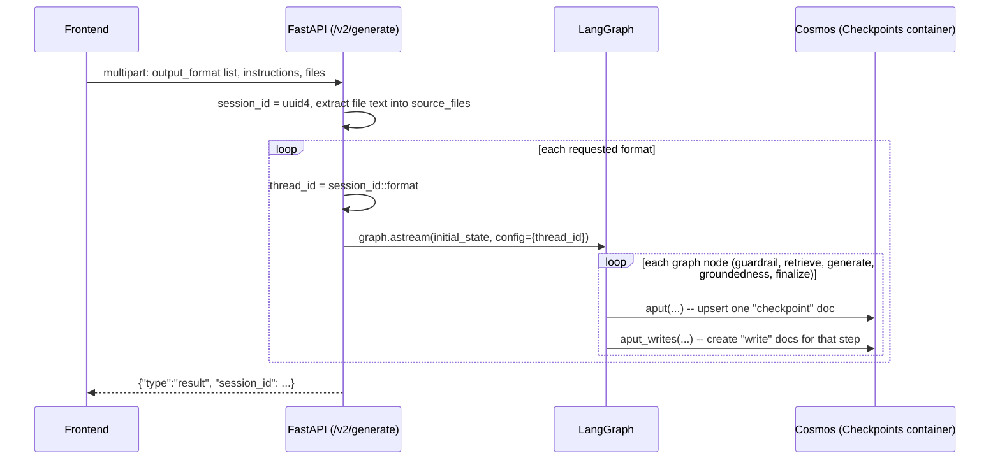
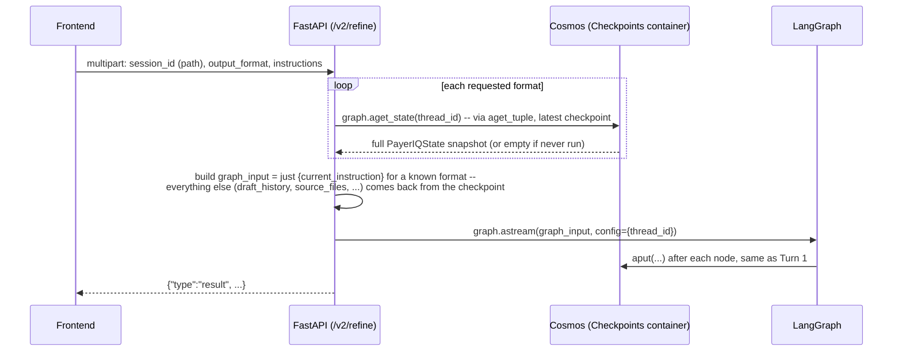

# Memory — how `/v2` persists and resumes state, end to end


This doc traces one concept — "memory" — across the whole `/v2` pipeline: what
gets persisted, where, keyed by what, and exactly when a write or a read
happens relative to an HTTP call. See [README.md section 4](README.md#4-memory--the-cosmos-db-checkpointer)
for the condensed version and [`app/services/cosmos_checkpoint.py`](app/services/cosmos_checkpoint.py)
for the implementation this doc walks through.

## 1. Three things this codebase could mean by "memory" — only one is this doc

| Kind | What it holds | Backing store | Lifetime | Covered here? |
|---|---|---|---|---|
| **LangGraph session state** | `PayerIQState` — instructions, drafts, retry/groundedness history, uploaded file text, per `session_id::output_format` thread | Cosmos DB, `Checkpoints` container (`AsyncCosmosDBSaver`) | Indefinite — nothing currently expires or deletes it | **Yes — this doc** |
| **Document-history compliance log** | An immutable audit trail of every uploaded file (who, when, which version), plus the raw file itself | Cosmos DB, `DocumentHistory` container (`document_history_service.py`) + Azure Blob Storage | Indefinite, append-only, never read back by the pipeline | No — separate concern, not conversational state |
| **Grounding retrieval cache** | The last `retrieve_grounding()` result (Azure AI Search hits) | A process-local Python variable in `azure_search_service.py` | `GROUNDING_CACHE_TTL_SECONDS` (default 900s), and gone on process restart | No — ephemeral performance cache, not session memory |

The rest of this doc is entirely about the first row: how a `/v2/generate`
call's state survives to be picked back up by a later `/v2/refine` call,
possibly minutes or days apart, possibly on a different container instance.

## 2. The core idea: LangGraph's `BaseCheckpointSaver`

LangGraph persists the *entire* graph state after every node transition, keyed
by a `thread_id`. Without a checkpointer, `session_id` would be meaningless —
every HTTP call would start the graph from a blank slate. LangGraph ships
official checkpointers for Postgres, SQLite, and MongoDB but not Cosmos DB's
NoSQL API, so this project implements its own: `AsyncCosmosDBSaver` in
`app/services/cosmos_checkpoint.py`, reusing the same Cosmos account already
provisioned for document history rather than standing up a Postgres server
just for this.

### Keying: why one session can have several threads

`PayerIQState.output_format` is a single value, but one `session_id` can cover
several formats (STTM, FRD, Agile) added at different times. Rather than one
thread per session — which would mean a second format's run overwrites the
first format's `current_draft`/`instruction_history` — `app/routergenerator.py`
gives **each `(session_id, output_format)` pair its own LangGraph thread**:

```python
def _thread_id(session_id: str, output_format: str) -> str:
    return f"{session_id}::{output_format}"
```

`AsyncCosmosDBSaver`'s Cosmos container is partitioned by `/thread_id`, so this
also determines the physical partitioning of the data — every document for one
format of one session lives in the same logical partition.

## 3. What actually gets stored

One Cosmos container (default `Checkpoints`, `AZURE_COSMOS_CHECKPOINT_CONTAINER_NAME`,
auto-created via `create_container_if_not_exists` on startup) holds two kinds
of documents side by side, distinguished by a `type` field:

| Document `id` pattern | `type` | Contents |
|---|---|---|
| `checkpoint::<checkpoint_ns>::<checkpoint_id>` | `"checkpoint"` | The **entire** `PayerIQState` snapshot at that step — `instruction_history`, `draft_history`, `source_files` (full extracted text of every uploaded file), `current_draft`, `retry_count`, `groundedness_score`, `status`, everything — plus `metadata` and `parent_checkpoint_id` (a linked list back through every prior step of this thread) |
| `write::<checkpoint_ns>::<checkpoint_id>::<task_id>::<idx>` | `"write"` | One pending write for one in-flight task at that checkpoint — LangGraph's own bookkeeping for work scheduled but not yet folded into a checkpoint |

Both payloads are opaque to Cosmos: serialized with LangGraph's own
`serde.dumps_typed()` (msgpack), then base64-encoded into a plain
`{"type": ..., "data": ...}` JSON shape, since Cosmos's NoSQL API has no
native binary field.

**This is deliberately simpler than the Postgres/SQLite savers.** Those
normalize channel values into a separate blob table keyed by
`(channel, version)` so unchanged values aren't duplicated across many
checkpoints. Here, `Checkpoint.channel_values` is the *full* state at that
point in time (not a diff), so `AsyncCosmosDBSaver` just stores that whole
dict directly in the checkpoint document — one read per lookup, no blob-table
joins. The tradeoff: some storage duplication across a long refinement chain
(each turn's checkpoint re-stores the full `source_files` text again), judged
an acceptable trade for a document-oriented store at this codebase's size.

## 4. End-to-end walkthrough

### Turn 1 — `POST /v2/generate` (brand-new session)



Key point: **a checkpoint is written after every single node**, not once at
the end. `_run_format_stream()` in `routergenerator.py` streams progress by
observing `graph.astream(..., stream_mode="updates")`, and each node
completion it observes already implies a `Cosmos.upsert_item` happened
underneath. If the process crashed mid-run, whatever nodes had already
completed are durable — only the in-flight node's work is lost.

### Turn 2 — `POST /v2/refine/{session_id}` (continuing an existing format)



The critical detail: `refine`'s `make_input()` for an already-known format
returns **only `{"current_instruction": instructions}`** (plus `source_files`
if new files were uploaded this turn) — not a full state. LangGraph merges
this partial dict onto the state it loads from the checkpoint via
`aget_tuple`, so `instruction_history`, `draft_history`, and previously
uploaded `source_files` all carry forward automatically without the caller
resending them.

### Turn 3 — adding a brand-new format mid-session (cold start)

If `/v2/refine` is called with a format that has never run for this
`session_id` (e.g. the user checks "Agile Artifact" for the first time), that
format's thread has no checkpoint yet. `routergenerator.py` detects this via
an empty `snapshot.values` and cold-starts it exactly like `/v2/generate`
would — a full `_initial_state(...)` — but **seeds it with `source_files` and
`project_name` borrowed from whichever other requested format already has a
thread**, so the newly added format doesn't need the vendor file re-uploaded:

```python
for fmt in output_format:
    snapshot = await graph.aget_state({"configurable": {"thread_id": _thread_id(session_id, fmt)}})
    if snapshot.values and known_source_files is None:
        known_source_files = snapshot.values.get("source_files", [])
        known_project_name = snapshot.values.get("project_name", "")
if known_source_files is None:
    raise HTTPException(404, "Unknown session")   # every requested format is new -> session_id itself is unknown
```

This lookup happens **before streaming starts**, so a truly unknown
`session_id` (no format has ever run under it) still returns a plain HTTP 404
rather than an in-stream error — the frontend can distinguish "bad session"
from "a mid-stream failure."

### `GET /v2/status/{session_id}?output_format=...`

A pure read — `graph.aget_state(config)` for that one thread, returning just
`{"status": ..., "session_id": ...}`. No write happens. `snapshot.values`
being falsy is the same "never run" signal `/v2/refine` uses to decide
whether to cold-start.

## 5. How a LangGraph call maps to a Cosmos operation

| LangGraph call | Cosmos operation | When it runs |
|---|---|---|
| `checkpointer.setup()` | `create_container_if_not_exists(id="Checkpoints", partition_key="/thread_id")` | Once, at app startup, from `init_graph_resources()` |
| `aget_tuple(config)`, no `checkpoint_id` | `SELECT * FROM c WHERE thread_id=@tid AND type='checkpoint' AND checkpoint_ns=@ns ORDER BY checkpoint_id DESC OFFSET 0 LIMIT 1` | "Give me the latest state for this thread" — checkpoint IDs are time-ordered UUIDs, so `ORDER BY ... DESC LIMIT 1` is enough |
| `aget_tuple(config)`, specific `checkpoint_id` | Direct `read_item(id, partition_key=thread_id)` | Time-travel/history lookups (not currently exercised by any endpoint) |
| `aput(config, checkpoint, metadata, new_versions)` | `upsert_item(...)` of one `"checkpoint"` document | After **every** graph node completes, not just at the end of a run |
| `aput_writes(config, writes, task_id)` | `create_item(...)` per write, or `upsert_item(...)` for "special" writes (ERROR/SCHEDULED/INTERRUPT/RESUME) which must overwrite | Between checkpoints, as LangGraph schedules/records task output — regular writes reject a duplicate id (`CosmosResourceExistsError` swallowed), matching Postgres's `ON CONFLICT DO NOTHING` |
| `aget_state(config)` | Same as `aget_tuple` under the hood | `/v2/refine`'s "does this format already have a thread" check, and `/v2/status` |
| `adelete_thread(thread_id)` | Query every doc for that `thread_id`, delete each | Implemented, but **not called by any endpoint today** — see gaps below |

## 6. What's carried forward across turns vs. what's not

| Field | Behavior across `/v2/refine` turns |
|---|---|
| `source_files` | Never replaced — only appended to. Turn 1's upload plus every later turn's new uploads are all still there, oldest first, so "use the new vendor file instead of the earlier one" has both to compare |
| `instruction_history` | Appended to by `merge_history_node` every turn — full record of every instruction given, timestamped |
| `draft_history` | Appended to by `groundedness_node` every generation attempt (across every turn, not just retries within one turn) |
| `retry_count` | Reset to `0` at the start of every turn by `merge_history_node` — it's a per-turn counter, not cumulative across the session |
| `feedback` | Reset to `""` at the start of every turn — stale correction feedback from a prior turn's retry never leaks into a new turn's generation |
| `current_instruction` | Overwritten each turn — only the latest instruction, not history (that's what `instruction_history` is for) |

## 7. Known gaps

- **Nothing expires.** No TTL, no retention policy, no archival — every
  checkpoint and write document for every session lives in Cosmos forever
  unless something calls `adelete_thread()`, which no endpoint does today.
- **`prune()` and `copy_thread()` are unimplemented** (not required by
  `BaseCheckpointSaver`'s abstract surface, and no endpoint currently needs
  them) — a future "delete old sessions" or "fork a session" feature would
  need to add them.
- **No storage deduplication.** Every checkpoint re-stores the full
  `source_files` text, even across many refinement turns on a long session —
  a deliberate tradeoff for implementation simplicity (see section 3), not
  free.
- **Only the async surface is implemented** — `/v2` only ever calls the
  graph's async methods, so `AsyncCosmosDBSaver` has no sync counterparts.
- **Custom code, not a battle-tested community package.** Unlike the
  official Postgres/SQLite/Mongo checkpointers, this one hasn't seen
  production load beyond this project — see
  [README section 13](README.md#13-known-limitations--roadmap) for the
  broader list of untested edges.
