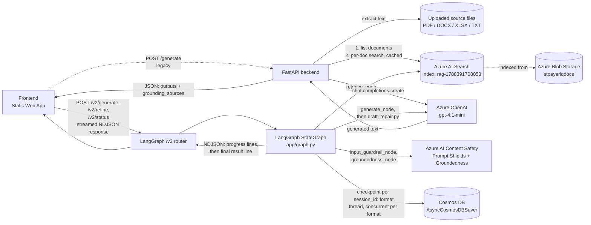
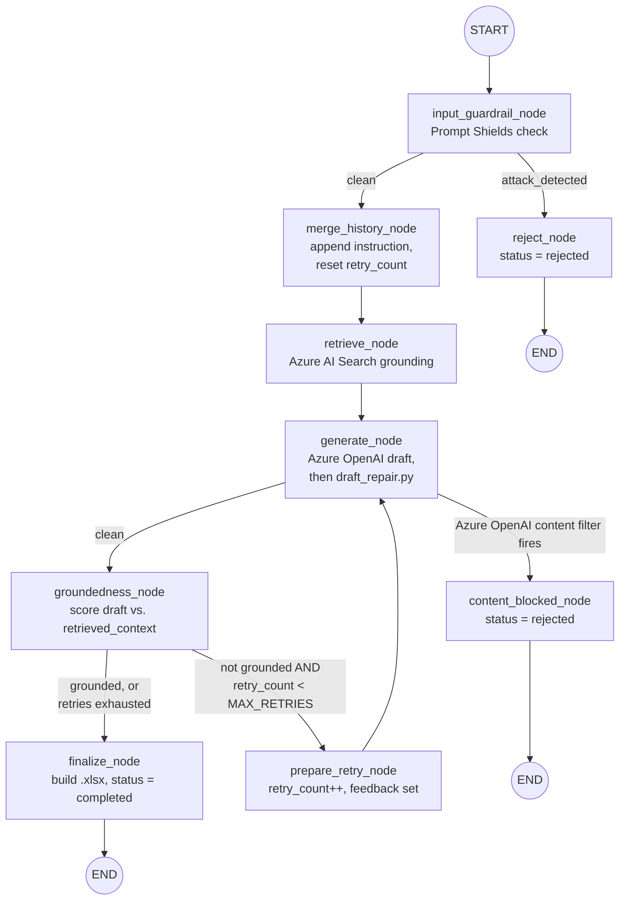
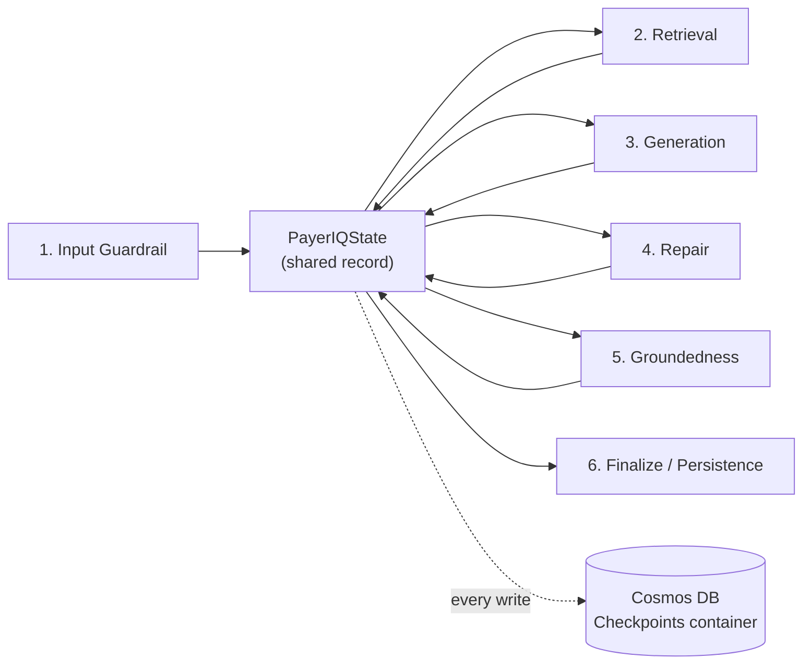
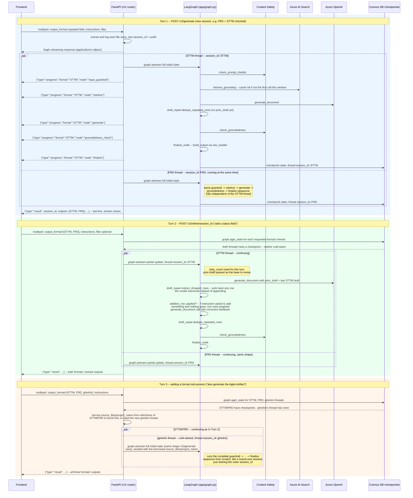
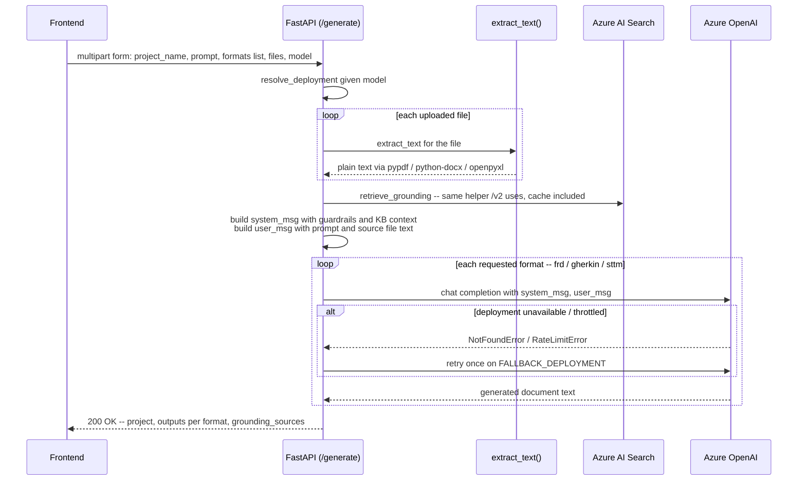
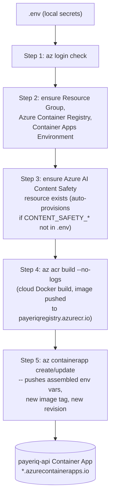

# PayerIQ Backend — Architecture

PayerIQ is a FastAPI service that turns analyst instructions + uploaded source
files into production-ready payer requirements documents (FRD, Gherkin
acceptance criteria, STTM mappings), grounded in an enterprise knowledge base
held in Azure AI Search, using Azure OpenAI for generation.

## Table of contents

0. [Getting started (local setup)](#0-getting-started-local-setup)
1. [Architecture pattern](#1-architecture-pattern)
2. [Components](#2-components)
3. [LangGraph state machine (`/v2`)](#3-langgraph-state-machine-v2)
4. [Memory — the Cosmos DB checkpointer](#4-memory--the-cosmos-db-checkpointer)
5. [End-to-end sequence — `/v2` LangGraph pipeline](#5-end-to-end-sequence--v2-langgraph-pipeline)
6. [Request flow — `POST /generate` (v1)](#6-request-flow--post-generate-v1)
7. [Azure AI Search — retrieval and caching](#7-azure-ai-search--retrieval-and-caching)
8. [Prompt structure sent to Azure OpenAI](#8-prompt-structure-sent-to-azure-openai)
9. [Session state across a `/v2` refinement loop](#9-session-state-across-a-v2-refinement-loop)
10. [Deterministic safety nets — `draft_repair.py`](#10-deterministic-safety-nets--draft_repairpy)
11. [Content Safety — guardrails, groundedness, and length limits](#11-content-safety--guardrails-groundedness-and-length-limits)
12. [Deployment & infrastructure](#12-deployment--infrastructure)
13. [Known limitations / roadmap](#13-known-limitations--roadmap)
14. [Configuration](#14-configuration)
15. [Endpoints](#15-endpoints)
16. [Dependencies (`requirements.txt`)](#16-dependencies-requirementstxt)
17. [Authentication — login and Bearer tokens](#17-authentication--login-and-bearer-tokens)
18. [Telemetry — Azure Monitor](#18-telemetry--azure-monitor)

---

## 0. Getting started (local setup)

```powershell
python -m venv .venv
.\.venv\Scripts\Activate.ps1
pip install --upgrade pip
pip install -r requirements.txt
```

Then, before the first run:

1. Copy your Azure OpenAI / Azure AI Search / Azure Cosmos DB / (optionally)
   Content Safety values into a `.env` file at the repo root — see
   [Configuration](#14-configuration) for the full variable list.
   **Never commit `.env`** — confirm it's gitignored. It's also excluded from
   the Docker build context by [`.dockerignore`](.dockerignore), so it never
   ends up baked into a container image layer.
2. Start the API:
   ```powershell
   python -m uvicorn app.main:app --reload --reload-dir app --port 8000
   ```
   (`python -m uvicorn` avoids a stale `uvicorn.exe` launcher pointing at an
   old venv path if this folder was ever moved/renamed; `--reload-dir app`
   keeps the file-watcher from also watching `.venv`, which would otherwise
   trigger spurious restarts on every pip-related file touch.)
3. Confirm it's up: `GET http://localhost:8000/` → `{"status": "healthy", ...}`.
   `GET /health` additionally pings the configured Azure OpenAI deployment(s).

`/generate` (v1) works with just the Azure OpenAI + Azure Search variables
set. The `/v2` LangGraph endpoints additionally need `CONTENT_SAFETY_ENDPOINT`
/ `CONTENT_SAFETY_KEY` and `AZURE_COSMOS_ENDPOINT` / `AZURE_COSMOS_KEY` —
without those, `/v2/*` routes return `503` but `/generate` keeps working
normally (see [`init_graph_resources`](app/routergenerator.py)).

---

## 1. Architecture pattern

Two pipelines are mounted on the same FastAPI app, sharing the same
retrieval/generation services underneath:

- **`POST /generate` (v1)** — a single deterministic retrieve-then-generate
  pass: Azure AI Search grounds the request, Azure OpenAI drafts each
  requested format in one direct completion call per format, no retry loop
  or persisted state.
- **`/v2/*` (LangGraph pipeline, the frontend's active integration)** — the
  same retrieval and generation services, orchestrated as a `langgraph`
  `StateGraph` (`app/graph.py`) that adds: Prompt Shields input guardrails, a
  groundedness-scored self-correction step, and deterministic post-generation
  repair (`app/services/draft_repair.py`) that catches two specific failure
  modes plain prompting can't reliably prevent. Session state is persisted
  per `thread_id` via `AsyncCosmosDBSaver`
  (`app/services/cosmos_checkpoint.py`, requires `AZURE_COSMOS_ENDPOINT` /
  `AZURE_COSMOS_KEY` — the same Cosmos account used for document history) —
  but a **session** (`session_id`) is not one thread: every requested output
  format gets its own thread nested under the session, and every format's
  graph run happens **concurrently**, not one after another. The response is
  **streamed** as newline-delimited JSON (progress-per-node, then a final
  result line) rather than one blocking JSON body, since a full run across
  several formats can take long enough that a silent wait looked broken.
  Mounted under `/v2` so it can evolve independently of the simpler
  `/generate` contract — see [Endpoints](#15-endpoints).

Both pipelines share the same grounding logic
(`azure_search_service.retrieve_grounding`) and the same guardrailed prompt
templates (`app/services/prompt_templates.py`), so the two never drift into
different rules for the same output format.

- **Retrieval**: Azure AI Search grounds every generation call in the
  organization's actual reference documents (templates, standards, data
  dictionary) — output isn't drawn from the model's general knowledge alone.
- **Generation**: Azure OpenAI produces the requested FRD/STTM/Agile Artifact
  output, constrained by that retrieved context plus a guardrailed system
  prompt.
- Every claim must trace back to a retrieved source or an uploaded file; where
  neither covers something, the model is required to label it an Assumption,
  Candidate mapping, or Open Question instead of inventing it.

See [Known limitations / roadmap](#13-known-limitations--roadmap) for what's
still missing before `/v2` is fully production-hardened (notably: automated
test coverage, and that the zero-retry default trades away a safety net for
latency).

## 2. Components

| Component | Role |
|---|---|
| **FastAPI backend** (`app/main.py`) | Hosts `/generate` (v1, direct) and mounts the `/v2` router (LangGraph) |
| **LangGraph `StateGraph`** (`app/graph.py`) | `/v2` only — orchestrates guardrail → retrieve → generate → groundedness-check → retry/finalize as a stateful graph, one instance per (session, format) thread |
| **`draft_repair.py`** (`app/services/draft_repair.py`) | `/v2` only — deterministic, code-based repair run after every `generate_node` call: restores a row the model overwrote instead of appending, removes exact-duplicate rows, and detects + retries once when an "add" instruction was outright ignored — see [section 10](#10-deterministic-safety-nets--draft_repairpy) |
| **Azure Blob Storage** | Source-of-truth store for the enterprise reference documents (standards, templates, data dictionary, sample rules) |
| **Azure AI Search** | Indexes the blob documents (chunked, with vector + semantic config); queried for grounding context, with an in-process cache for the common case — see [section 7](#7-azure-ai-search--retrieval-and-caching) |
| **Azure OpenAI** | Chat completion model (`gpt-4.1-mini` by default) that drafts the requested document(s) |
| **Azure AI Content Safety** | `/v2` only — Prompt Shields (jailbreak/prompt-injection detection on input) and Groundedness Detection (scores each draft against retrieved context) — see [section 11](#11-content-safety--guardrails-groundedness-and-length-limits) |
| **Cosmos DB (`AsyncCosmosDBSaver`)** | `/v2` only — the LangGraph checkpointer; persists `PayerIQState` per `session_id::output_format` thread so `/v2/refine` can continue, or cold-start, any requested format across HTTP calls — see [section 4](#4-memory--the-cosmos-db-checkpointer) |
| **Azure Container Apps** | Hosts the deployed container (`payeriq-api`); provisioned/updated by [`deploy.ps1`](deploy.ps1) — see [section 12](#12-deployment--infrastructure) |
| **Frontend** (Azure Static Web App, separate repo) | Uploads files/prompt/output-format selection to `/v2/generate` or `/v2/refine`, reads the streamed progress + final `outputs` map, and renders Excel/Word artifacts for the analyst |
| **`telemetry.py`** (`app/services/telemetry.py`) | Wires OpenTelemetry auto-instrumentation (FastAPI, httpx, `logging`) into Azure Monitor and emits three custom events from `app/graph.py`'s nodes — see [section 18](#18-telemetry--azure-monitor) |




## 3. LangGraph state machine (`/v2`)

`app/graph.py` compiles a `StateGraph[PayerIQState]` with a checkpointer, so
every node transition is durable and resumable. This is the "instruction
agent" loop: it takes the analyst's `current_instruction`, screens it,
grounds it, drafts against it, scores the draft, and either finalizes or
self-corrects — instead of a single uncontrolled model call. Every arrow
below is a durable checkpoint (see
[section 4](#4-memory--the-cosmos-db-checkpointer)), so a run can be picked
back up later from exactly where it left off, and every prior
draft/score/instruction stays queryable for audit.



**Key routing rules** (`route_after_guardrail`, `route_after_generate`,
`route_after_groundedness` in `app/graph.py`):

- `attack_detected` short-circuits straight to `reject` — retrieval and
  generation never run against a flagged instruction.
- A **second, independent** safety check sits inside `generate_node` itself:
  Azure OpenAI's own content filter, which inspects the actual prompt sent
  to the model (not just the raw instruction Prompt Shields already cleared).
  A phrasing mild enough to pass `input_guardrail_node` can still be refused
  here once embedded in the full generation prompt — `route_after_generate`
  sends that case to `content_blocked_node` instead of
  `groundedness_check`, producing the same `status: "rejected"` outcome as a
  Prompt Shields rejection. See
  [CONTENT_SAFETY.md section 1](CONTENT_SAFETY.md#1-what-it-wraps) for the
  full detail and a real example that triggered it.
- `groundedness_check` *can* loop back into `generate` (via `prepare_retry`)
  up to `MAX_RETRIES` times — but `MAX_RETRIES = 0` by default, so that edge
  is never taken in practice. Whether a draft clears the groundedness
  threshold or simply has zero retries available, both paths lead straight
  to `finalize_node`. There is no human-review pause; this graph has no
  interrupt in it.
- Every loop iteration is scoped to the *current* instruction only:
  `merge_history_node` resets `retry_count` and `feedback` on every new turn.

> **Why `MAX_RETRIES = 0`?** A retry no longer gates whether a low-scoring
> draft reaches the customer — `finalize_node` is reached either way once
> retries are exhausted, since there's no human-review fallback to pause on
> anymore. Real testing showed retries often didn't raise the score at all
> (some formats' scores stayed flat or got *worse* across attempts), while
> each attempt costs a full extra generate + groundedness-check cycle
> (~18–25s observed). With that cost buying no reliable benefit, `0` keeps
> latency predictable — verified: 3 formats concurrently, cold cache, 40s
> total. The real risk this trades away — the model occasionally *ignoring*
> an instruction outright on a long, complex document, a different failure
> mode than scoring low — is caught separately and narrowly by
> `draft_repair.addition_not_applied()`
> (see [section 10](#10-deterministic-safety-nets--draft_repairpy)), so the
> broad retry cost doesn't come back just to catch that one case.

**Multi-format submissions** (checking FRD + STTM + Agile Artifact at once,
or adding one mid-session to a document that's already been generated) are
*not* a feature of the graph itself — `PayerIQState.output_format` is a
single string per run. Instead, each selected format gets its **own
LangGraph thread** — `thread_id = f"{session_id}::{output_format}"`
(`routergenerator._thread_id`) — nested under the shared `session_id`, and
`routergenerator._run_formats_concurrently()` runs the whole graph above
**once per format, concurrently**, via one `asyncio.Task` per format feeding
progress events into a shared queue that merges them into one stream in true
arrival order. Concurrency is possible specifically *because* each format
has its own thread now: nothing about one format's `current_draft`/
`draft_history` is visible to another's, so there's no shared mutable state
to race on. A `/v2/refine` call can also check a format that was never part
of the session — that format's thread has no checkpoint yet, so it's
**cold-started** exactly like `/v2/generate` would, seeded with the
session's already-known `source_files`/`project_name` borrowed from
whichever other requested format's thread already exists, so "also generate
the FRD" doesn't need the vendor file re-uploaded.

### Agent view of the same graph

The same nine `app/graph.py` nodes read naturally as **six functional
agents** — a useful lens for explaining the pipeline without walking through
every LangGraph internal. This is a relabeling of exactly what's diagrammed
above, not a different implementation: every "agent" below is one or more of
the same nodes already shown in the flowchart. (`content_blocked_node` isn't
given its own row — it's a second exit door for the **Input Guardrail
Agent**'s job, just triggered from inside the Generation Agent's step
instead of before it; see the routing rules above.)

| # | Agent | Implemented as | External call | Reads from shared state | Writes to shared state |
|---|---|---|---|---|---|
| 1 | **Input Guardrail Agent** | `input_guardrail_node` | Azure AI Content Safety — Prompt Shields | `current_instruction`, `source_files` | `attack_detected` |
| 2 | **Retrieval Agent** | `merge_history_node` → `retrieve_node` | Azure AI Search | `current_instruction`, `project_name` | `instruction_history`, `retry_count`/`feedback` (reset), `retrieved_context`, `grounding_sources` |
| 3 | **Generation Agent** | `generate_node` (the `openai_service.generate_document()` call) | Azure OpenAI | `draft_history`, `instruction_history`, `retrieved_context`, `source_files`, `feedback` | `current_draft` (pre-repair) |
| 4 | **Repair Agent** | `generate_node`, immediately after — `draft_repair.restore_dropped_rows()` / `addition_not_applied()` / `dedupe_repeated_rows()` | *none — pure deterministic code, no network call* | `current_draft` (pre-repair), the prior draft, `current_instruction` | `current_draft` (final, post-repair) |
| 5 | **Groundedness Agent** | `groundedness_node` | Azure AI Content Safety — Groundedness Detection | `current_draft`, `retrieved_context` | `groundedness_score`, `grounded`, `draft_history` |
| 6 | **Finalize / Persistence Agent** | `finalize_node` | `xlsx_builder` (local disk write) | `current_draft`, `output_format`, `session_id` | `status`, `output_path` |

Two honesty notes on the mapping, so this table doesn't imply structure that
isn't actually in the code:

- **The Repair Agent is not a separate LangGraph node.** There's no
  `"repair"` entry in `build_graph()` — `draft_repair.py`'s three functions
  run as plain Python calls inside `generate_node`, right after the LLM
  responds and before that node returns. It's listed as its own agent here
  because it's a distinct *responsibility* (deterministic, rule-based
  correction vs. the LLM's free-text generation immediately before it), not
  because it's a distinct graph step.
- **Persistence isn't unique to agent 6.** Every one of the six agents above
  is checkpointed to Cosmos DB the moment its node returns — that's the
  LangGraph engine calling `AsyncCosmosDBSaver.aput()`/`aput_writes()` after
  *each* node, not just at the end (see [section 4](#4-memory--the-cosmos-db-checkpointer)
  below). What's actually unique to agent 6 is assembling the final `.xlsx`
  file and stamping `status: "completed"` — the memory write happens
  identically for all six.

**How the agents connect — and how memory moves between them:**



No agent calls another agent directly, and no agent passes its output
straight to the next agent's input. Every agent reads whatever fields it
needs from **one shared record** (`PayerIQState`) and returns only the
fields it changed; LangGraph merges that into the record before the next
agent runs. This indirection is deliberate — it's what let this project add
the Repair Agent's logic later as a pure addition inside the Generation
Agent's step, without touching the Retrieval or Groundedness agents at all.

Two different kinds of "memory" are at work here, and it matters which one
a given guarantee depends on:

- **Working memory, within one run**: `PayerIQState` itself, alive only for
  the duration of one `graph.astream(...)` call. This is what lets agent 5
  (Groundedness) see the draft agent 3+4 just produced, without either of
  them knowing agent 5 exists.
- **Persistent memory, across runs**: after *every* agent's step, that same
  `PayerIQState` is written whole to the Cosmos DB `Checkpoints` container,
  keyed by `thread_id = session_id::output_format`. This is what lets agent 1
  (Input Guardrail), on a `/v2/refine` call made an hour or a day later and
  handled by a completely different container replica, pick up with the full
  `instruction_history`/`draft_history`/`source_files` already in hand — none
  of the agents themselves know or care that a checkpoint ever happened; it's
  handled entirely by the LangGraph engine wrapping every node. Full
  mechanics, including exactly which Cosmos operation fires after which
  agent: [MEMORY.md](MEMORY.md) and [section 4](#4-memory--the-cosmos-db-checkpointer)
  below. (A *third*, unrelated Cosmos container — `DocumentHistory` — logs a
  compliance audit trail of uploaded files; it's written by
  `document_history_service.py` outside this agent chain entirely and none
  of the six agents read it back.)

Engineering-depth version of this exact material — every function's real
code, the router-naming caveat, and a step-by-step traced example — lives in
[LANGGRAPH.md](LANGGRAPH.md); a non-technical walkthrough of the same shape
is in [LANGGRAPH_OVERVIEW.md](LANGGRAPH_OVERVIEW.md).

## 4. Memory — the Cosmos DB checkpointer

"Memory" here means LangGraph's own concept: a `BaseCheckpointSaver` that
persists the *entire* graph state after every node transition, keyed by
`thread_id`, so a graph run can be picked back up by a completely different
HTTP request (`/v2/refine`), with full continuity. Without it, `session_id`
would be meaningless — every call would start from a blank slate.

LangGraph ships official checkpointers for Postgres, SQLite, and MongoDB, but
none for Azure Cosmos DB's NoSQL API — and this project already runs a Cosmos
account for document-history compliance logging
(`app/services/document_history_service.py`), so
[`app/services/cosmos_checkpoint.py`](app/services/cosmos_checkpoint.py)
implements `AsyncCosmosDBSaver`, a from-scratch `BaseCheckpointSaver`, against
that same account instead of standing up a separate Postgres server.

### Storage layout

One Cosmos container (default name `Checkpoints`, configurable via
`AZURE_COSMOS_CHECKPOINT_CONTAINER_NAME`, created automatically on first boot
via `create_container_if_not_exists`), **partitioned by `/thread_id`** (i.e.
by `session_id::output_format`, not just `session_id`), holding two kinds of
documents side by side:

| Document `id` pattern | `type` | Contents |
|---|---|---|
| `checkpoint::<checkpoint_ns>::<checkpoint_id>` | `"checkpoint"` | The **entire** `PayerIQState` snapshot at that step (`instruction_history`, `draft_history`, `source_files`, `current_draft`, `retry_count`, ...), plus `metadata` and `parent_checkpoint_id` |
| `write::<checkpoint_ns>::<checkpoint_id>::<task_id>::<idx>` | `"write"` | One pending write for one in-flight task at that checkpoint — LangGraph's own bookkeeping between checkpoints |

Both the checkpoint and write payloads are opaque to Cosmos — they're
serialized with LangGraph's own `serde.dumps_typed()` (msgpack under the
hood), then base64-encoded into a plain `{"type": ..., "data": ...}` JSON
shape, since Cosmos's NoSQL API has no native binary field.

This is deliberately **simpler than the Postgres/SQLite/in-memory savers**:
those normalize channel values into a separate blob table keyed by
`(channel, version)` so unchanged values aren't duplicated across many
checkpoints. `Checkpoint.channel_values` is defined as the *full* state at
that point in time (not a diff), so `AsyncCosmosDBSaver` just stores that
whole dict directly in the checkpoint document instead — one straightforward
read per lookup, no blob-table joins. The tradeoff is some storage
duplication across a long refinement chain, which is a fine trade for a
document-oriented store and a codebase this size.

### How each LangGraph call maps to a Cosmos operation

| LangGraph call | Cosmos operation |
|---|---|
| `checkpointer.setup()` | `database.create_container_if_not_exists(id="Checkpoints", partition_key="/thread_id")` — called once at startup from `init_graph_resources()` |
| `aget_tuple(config)` (no `checkpoint_id`) | `SELECT * FROM c WHERE thread_id=@tid AND type='checkpoint' AND checkpoint_ns=@ns ORDER BY checkpoint_id DESC OFFSET 0 LIMIT 1` — checkpoint IDs are time-ordered UUIDs, so this is "give me the latest state for this thread" |
| `aget_tuple(config)` (specific `checkpoint_id`) | Direct `read_item(id, partition_key=thread_id)` — used for time-travel/history lookups |
| `aput(config, checkpoint, metadata, new_versions)` | `upsert_item(...)` of one `"checkpoint"` document — this is what runs after **every** graph node, not just at the end |
| `aput_writes(config, writes, task_id)` | `create_item(...)` per pending write (or `upsert_item` for "special" writes like an error, which must overwrite) — `create_item` deliberately rejects a duplicate id so a regular write is write-once, matching Postgres's `ON CONFLICT DO NOTHING` semantics |
| `aget_state(config)` (used by `/v2/refine` and `/v2/status`) | Same as `aget_tuple` under the hood — reconstructs `PayerIQState` plus any pending writes; an empty result (`snapshot.values` falsy) is exactly how `routergenerator` detects a format's thread has never run, and cold-starts it |
| `adelete_thread(thread_id)` | Query all documents for that `thread_id`, delete each — not currently called by any endpoint, but implemented for future cleanup/retention tooling |

### Why this, and not the checkpoint for Postgres or Mongo

- **Reuses existing infrastructure.** No new Azure resource type, no new
  credentials to manage/rotate — `AZURE_COSMOS_ENDPOINT`/`AZURE_COSMOS_KEY`
  already existed for document history.
- **Removed an entire provisioning path.** `deploy.ps1` used to auto-create a
  Postgres Flexible Server (admin password generation, firewall rules, a
  whole extra Step 3) purely to back the checkpointer. That's gone.
- The cost is that this is custom code (not an off-the-shelf, community
  battle-tested package) — see [Known limitations](#13-known-limitations--roadmap)
  for what hasn't been stress-tested yet. `prune()`/`copy_thread()` are
  intentionally left unimplemented since no endpoint currently needs them.

## 5. End-to-end sequence — `/v2` LangGraph pipeline

Covers a full customer session: a multi-format first submission (concurrent),
a refinement turn on those same formats, and adding a brand-new format
mid-session (cold-start).



**On `/v2/refine` + multi-format sessions**: each format lives on its own
thread, so a `/v2/refine` call genuinely revises every requested format
independently — including a format being added to the session for the first
time (Turn 3 above), which cold-starts cleanly instead of inheriting another
format's history. This replaced an earlier design where every format shared
one thread and `/v2/refine` only ever continued whichever format happened to
be processed last.

## 6. Request flow — `POST /generate` (v1)



## 7. Azure AI Search — retrieval and caching

### Index schema (`rag-1788391708053`)

Created via Azure's "Import and vectorize data" wizard against the blob
container. Live fields:

| Field | Type | Notes |
|---|---|---|
| `chunk_id` | `Edm.String` (key) | Unique chunk identifier |
| `parent_id` | `Edm.String`, filterable | Groups chunks back to their source document |
| `chunk` | `Edm.String`, searchable | The actual chunk text — **this is the content field**, not `content` |
| `title` | `Edm.String`, searchable | Source document display name |
| `text_vector` | `Collection(Edm.Single)`, 1536-dim | Embedding vector (Azure OpenAI embedding profile, HNSW/cosine) — **present in the index but not currently queried by the app** |

The index also has a semantic configuration (`rag-1788391708053-semantic-configuration`)
prioritizing `title` + `chunk`. Neither the vector field nor the semantic
config is used yet — see [Known limitations](#13-known-limitations--roadmap).

### Retrieval strategy: per-document, not blended top-k

A single blended `top_k` query risks one strongly-matching document crowding
out the rest. Since the knowledge-base documents are meant to act as
**standing rules** (not just topical grounding), retrieval instead:

1. `list_indexed_documents()` — one broad query (`search_text="*"`, `select=[title]`)
   returns the distinct document titles currently indexed.
2. For each title, `search_knowledge_base()` runs a **filtered** query scoped
   to that one document (`search.ismatch('"<title>"', 'title')`), asking for
   its top `CHUNKS_PER_DOCUMENT = 2` chunks — with `search_text="*"`, not the
   caller's prompt, since these documents apply unconditionally as standing
   rules rather than being relevance-filtered per request. All documents are
   queried **concurrently** (`asyncio.gather`), not one at a time.
3. Results from all documents are concatenated into the `KNOWLEDGE BASE CONTEXT`
   block of the system prompt.

If Search is unreachable or the index is empty, it falls back to a single
blended `top_k=10` query using the caller's actual prompt, rather than
sending no grounding at all.

Both `/generate` and `retrieve_node` in the LangGraph pipeline call this same
`retrieve_grounding()` helper, so retrieval behavior never diverges between
v1 and `/v2`.

### Grounding cache

The per-document branch above queries with `search_text="*"` — deterministic
regardless of the caller's actual prompt — so in the normal case (the index
has documents) its result only changes when someone re-indexes the knowledge
base, a rare, manual event, not per request. `retrieve_grounding()` caches
that result in-process for `GROUNDING_CACHE_TTL_SECONDS` (default `900`, 15
min — see [Configuration](#14-configuration)), guarded by an `asyncio.Lock`
so concurrent callers (e.g. two formats' `retrieve_node`s racing each other,
per [section 3](#3-langgraph-state-machine-v2)) share one fetch instead of
duplicating it. Measured impact against the current 7-document index: a cold
call took ~6s; a warm cached call, with a completely different prompt, took
~0.00s and returned identical content. The fallback path (index empty/
unreachable, single blended query using the caller's actual prompt) is
**never** cached, since that one genuinely depends on the request.

**Caveat**: the cache is a plain module-level variable, private to one
running process. It isn't shared across horizontally-scaled replicas (each
gets its own copy, independently warmed) and doesn't survive a restart —
neither affects correctness, they just determine how often the full
retrieval cost gets paid again.

### Example request/response (Azure AI Search REST)

**Request** (`POST /indexes/rag-1788391708053/docs/search`):
```json
{
  "search": "*",
  "top": 2,
  "select": "chunk,title",
  "filter": "search.ismatch('\"sample_adjudication_rules.docx\"', 'title')"
}
```

**Response** (trimmed):
```json
{
  "value": [
    {
      "@search.score": 5.41,
      "title": "sample_adjudication_rules.docx",
      "chunk": "PAYMENT INTEGRITY — CLAIM ADJUDICATION RULES (SAMPLE / DRAFT)\n1. DUPLICATE CLAIM DETECTION\n   - A claim is considered a potential duplicate when ALL of the following match ..."
    }
  ]
}
```

This gets normalized by `search_knowledge_base()` into:
```json
{
  "source_document": "sample_adjudication_rules.docx",
  "excerpt": "PAYMENT INTEGRITY — CLAIM ADJUDICATION RULES ...",
  "relevance_score": 5.41
}
```

...and rendered by `format_chunks()` into the labeled block the LLM sees:
```
[Source: sample_adjudication_rules.docx | relevance 5.41]
PAYMENT INTEGRITY — CLAIM ADJUDICATION RULES (SAMPLE / DRAFT)
1. DUPLICATE CLAIM DETECTION
   - A claim is considered a potential duplicate when ALL of the following match ...
```

## 8. Prompt structure sent to Azure OpenAI

Each `/generate` call issues **one chat completion per requested format**
(`frd`, `gherkin`, `sttm`), sharing the same grounding but a different
`system_msg` output instruction. `/v2`'s `generate_node` builds the same kind
of guardrailed prompt via `openai_service.generate_document`, additionally
folding in `instruction_history`, the prior draft (if revising), and any
`correction_feedback` from a failed groundedness check or a
`draft_repair`-triggered retry.

**System message** (abridged):
```
You are an expert PayIntegrity / Healthcare Payer Business Analyst drafting
precise, production-ready specification documents (FRD, STTM, Agile
Artifacts) strictly grounded in the source files, knowledge-base context,
and instructions below.

GUARDRAILS (apply in order):
1. GROUNDING — base every claim on uploaded source material or KB context;
   label anything else an Assumption, Candidate mapping, or Open Question.
2. AUTHORITATIVE RULES — treat the KNOWLEDGE BASE CONTEXT excerpts as
   binding standards, not optional background; flag conflicts with the
   uploaded source as Open Questions instead of silently picking one.
3. SOURCE RESTRICTION — never invent tables/fields/joins not present below.
4. SCOPE TEST — refuse (with a fixed message) if the request falls outside
   the configured payer process areas.
5. Single-source-file handling; use formal "shall/must" language.
6. Follow the requested output format exactly (e.g. '|'-delimited rows).

=== KNOWLEDGE BASE CONTEXT ===
[Source: <doc title> | relevance <score>]
<chunk text>
...
```

**User message**:
```
Project: <project_name>

Instructions from analyst:
<prompt>

Uploaded source material:
<extracted text from each uploaded file>

Output requirement: <format-specific instruction, e.g. the 22-column STTM spec>
```

**Response**: raw text per format, e.g. for `sttm` — four `##`-headed
sections (`STTM Summary`, `STTM Mapping`, `Assumptions and Open Questions`,
`SME Review Checklist`) with `|`-delimited rows. In v1 the frontend converts
this text into the final `.xlsx`/`.docx` deliverable; in `/v2`, `finalize_node`
does that conversion server-side via `xlsx_builder.build_output()`.

**Post-processing (`/v2` only)**: the raw text `generate_node` gets back from
`generate_document()` isn't used as-is — `app/services/draft_repair.py` runs
two or three deterministic, code-based passes over it before it becomes
`current_draft` (see [section 10](#10-deterministic-safety-nets--draft_repairpy)
for the full mechanism). None of this changes the prompt itself; it's a
correction step applied to what came back.

## 9. Session state across a `/v2` refinement loop

Everything needed for a customer's iterative "refine until satisfied"
workflow (e.g. "map every column in the attached vendor file...", then later
"keep everything the same, but only revise the rows for X") is carried in
`PayerIQState` (`app/graph.py`) and persisted per thread by the Cosmos DB
checkpointer (mechanics in [section 4](#4-memory--the-cosmos-db-checkpointer))
between calls:

- **`instruction_history`** — every instruction given this format's thread,
  oldest first; `/v2/refine` appends to it rather than replacing it.
- **`source_files`** — every file uploaded to this format's thread, oldest
  first, **append-only** — a new upload on a refine turn never discards an
  earlier one. When a format cold-starts mid-session (see
  [section 3](#3-langgraph-state-machine-v2)), it's seeded with the files
  borrowed from another already-started format's thread, then grows from
  there independently.
- **`draft_history`** — every generated draft with its groundedness score, on
  this format's thread. `generate_node` always includes the *most recent*
  draft in the prompt when one exists, so a targeted instruction ("keep
  everything the same, only revise the rows for claim type X") is a genuine
  revision of that draft, not a from-scratch regeneration.
- **`retry_count` / `feedback`** reset each turn. With `MAX_RETRIES = 0` by
  default this loop edge is never taken (see
  [section 3](#3-langgraph-state-machine-v2)'s callout) — `feedback` would
  still be populated by `prepare_retry_node` if the constant is ever raised
  locally, but that path isn't exercised in the default configuration.
- **`project_name`** on a cold-started format — borrowed the same way
  `source_files` is, so the knowledge-base retrieval query for a newly-added
  format still has the real project context instead of falling back to
  "Untitled Project".

This is what makes the loop in [section 5](#5-end-to-end-sequence--v2-langgraph-pipeline)'s
sequence diagram work end to end: the customer submits an instruction
(optionally with a vendor sheet attached, optionally for several output
formats at once, concurrently), gets drafts back, and each subsequent
`/v2/refine` call — with or without a new file, with or without a
newly-checked format — revises forward from where each format's own thread
left off, rather than starting over each time.

## 10. Deterministic safety nets — `draft_repair.py`

`generate_node` doesn't just trust whatever `generate_document()` returns — a
full-document free-text rewrite has no structural guarantee it actually did
what a "keep everything else, just change X" instruction asked for.
`app/services/draft_repair.py` catches specific, well-defined failure modes
in code, deterministically, rather than hoping a stronger prompt fixes them:

| Function | Catches | Mechanism |
|---|---|---|
| `restore_dropped_rows(prior_draft, new_draft, instruction)` | The model overwrote an existing row in place instead of appending a new one for an "add" instruction (e.g. asked to add a `status2` field, it silently replaces the existing `status1` row instead of adding a new one) | Diffs each table section's rows by their key column (the first column that's independently unique within *both* the prior and new row lists — usually an id like `Mapping ID`). A row whose content changed while the section's row count didn't grow, for a section whose keys look like a numbered id sequence (`M-001`, `A-002`, ...), gets restored to its prior content and the overwriting content is re-appended under a fresh id instead. Skipped if the instruction mentions removal/rename/replace (trusts the rewrite as intentional), and skipped for sections that aren't a numbered-id sequence (a routine metadata edit, like a `Version / Date` bump, is never mistaken for a swallowed addition) |
| `dedupe_repeated_rows(draft)` | The model emits the same newly-requested row twice in one response (two rows, identical content except their own id) | Runs on **every** generation, not just refines — this can happen on the very first draft too. Per table section, keeps the first occurrence of each row and drops any later row identical to an earlier one once that row's own key column is ignored |
| `addition_not_applied(prior_draft, new_draft, instruction)` | The model ignored an "add a field/row" instruction outright — no row was overwritten (so `restore_dropped_rows` has nothing to catch), it just didn't add anything | True only when the instruction reads as an addition (and not also a removal) and **no** table section grew a row anywhere between the prior and new draft. `generate_node` treats a `True` result as worth exactly one extra `generate_document()` call with explicit corrective feedback ("you didn't actually add it, do so now") — and only keeps that retry's output if it actually fixed the problem |

All three operate on the same `##`-headed, `|`-delimited text convention
`xlsx_builder.py` already parses (see
[section 8](#8-prompt-structure-sent-to-azure-openai)) — `split_sections()`/
`is_tabular()` are shared with `xlsx_builder.py` so both modules parse a
draft identically.

**Why this exists instead of a bigger prompt**: this domain's "add a column"
instruction doesn't add a spreadsheet column — the STTM's columns
(`Mapping ID`, `Target Field Name`, ...) are fixed by the template; it adds a
new *row*. A free-text LLM rewrite has no built-in guarantee it preserves
every prior row, and an instruction that resembles an existing row's content
(`status1`, then later `status2`) is exactly the case a model is most likely
to misread as "correct the existing one" rather than "add another." These
three functions turn "hope the prompt is strong enough" into a
code-enforced guarantee for the specific failure shapes real testing
produced, without trying to solve free-text instruction-following in
general — see [Known limitations](#13-known-limitations--roadmap) for what's
still out of scope (near-duplicate, differently-worded rows; anything beyond
these three specific shapes).

## 11. Content Safety — guardrails, groundedness, and length limits

`app/services/content_safety_service.py` wraps two distinct Azure AI Content
Safety capabilities, called from two different graph nodes:

| Capability | Called from | Purpose | API version |
|---|---|---|---|
| **Prompt Shields** (`text:shieldPrompt`) | `input_guardrail_node` | Detects direct jailbreak attempts in the instruction box *and* indirect prompt injection hidden inside an uploaded document, before any retrieval/generation runs | `2024-09-01` (GA) |
| **Groundedness Detection** (`text:detectGroundedness`) | `groundedness_node` | Scores how well the generated draft is actually supported by `retrieved_context`. Recorded on every turn and capable of driving a retry if `MAX_RETRIES` is raised above its default of `0` (see [section 3](#3-langgraph-state-machine-v2)), but in the default configuration this score doesn't gate finalization — it's informational | `2024-09-15-preview` — **Groundedness Detection is still preview-only and 404s under the GA API version**, so it needs this separate, newer `api-version` while Prompt Shields stays on the GA one |

**Not shown to the customer.** The streamed progress line for this node
(`{"type":"progress","node":"groundedness_check",...}`) deliberately omits
the numeric score — `"Checking that every mapping is traceable to your
source material..."` rather than a `"score 0.35"`-style message. A raw
groundedness number reads to a non-technical viewer as "this document is 35%
correct," when the metric actually measures traceability to source material,
not overall quality. The real score is still returned in the final
`outputs`-map result (`groundedness_scores`) for anyone who needs it
programmatically — just not narrated live.

### Hard length limits (and why the service truncates instead of failing)

Both APIs reject oversized requests outright with a `400 InvalidRequestBody`
rather than truncating server-side. These were discovered empirically against
production traffic (a real uploaded vendor file, not just short test
prompts) and are Azure's documented per-call caps:

| Field | Limit | Where enforced in code |
|---|---|---|
| `shieldPrompt`: `userPrompt` + `documents` combined | 10,000 chars | `MAX_SHIELD_PROMPT_TOTAL_CHARS = 9500` (safety margin below the hard cap, matching Microsoft's own packing guidance) |
| `detectGroundedness`: `text` (the draft being scored) | 7,500 chars | `MAX_TEXT_CHARS = 7000` |
| `detectGroundedness`: `groundingSources` combined | 55,000 chars | `MAX_GROUNDING_SOURCES_CHARS = 50000` |

`_cap_combined_length()` truncates a list of strings so their *combined*
length stays under budget (cutting off later items first); both `check_prompt_shields`
and `check_groundedness` apply it before building the request body, so a
large real-world upload degrades to "checked against a truncated prefix"
rather than the whole `/v2/generate` call failing outright. This is a
pragmatic mitigation, not full chunking — see
[Known limitations](#13-known-limitations--roadmap) for the more correct
long-term fix.

### Error surfacing

`httpx.Response.raise_for_status()` only reports the HTTP status line (e.g.
`"400 Bad Request"`) and discards Azure's actual JSON error body — which is
where the useful part is (`{"error": {"code": "InvalidRequestBody", "message":
"The text length exceeds limit, ..."}}`). `_raise_with_body()` re-raises with
that body appended, and every `/v2` route handler in `routergenerator.py`
catches the resulting exception and returns it as a streamed
`{"type": "error", "message": ...}` line for the `/v2/generate`/`/v2/refine`
streaming endpoints (with the traceback also logged server-side via
`logger.exception(...)`), or `HTTPException(500, detail=str(e))` for the
handful of checks that still happen before streaming starts (e.g. the
"unknown session" 404 in `/v2/refine`) — so a real Content Safety rejection
shows up as an actionable message instead of a bare `"400 Bad Request"` or a
generic `"Internal Server Error"` that hides the cause entirely.

**Why this matters for debugging `/v2`**: an *unhandled* exception inside a
FastAPI route bypasses Starlette's CORS middleware when building its fallback
500 response (that middleware only runs for responses that flow back through
the normal ASGI response cycle). In the browser, a bypassed-CORS 500 shows up
as a **CORS error** ("No 'Access-Control-Allow-Origin' header"), not as a
visible 500 — which is misleading, since the CORS configuration
(`app/main.py`) is actually correct. Wrapping errors instead of letting
exceptions propagate unhandled routes the error response through
`ExceptionMiddleware`, which *does* sit below the CORS middleware, so the
browser gets the real error with CORS headers intact.

## 12. Deployment & infrastructure

`deploy.ps1` is a single idempotent script that takes this repo from source
to a running Azure Container App. It's safe to re-run — every step checks
whether its resource already exists before creating it.



- **Resource footprint**: one Resource Group (`rg-foundry`), one Container
  Registry (`payeriqregistry`), one Container Apps Environment
  (`rg-foundry-env`), one Content Safety resource (`payeriq-contentsafety`,
  auto-provisioned if missing), and the `payeriq-api` Container App itself.
  Cosmos DB, Azure AI Search, and Azure OpenAI are **not** provisioned by
  this script — they're expected to already exist, with their
  endpoint/key values supplied via `.env`.
- **Env var assembly**: `deploy.ps1` reads `.env`, resolves any missing
  Content Safety values by querying/creating that resource, then builds an
  explicit `--env-vars` list for `az containerapp create`/`update`. Cosmos
  variables (`AZURE_COSMOS_ENDPOINT`/`KEY`/`DATABASE_NAME`/`CONTAINER_NAME`)
  are pushed whenever they're present, independent of whether
  `AZURE_DOCS_STORAGE_CONNECTION_STRING` is also set — those two used to be
  bundled under one check, which would have silently disabled the `/v2`
  checkpointer (which only needs the Cosmos vars) whenever the unrelated
  blob-storage connection string was missing.
- **`az acr build --no-logs`**: the build step deliberately skips live log
  streaming. `az acr build`'s default log-streaming path pipes colorized
  build output through `colorama`, which crashes with a `UnicodeEncodeError`
  on a non-UTF8 Windows console codepage (a known Azure CLI/Windows issue,
  unrelated to this repo's code). `--no-logs` still blocks until the build
  finishes and still sets `$LASTEXITCODE` correctly — it just doesn't stream
  the log lines that trigger the crash.
- **`.dockerignore`**: excludes `.env`, `.git`, `.venv`, `__pycache__`, and
  `generated_outputs` from the build context. Without it, `COPY . .` in the
  [`Dockerfile`](Dockerfile) would bake `.env`'s live API keys directly into
  an image layer (extractable by anyone with registry pull access,
  independent of any app-level auth) and balloon the build context with an
  entire local virtualenv that's useless inside the Linux container anyway.
- **Container image**: `python:3.11-slim`, dependencies installed from
  `requirements.txt` before the rest of the source is copied (layer caching),
  runs as a non-root `appuser`, `CMD uvicorn app.main:app --host 0.0.0.0 --port 8000`
  (see [`Dockerfile`](Dockerfile)). `EXPOSE 8000` matches `deploy.ps1`'s
  `--target-port 8000`.
- **Revisions**: `az containerapp update` creates a new revision on every
  deploy (`activeRevisionsMode: Single`, 100% traffic to latest) — there's no
  blue/green or canary step today.

## 13. Known limitations / roadmap

- **Zero-retry default trades a safety net for latency.** `MAX_RETRIES = 0`
  means a draft that fails to clear the groundedness threshold still
  finalizes — there's no human-review fallback anymore.
  `draft_repair.addition_not_applied()` catches one specific failure mode (an
  ignored "add" instruction) with a single targeted retry, but a broader "the
  model did something else wrong" case has no safety net today. If quality
  complaints start outnumbering speed complaints, `MAX_RETRIES` is the first
  knob to revisit.
- **`dedupe_repeated_rows` is exact-match only.** It catches two rows
  identical except for their own id, not two rows that say the same thing in
  different words. A near-duplicate with reworded content would slip
  through.
- **No token-level content streaming.** `/v2/generate`/`/v2/refine` stream
  *stage* progress (which graph node just completed), not the document text
  itself token-by-token — the final document still appears all at once when
  the `"result"` line arrives. Genuine content streaming was deliberately not
  built: if `MAX_RETRIES` is ever raised again, a retry could discard a
  partially-shown draft mid-stream, and `draft_repair` already changes a few
  rows *after* generation in some cases — streaming raw model tokens risks
  showing the customer content that then changes or disappears.
- **Grounding cache is per-process, not shared/distributed.** See
  [section 7](#7-azure-ai-search--retrieval-and-caching)'s caveat — fine for
  correctness, just means horizontal scaling doesn't share the warm cache
  across replicas.
- **Keyword search only.** The index has a vector field (`text_vector`) and
  semantic config ready to use, but the app currently issues plain
  `search_text` (BM25) queries — no embedding call is made against the query,
  so relevance ranking doesn't benefit from semantic similarity yet.
- **Reference library fits entirely in context.** All 7 documents combined
  are ~55K tokens — trivial for a 1M-token model. Full-document injection
  (skip search, cache and paste the whole reference library into the system
  prompt) would be simpler and guarantee complete coverage; Azure AI Search
  retrieval is likely only worth keeping if this library grows much larger.
- **Document count drift.** The index currently holds 7 documents, including
  template/sample files (`Feature Template.docx`, `User Story Template.docx`,
  `sample_adjudication_rules.docx`) that may not be intended as production
  grounding material — worth auditing the source blob container.
- **Content Safety truncation, not chunking.** [Section 11](#11-content-safety--guardrails-groundedness-and-length-limits)'s
  length caps keep large real-world uploads from hard-failing the request,
  but a draft/context that exceeds the cap is silently checked against a
  truncated prefix rather than its full content — the more correct fix is
  splitting long text into multiple Groundedness/Prompt Shields calls (per
  Microsoft's own chunking guidance) and aggregating the results, which
  hasn't been built yet.
- **`AsyncCosmosDBSaver` is new, custom code.** Functionally verified
  end-to-end (concurrent multi-format generation, cold-starting a format
  mid-session, the `draft_repair` targeted-retry path, all confirmed working
  against the live Cosmos-backed checkpointer), but not yet load-tested for
  concurrent writes to the same `thread_id` or very long-running refinement
  chains. `prune()` and `copy_thread()` are intentionally unimplemented
  (`NotImplementedError`, the `BaseCheckpointSaver` default) since no
  endpoint currently calls them.
- **Telemetry ships as code, not yet as a live signal.** `app/services/telemetry.py` ([section 18](#18-telemetry--azure-monitor)) is wired into `app/main.py` and `app/graph.py`, and the full test suite passes with it in place — but it's a no-op until `APPLICATIONINSIGHTS_CONNECTION_STRING` is actually set on the deployment. No Application Insights resource, dashboard, or alert rule has been provisioned yet; that's an infra step outside this repo.
- **Most of `/v2` still has no automated test coverage.** `tests/` currently
  only covers authentication (`test_auth_service.py`, `test_auth_router.py`
  — login's bcrypt/Cosmos/token logic and the `require_auth` gate on
  `/v2/generate`/`/v2/refine`/`/v2/status`; run with `pytest` after
  `pip install -r requirements-dev.txt`). The guardrail/retry routing logic
  in `app/graph.py` and the repair logic in `draft_repair.py` are still only
  exercised manually. Prioritize
  negative-case tests (Prompt Shields rejection, scope-test refusal, unknown
  `session_id`, missing Cosmos DB, oversized input hitting the Content Safety
  length caps, a genuinely dropped row vs. a legitimate edit) before treating
  `/v2` as fully production-hardened.

## 14. Configuration

| Env var | Purpose |
|---|---|
| `AZURE_OPENAI_ENDPOINT`, `AZURE_OPENAI_API_KEY`, `OPENAI_API_VERSION` | Azure OpenAI client |
| `AZURE_OPENAI_DEPLOYMENT_NAME` | Default chat deployment (required at boot) |
| `AZURE_OPENAI_FALLBACK_DEPLOYMENT_NAME` | Optional failover deployment for `NotFoundError`/`RateLimitError` |
| `AZURE_SEARCH_ENDPOINT`, `AZURE_SEARCH_KEY`, `AZURE_SEARCH_INDEX_NAME` | Azure AI Search client |
| `GROUNDING_CACHE_TTL_SECONDS` | v1 and `/v2` both — how long `retrieve_grounding()`'s per-document result is cached in-process before re-querying Azure AI Search (default `900`, 15 min). See [section 7](#7-azure-ai-search--retrieval-and-caching) |
| `AZURE_STORAGE_CONNECTION_STRING` | Blob container backing the search index (not read directly by this service) |
| `AZURE_COSMOS_ENDPOINT`, `AZURE_COSMOS_KEY`, `AZURE_COSMOS_DATABASE_NAME`, `AZURE_COSMOS_CONTAINER_NAME` | Document-history compliance log (`document_history_service.py`); feature is off (`HISTORY_ENABLED=False`) unless these plus the docs storage connection string are set. `AZURE_COSMOS_ENDPOINT`/`AZURE_COSMOS_KEY` are also reused by the `/v2` LangGraph checkpointer (see [section 4](#4-memory--the-cosmos-db-checkpointer)) |
| `AZURE_DOCS_STORAGE_CONNECTION_STRING`, `DOCUMENT_HISTORY_INDEX_NAME` | Blob container archiving raw uploaded files for compliance |
| `CONTENT_SAFETY_ENDPOINT`, `CONTENT_SAFETY_KEY` | **`/v2` only** — Azure AI Content Safety (Prompt Shields + Groundedness Detection); `/v2` endpoints return errors without these. See [section 11](#11-content-safety--guardrails-groundedness-and-length-limits) |
| `AZURE_COSMOS_CHECKPOINT_CONTAINER_NAME` | **`/v2` only** — Cosmos container name for the LangGraph checkpointer, `AsyncCosmosDBSaver` (default `Checkpoints`); created automatically if missing. Uses `AZURE_COSMOS_ENDPOINT`/`AZURE_COSMOS_KEY`/`AZURE_COSMOS_DATABASE_NAME` above — `/v2` endpoints return `503` if those aren't set, `/generate` is unaffected |
| `GENERATED_OUTPUT_DIR` | **`/v2` only** — local directory `xlsx_builder.py` writes finalized `.xlsx` deliverables to (default `generated_outputs/`) |
| `AUTH_JWT_SECRET` | **`/v2` only** — signs/verifies login tokens; every `/v2/generate`, `/v2/refine`, `/v2/status` call returns `503` if unset, since a token could not be safely verified. See [section 17](#17-authentication--login-and-bearer-tokens) |
| `AZURE_COSMOS_AUTH_DATABASE_NAME` | **`/v2` only** — Cosmos database holding the `UserCredential` container, default `"payeriqdb"` — deliberately a *different* database than `AZURE_COSMOS_DATABASE_NAME` (default `"PayerIQ"`), same Cosmos account, reusing `AZURE_COSMOS_ENDPOINT`/`AZURE_COSMOS_KEY` |
| `AZURE_COSMOS_USER_CONTAINER_NAME` | **`/v2` only** — container name within the auth database, default `"UserCredential"` |
| `AUTH_TOKEN_TTL_SECONDS` | **`/v2` only** — how long an issued login token stays valid (default `28800`, 8 hours) |
| `APPLICATIONINSIGHTS_CONNECTION_STRING` | Enables `telemetry.py`'s Azure Monitor OpenTelemetry instrumentation and its three custom events (default: unset, telemetry disabled with a startup warning — see [section 18](#18-telemetry--azure-monitor)) |

> **Never commit `.env`.** It holds live API keys and connection strings —
> confirm it's gitignored before pushing this repo to GitHub, and confirm
> [`.dockerignore`](.dockerignore) keeps it out of container images too.

## 15. Endpoints

| Method | Path | Purpose |
|---|---|---|
| `GET` | `/` | Liveness check |
| `GET` | `/health` | On-demand check that each configured deployment actually responds |
| `POST` | `/generate` 🔒 | v1: direct one-shot generation endpoint (see [flow](#6-request-flow--post-generate-v1)). Requires the same Bearer token as `/v2` (see [section 17](#17-authentication--login-and-bearer-tokens)) — still does **not** run Prompt Shields or Groundedness; only `graph.py`'s `/v2` path does |
| `POST` | `/v2/auth/login` | v2: JSON body `{"username", "password"}`. Returns `{"token", "username", "role", "tenantId"}` on success, `401` on bad credentials. See [section 17](#17-authentication--login-and-bearer-tokens) |
| `POST` | `/v2/generate` 🔒 | v2: starts a new session. Multipart form: one or more `output_format` fields (repeated for multi-select), `instructions`, `project_name?`, `uploaded_by?`, `files[]?`. Each requested format gets its own LangGraph thread (`session_id::format`) and all formats run **concurrently**. **Streams newline-delimited JSON** (`application/x-ndjson`) rather than one JSON body: `{"type":"progress","format":...,"node":...,"message":...}` lines as each graph node completes, then a final `{"type":"result", session_id, status, statuses: {format: status}, outputs: {format: draft}, groundedness_score, groundedness_scores, retry_count, retry_counts, output_path, source_filenames}` line — `status` reflects only the *last* requested format (a legacy field, kept for compatibility); `statuses` gives every requested format's own outcome (`"completed"` or `"rejected"`), needed when one format in a multi-format request is blocked by Prompt Shields while another succeeds — or `{"type":"error","message":...}` on failure. See [section 5](#5-end-to-end-sequence--v2-langgraph-pipeline) |
| `POST` | `/v2/refine/{session_id}` 🔒 | v2: follow-up turn. Multipart form: one or more `output_format` fields, `instructions`, `uploaded_by?`, `files[]?` — new files are *appended* to each requested format's file list, not replacing it. Each requested format resumes from its own thread if one exists, or **cold-starts** (exactly like `/v2/generate`) if this is the first time that format's been requested in this session — seeded with `source_files`/`project_name` borrowed from another already-started format's thread. 404 only if *no* requested format has ever run under this `session_id`. Same streaming contract and final-line shape as `/v2/generate` |
| `GET` | `/v2/status/{session_id}?output_format=<format>` 🔒 | v2: current status of one format's thread within a session — `output_format` is required, since each format lives on its own thread |

🔒 = requires `Authorization: Bearer <token>` from `/v2/auth/login` — see [section 17](#17-authentication--login-and-bearer-tokens).

## 16. Dependencies (`requirements.txt`)

| Library | Role | Used for |
|---|---|---|
| `fastapi` | Web framework | Defines the app and its endpoints (`app/main.py`) |
| `uvicorn[standard]` | ASGI server | Runs the FastAPI app (`CMD` in the Dockerfile); `[standard]` adds faster C-based extras (uvloop, httptools) |
| `python-dotenv` | `.env` loader | `load_dotenv()` reads Azure credentials into environment variables locally |
| `python-multipart` | multipart/form-data parsing | Required by FastAPI to accept the file uploads + form fields on `/generate` and `/v2/*` |
| `openai` | Azure OpenAI SDK | `AsyncAzureOpenAI` client — the `chat.completions.create()` calls that generate FRD/STTM/Agile text |
| `azure-search-documents` | Azure AI Search SDK | `SearchClient` in `azure_search_service.py` — retrieves grounding chunks (the "R" in RAG) |
| `aiohttp` | Async HTTP transport | Not called directly — required under the hood by the async `azure-search-documents`/`azure-cosmos` clients; missing it makes retrieval/history calls fail silently |
| `azure-cosmos` | Azure Cosmos DB SDK | `CosmosClient` in `document_history_service.py` — writes the compliance history record for every uploaded file; also backs `AsyncCosmosDBSaver` (**v2**) in `cosmos_checkpoint.py` — see [section 4](#4-memory--the-cosmos-db-checkpointer) |
| `azure-storage-blob` | Azure Blob Storage SDK | `BlobServiceClient` in `document_history_service.py` — archives the raw uploaded file for compliance |
| `httpx` | HTTP client | `content_safety_service.py` (**v2**) — calls Prompt Shields / Groundedness Detection, see [section 11](#11-content-safety--guardrails-groundedness-and-length-limits) |
| `pypdf` | PDF text extraction | `extract_text()` — pulls text out of uploaded `.pdf` source files |
| `python-docx` | `.docx` reader/writer | `extract_text()` — pulls paragraph text out of uploaded `.docx` source files |
| `openpyxl` | `.xlsx` reader/writer | `extract_text()` (reads uploaded `.xlsx`/`.xls`) and `xlsx_builder.py` (**v2**, writes the finalized output workbook) |
| `langgraph` | Agent orchestration | `app/graph.py` (**v2**) — the `StateGraph` self-correction pipeline; `langgraph.checkpoint.base.BaseCheckpointSaver` is the interface `AsyncCosmosDBSaver` implements |
| `bcrypt` | Password hash verification | `auth_service.py` (**v2**) — `bcrypt.checkpw()` against the stored `passwordHash`, never comparing plaintext |
| `PyJWT` | Token signing/verification | `auth_service.py` (**v2**) — issues and verifies the Bearer token every protected `/v2` route requires |
| `azure-monitor-opentelemetry` | Azure Monitor auto-instrumentation | `telemetry.py` — wires FastAPI/httpx/`logging` tracing into Application Insights, see [section 18](#18-telemetry--azure-monitor) |
| `azure-monitor-events-extension` | Custom event export | `telemetry.py`'s `track_event()` — writes the three `customEvents` rows described in [section 18](#18-telemetry--azure-monitor) |

Roughly: `fastapi`/`uvicorn`/`python-multipart`/`python-dotenv` are web-app
scaffolding; `openai`/`azure-search-documents`/`aiohttp` are the RAG pipeline;
`azure-cosmos`/`azure-storage-blob` are the compliance audit-trail feature
and (v2) the LangGraph checkpointer; `pypdf`/`python-docx`/`openpyxl` handle
file I/O in and out; `httpx`/`langgraph` are v2-only. `bcrypt`/`PyJWT` back
login. `azure-monitor-opentelemetry`/`azure-monitor-events-extension` back
telemetry (optional — see [section 18](#18-telemetry--azure-monitor)).
`asyncio`/`json`/`time`
(concurrency, the NDJSON streaming format, and the grounding cache's TTL) are
all Python standard library.

## 17. Authentication — login and Bearer tokens

`/v2/generate`, `/v2/refine/{session_id}`, `/v2/status/{session_id}`, and
`/generate` (v1) all require a valid Bearer token via the same
`require_auth()` dependency. `/generate` didn't originally — its "kept for
compatibility" role from [section 1](#1-architecture-pattern) meant the
route itself stayed fully open, accepting file uploads and calling Azure
OpenAI with no login check at all. That's been closed: `Depends(require_auth)` was added at
`app/main.py`'s `/generate` handler, verified with a token-less request
returning `401` and the full test suite staying green. What *hasn't* changed
is `/generate`'s guardrails — it still calls Azure OpenAI directly, without
`graph.py`'s Prompt Shields or Groundedness check (see
[section 1](#1-architecture-pattern) and [section 11](#11-content-safety--guardrails-groundedness-and-length-limits)).
An authenticated caller of `/generate` is still relying on Azure OpenAI's own
provider-level content filter as the only safety net on that path; routing
`/generate` through `build_graph()` the way `/v2/generate` does would close
that gap too, at the cost of matching `/v2`'s response shape and latency
profile instead of `/generate`'s current one-shot JSON response.

### Why this isn't checked in the browser

The frontend cannot compare the submitted password against Cosmos DB
directly — doing so would mean shipping a Cosmos DB key into the frontend JS
bundle, readable by anyone via dev tools, granting full read/write access to
every container in the account (not just login capability), and it would
require comparing the bcrypt `passwordHash` client-side, which defeats the
purpose of hashing it in the first place. Login must be verified
server-side; the frontend only ever holds the short-lived token that
verification produces.

### The flow

```mermaid
sequenceDiagram
    participant FE as React SPA
    participant API as FastAPI (/v2/auth/login)
    participant Cosmos as Cosmos DB (payeriqdb / UserCredential)

    FE->>API: POST /v2/auth/login {"username", "password"}
    API->>Cosmos: SELECT * FROM c WHERE c.username = @username
    Cosmos-->>API: user document (passwordHash, role, tenantId, isActive)
    API->>API: bcrypt.checkpw(password, passwordHash)
    alt invalid credentials or inactive account
        API-->>FE: 401 {"detail": "Invalid username or password."}
    else valid
        API->>Cosmos: upsert_item -- lastLogin = now (best-effort)
        API->>API: sign JWT {sub, role, tenantId, iat, exp}
        API-->>FE: 200 {"token", "username", "role", "tenantId"}
    end
    Note over FE,API: Every later /v2/generate, /v2/refine, /v2/status call<br/>sends Authorization: Bearer &lt;token&gt;
    FE->>API: POST /v2/generate (Authorization: Bearer ...)
    API->>API: require_auth() -- jwt.decode(token), verify signature + expiry
    alt missing/invalid/expired token
        API-->>FE: 401
    else valid
        API->>API: proceed to input_guardrail_node...
    end
```

### Implementation

- **`app/services/auth_service.py`** — `login(username, password)` looks up
  the user via a cross-partition query (`SELECT * FROM c WHERE c.username =
  @username`, `enable_cross_partition_query=True` — the `UserCredential`
  container's actual partition key path isn't assumed), rejects if the
  account is missing, `isActive: false`, or the password fails
  `bcrypt.checkpw()` against `passwordHash` — all three cases return the
  same generic `AuthError("Invalid username or password.")` so a login
  attempt can't be used to enumerate valid usernames or distinguish "wrong
  password" from "no such account." On success it best-effort updates
  `lastLogin` (a failure there never blocks the login itself) and signs a
  JWT (`HS256`, `AUTH_JWT_SECRET`) carrying `sub` (username), `role`,
  `tenantId`, `iat`, and `exp` (`AUTH_TOKEN_TTL_SECONDS` from now, default 8
  hours).
- **`app/auth_router.py`** — `POST /login` (mounted at `/v2/auth/login` from
  `app/main.py`) wraps `auth_service.login()`, mapping `AuthError` → `401`
  and a configuration `RuntimeError` (missing Cosmos/JWT env vars) → `503`
  rather than a bare `500`, consistent with `_require_graph()`'s pattern in
  `routergenerator.py`. It also exports `require_auth()`, a FastAPI
  dependency wired onto the three protected routes via `Depends(require_auth)`
  — it rejects a missing/malformed `Authorization` header or a token that
  fails `jwt.decode()` (expired, wrong signature, tampered) with `401`,
  collapsing every failure mode into one response so a request against a
  protected endpoint can't be used to probe *why* a token was rejected.

### A separate Cosmos database, same account

`UserCredential` lives in a Cosmos database named `payeriqdb`
(`AZURE_COSMOS_AUTH_DATABASE_NAME`) — **not** the `PayerIQ` database
(`AZURE_COSMOS_DATABASE_NAME`) that holds the `Checkpoints` and
`DocumentHistory` containers from [section 4](#4-memory--the-cosmos-db-checkpointer).
Both databases live in the same Cosmos account, so `AZURE_COSMOS_ENDPOINT`/
`AZURE_COSMOS_KEY` are shared; only the database name differs. Keeping user
accounts in a separate database is a natural boundary — nothing about
session/document data needs to touch it, and nothing about login needs to
touch `Checkpoints`/`DocumentHistory`.

### CORS — allowed origins

Identity answers "who is this caller"; CORS answers a different question —
"which browser-origin websites are allowed to make credentialed cross-origin
calls to this API at all." `app/main.py`'s `origins` list used to include a
literal `"*"` alongside the named frontend origins, together with
`allow_credentials=True`. Starlette's `CORSMiddleware` can't actually send a
literal `*` back when credentials are enabled (the CORS spec forbids
`Access-Control-Allow-Origin: *` with credentials) — so in practice it
reflected *any* request's `Origin` header verbatim, meaning any website could
make a credentialed call against this API from a visitor's browser. `"*"` has
been removed; `origins` now lists only:

```python
origins = [
    "https://icy-water-06fd47710.3.azurestaticapps.net",
    "http://localhost:8000",
    "http://localhost:3000",
    "http://localhost:5173",  # Vite's default dev server port
]
```

Verified with a `TestClient` preflight from each side: an untrusted origin
(`https://evil.example.com`) gets no `Access-Control-Allow-Origin` header
back; a listed origin still gets one. Adding a new legitimate frontend means
adding its origin here explicitly — there is deliberately no wildcard
fallback anymore.

### Known gaps

- **No password self-service** — no reset/change-password endpoint exists
  yet; `passwordHash` is expected to be provisioned directly in Cosmos DB
  (e.g. via Data Explorer) for now.
- **No refresh tokens** — once an 8-hour token expires, the user must log in
  again; there's no silent-refresh flow.
- **No rate limiting on `/v2/auth/login`** — a brute-force credential-
  stuffing attempt against it isn't throttled at the application layer
  today; this would need to sit in front of it (e.g. Azure Container Apps
  ingress rules or an API gateway) if it becomes a concern.
- **`role`/`tenantId` are carried but not yet enforced** — the JWT includes
  them and the frontend receives them, but no route currently branches
  behavior on `role` (e.g. an admin-only action) or scopes data by
  `tenantId`; they're structurally ready for that but not wired to anything
  yet.
- **Nothing *enforces* every route stays behind `require_auth`.** It's true
  today by inspection — every non-public route declares
  `Depends(require_auth)` — but that's a convention, not a guarantee. It's
  not hypothetical: `/generate` shipped without it for a while before this
  update. A regression test that walks every registered FastAPI route and
  asserts it requires auth unless it's on an explicit public allowlist
  (`/`, `/health`, `/v2/auth/login`) would turn this from "we checked once"
  into "CI checks on every PR" — not built yet.

## 18. Telemetry — Azure Monitor

`app/services/telemetry.py` wires this service into Azure Monitor via
OpenTelemetry, and emits three custom events from real decision points
inside `app/graph.py` — closing the gap noted in
[section 11](#11-content-safety--guardrails-groundedness-and-length-limits):
a Prompt Shields rejection or a groundedness score previously existed only in
that one request's streamed response, with no durable, queryable record
after the fact.

### Fail-open, like every other optional Azure dependency here

`configure()` is called once, from `app/main.py`, **before** `FastAPI()` is
instantiated — `azure-monitor-opentelemetry`'s auto-instrumentation patches
the FastAPI class itself, so it must run first for any app created afterward
to pick up request tracing. If `APPLICATIONINSIGHTS_CONNECTION_STRING` isn't
set, `configure()` prints a warning and returns; every later `track_event()`
call becomes a no-op. This is deliberately the same shape as
`init_graph_resources()` ([section 3](#3-langgraph-state-machine-v2)) and
`content_safety_service._require_configured()`
([section 11](#11-content-safety--guardrails-groundedness-and-length-limits)):
an Azure dependency the app needs in production, but must never block local
development or a misconfigured environment from booting.

Verified directly (not just by inspection): `app.main` imports cleanly and
`/generate`/`/v2/*` work normally with the env var unset; with a
well-formed-but-fake connection string set, `configure()` succeeds and
`track_event()` doesn't raise. The full test suite (35 tests) passes in
either state.

### What gets instrumented automatically

`configure_azure_monitor()`'s auto-instrumentation detects and enables
tracing for every supported library already installed in this project —
FastAPI (every request/response), `httpx` (every outbound call to Azure AI
Search/Content Safety), and stdlib `logging` (every existing `logger.*`
call, `app/routergenerator.py`'s `logger.exception(...)` included) — with no
further code changes. These land in Application Insights' `requests`,
`dependencies`, and `traces`/`exceptions` tables respectively.

### Custom events

Three events fire from `app/graph.py`, landing in the `customEvents` table:

| Event | Fires from | Custom dimensions |
|---|---|---|
| `node_completed` | Every node in `build_graph()`, via one generic timing wrapper (`_timed()`) applied when each node is registered — not duplicated per node | `node`, `duration_ms`, `session_id`, `output_format` |
| `guardrail_rejected` | `reject_node` (Prompt Shields) and `content_blocked_node` (Azure OpenAI's content filter) | `reason` (`"prompt_shields"` or `"content_filter"`), `session_id`, `output_format` |
| `groundedness_scored` | `groundedness_node`, every attempt (not just the final one) | `score`, `grounded`, `retry_index`, `session_id`, `output_format` |

`_timed()` wraps every node with one `async` timing/event-emitting shim at
registration time in `build_graph()`, rather than adding telemetry calls
inside each of the nine node functions individually — the node bodies
themselves stay free of telemetry concerns.

### Turning it on

Set `APPLICATIONINSIGHTS_CONNECTION_STRING` on the deployment (ideally as a
Key Vault reference in Container Apps' env vars, not a plaintext value) and
redeploy. Nothing else — `configure()` reads it automatically. Example query
once it's flowing (Log Analytics / KQL):

```kql
customEvents
| where name == "groundedness_scored"
| extend score = todouble(customDimensions.score), fmt = tostring(customDimensions.output_format)
| summarize p50 = percentile(score, 50) by fmt, bin(timestamp, 1d)
```

If the App Service/Container App's platform-level diagnostic logging to Log
Analytics is enabled independently of this instrumentation, `AppServiceConsoleLogs`
and `AppServiceHTTPLogs` already capture every `print()`/`logger.*` line and
every HTTP request today, with zero code involved — a separate, lower-fidelity
signal from the structured one above, useful as a fallback if
`APPLICATIONINSIGHTS_CONNECTION_STRING` isn't set yet.
