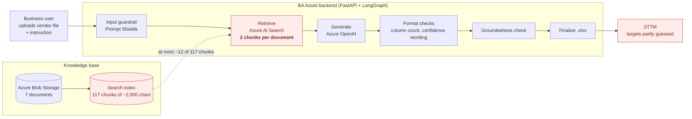
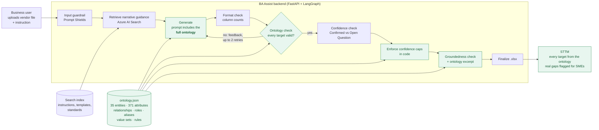
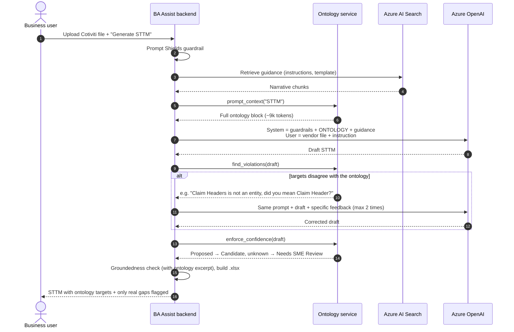
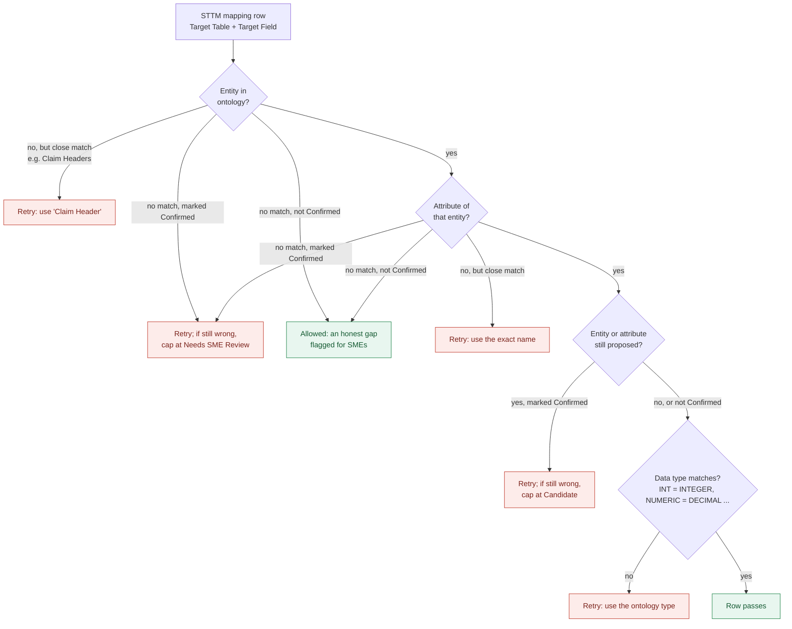
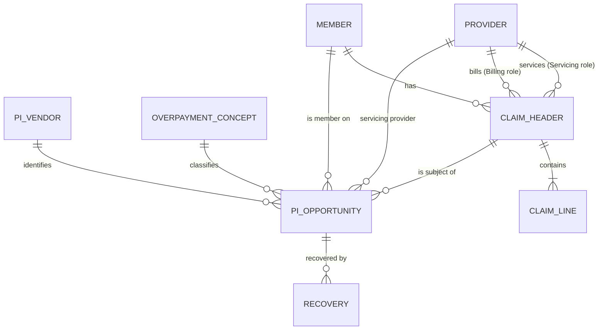
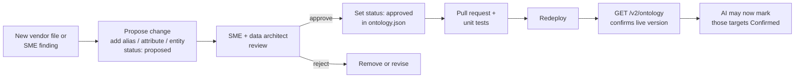

# BA Assist: Ontology for STTM Generation

**Purpose:** Explain why BA Assist needs an ontology, where the knowledge gap was, how the ontology now works in the pipeline, and what has been proven so far.
**Audience:** CTO and technology leadership; also the product owner, Payment Integrity SMEs, data architects and engineering.
**Status:** Built and wired into the backend. Unit-tested and verified with a simulated run, but **not yet measured on live generations**. The Payment Integrity part of the ontology is a **draft** that SMEs must approve (§8).
**Evidence base:** The knowledge-base documents in Azure Blob Storage, as indexed by Azure AI Search index `rag-1788391708053` (checked 2026-10-01), and the code in this repository (2026-10-02).

---

## 1. Summary

**What BA Assist does.** A business user uploads a vendor file, such as a Cotiviti overpayment file. BA Assist drafts a Source-to-Target Mapping (STTM) by mapping each source column to a field in the **enterprise canonical model**, the approved entities and attributes in the Payer Data Dictionary.

**What was wrong.** It couldn't do that reliably, for two reasons:

| | Gap | Effect |
|---|---|---|
| 1 | **The canonical model has no Payment Integrity entities.** For the Cotiviti file, 6 of 14 columns had nothing to map to, and they're the overpayment-specific ones. | The AI had to invent target tables and fields. The enterprise instruction document forbids exactly that. |
| 2 | **The AI saw only ~3% of the data dictionary.** Search returns 2 chunks per document, and the dictionary is 64 chunks. | Even existing targets were often missing from the AI's view, so the same file could map differently on each run. |

**What we built.** A **lightweight ontology**: the full data dictionary plus Payment Integrity entities, relationships, provider roles, vendor aliases, allowed values and business rules, kept in one JSON file ([`ontology.json`](ontology.json)). The backend now:

1. **gives the AI the whole ontology** on every STTM and FRD request, instead of search fragments;
2. **checks every target the AI writes** against the ontology, and sends the draft back for correction if a target is wrong;
3. **enforces in code** that nothing unapproved ships as "Confirmed".

**What it needs.** No new database, platform or licence. It runs on the existing FastAPI, LangGraph and Azure OpenAI stack.

**Expected result for the Cotiviti file.** All 14 columns get a target from the ontology, against 6 before. 8 can be "Confirmed" now. The other 6 stay "Candidate" until SMEs approve the Payment Integrity entities.

**Decisions needed (§12):** approve the approach, name an ontology owner, and get SME sign-off on the Payment Integrity entities.

---

## 2. Before: how STTM generation worked

**Where it broke (red).** Search is good for narrative guidance, such as how an FRD should be structured. It fails for a **reference model**: to pick the right target, the AI has to see *every* candidate attribute, not the 2 best-matching chunks. Nothing after generation checked targets against the model either. The checks only covered format: column counts and confidence wording.

---

## 3. The gaps in detail

### Gap 1: No Payment Integrity entities in the canonical model

The Payer Data Dictionary has **31 entities and 327 attributes** across Member, Enrollment, Provider, Claims, Pricing, Prior Authorization, Clinical, Quality, Risk Adjustment, Utilization, Value-Based Contracting and Care Management. **None of them is a Payment Integrity entity.** There is no Opportunity, Overpayment Concept, Audit, Recovery or Vendor.

The enterprise instruction document *names* a PI "Opportunity" entity, but gives only a sentence of example fields: no attribute names, types or keys. The glossary defines 16 PI *terms*, such as Overpayment, Recovery and Recoupment, but terms are definitions, not target fields.

**Mapping coverage for the Cotiviti file (`Input.xlsx`, 14 columns, 30 rows):**

| # | Source column | Best target in the old dictionary | Before | With ontology |
|---|---|---|---|---|
| 1 | Claim Number | Claim Header · `Claim_ID` | ✅ | ✅ Confirmed |
| 2 | Paid Date | Claim Header · `Paid_Date` | ✅ | ✅ Confirmed |
| 3 | Total Paid Amount | Claim Header · `Total_Paid_Amount` | ✅ | ✅ Confirmed |
| 4 | Total Allowed Amount | Claim Header · `Total_Allowed_Amount` | ✅ | ✅ Confirmed |
| 5 | Subscriber ID | Member · `Subscriber_ID` | ✅ | ✅ Confirmed |
| 6 | Member Unique ID | Member · `Member_ID` | ✅ likely | ✅ Confirmed (alias + rule PI-R3) |
| 7 | Servicing Provider NPI | Provider · `NPI` | ⚠️ no servicing role | ✅ Confirmed (Servicing role) |
| 8 | Servicing Provider Name | Provider · `Provider_Name` | ⚠️ no servicing role | ✅ Confirmed (Servicing role) |
| 9 | Dependent Number | — | ❌ | 🟡 Member · `Dependent_Sequence` (Candidate) |
| 10 | Source Adjustment Number | — | ❌ | 🟡 PI Opportunity · `Source_Adjustment_Number` (Candidate) |
| 11 | Total Refund Amount | — | ❌ | 🟡 PI Opportunity · `Identified_Overpayment_Amount` (Candidate) |
| 12 | Total Correct Amount | — | ❌ | 🟡 PI Opportunity · `Corrected_Paid_Amount` (Candidate) |
| 13 | Audit Type | — | ❌ | 🟡 PI Opportunity · `Audit_Type` (Candidate) |
| 14 | Overpayment Concept Name | — | ❌ | 🟡 Overpayment Concept · `Concept_Name` (Candidate) |

🟡 = the target exists in the ontology but is still `proposed`. It becomes "Confirmed" once SMEs approve it, with no code change.

### Gap 2: Retrieval sends only a small slice of each document

Measured from the live index:

| Document | Chunks in index | Characters | Sent to the AI per request | Share seen |
|---|---|---|---|---|
| Payer Data Dictionary + Glossary (`.xlsx`) | 64 | ~123,000 | 2 | **~3%** |
| PI Enterprise Instruction Document | 39 | ~75,000 | 2 | ~5% |
| "Data Mapping Standards and Framework" | 6 | ~11,000 | 2 | ~33% |
| Feature Template | 4 | ~7,000 | 2 | ~50% |
| User Story Template | 2 | ~3,000 | 2 | 100% |
| STTM Data Ingestion Template | 1 | ~900 | 1 | 100% |
| Sample Adjudication Rules | 1 | ~1,900 | 1 | 100% |

The two documents that matter most for mapping are the ones the AI saw least of. Spreadsheet chunks also split rows away from their column headers, so a retrieved chunk can show `Total_Paid_Amount | DECIMAL | …` without saying which entity it belongs to.

### Gap 3: Relationships and roles aren't modelled

- **Provider roles:** Claim Header only has `Billing_Provider_Key`, although the vendor file supplies a *Servicing* provider and the Reporting Standards say *"Always identify: Billing / Rendering / Attending / Servicing Provider."*
- **Subscriber and dependent:** Member has no dependent sequence, so `Dependent Number` had nowhere to go.
- **Missing document:** the instruction document cites a **`Healthcare_Payer_Enterprise_Logical_Data_Model`** (relationships, grain, subject areas). It isn't in Blob Storage or the index.

### Gap 4: Document quality issues

| Issue | Where | Effect |
|---|---|---|
| The file is titled "Data Mapping Standards and Framework" but contains the **Reporting Standards** | Knowledge base | There are no actual mapping standards |
| The only example STTM is **Risk Adjustment** | Knowledge base | There's no Payment Integrity example to copy |
| `Effective_Date` is listed twice | Dictionary · Fee Schedule | Ambiguous attribute |
| Trailing spaces in names (`"First Name "`, `"Gender "`) | Dictionary · Member | Exact matching fails |
| Claim Line's FK is `Claim_Key`, but Claim Header's key is `Claim_Header_Key` | Dictionary · Claims | The join is unclear |
| 7 FKs point at entities that don't exist (Subscriber, Network Tier, Geography, Contract, Pricing Rule, Care Manager, Program) | Dictionary · various | Those joins can't be mapped |
| 2 attributes are marked as FKs with no target (`Member.Subscriber_ID`, `Patient.Enterprise_Person_ID`) | Dictionary · Member / Patient | The relationship is unclear |

All of these are recorded in `ontology.json` under `knownIssues` (15 open items), so they're tracked rather than lost.

### What these gaps caused

- **Invented targets** for the six overpayment columns, which the instruction document forbids.
- **Different answers on each run**, because a different 2-chunk slice could be retrieved each time.
- **Meaningless confidence labels:** "Confirmed / Candidate / Needs SME Review" can't be judged when the target model isn't visible.
- **SME rework:** reviewers fixed mappings instead of confirming them, which removes the value of a first draft.

---

## 4. What "ontology" means here

An **ontology** is a formal, machine-usable description of the business domain: what exists, what it's called, how things relate, and which rules apply. Ours has seven parts:

| Part | Question it answers | Example | Count in `ontology.json` |
|---|---|---|---|
| **Entities** | What business objects exist? | Claim Header, Member, **PI Opportunity** | 35 (31 approved, 4 proposed) |
| **Attributes** | What fields, with what type? | `PI Opportunity.Identified_Overpayment_Amount` DECIMAL | 371 (326 approved, 45 proposed) |
| **Relationships** | How do entities connect? | PI Opportunity → Claim Header (many-to-one) | 44 |
| **Roles** | Which *kind* of link? | Claim → Provider as **Servicing** vs **Billing** | 5 |
| **Aliases** | What do vendors call this field? | "Total Refund Amount", "Refund Amt" → `Identified_Overpayment_Amount` | 14 groups |
| **Value sets** | Which values are allowed? | Audit Type ∈ {Coordination of Benefits, DRG Validation, …} | 5 |
| **Rules** | What must always be true? | Corrected Paid = Paid − Overpayment | 5 |

Every item carries `"status": "approved"` (copied from the Payer Data Dictionary) or `"proposed"` (the draft PI extension). That status is what the pipeline enforces (§5).

---

## 5. After: how the ontology is applied now

### 5.1 The pipeline with the ontology

**Green = new or changed.** The ontology enters the pipeline at four points:

| # | Where | What happens | Code |
|---|---|---|---|
| 1 | **Prompt** | The whole ontology (~36,000 characters, ~9,000 tokens) is placed in the system message as a `CANONICAL ONTOLOGY` block, with binding instructions: use only these entity and attribute names, take types and definitions from them, never mark a `proposed` item "Confirmed", raise unmatched columns as Open Questions. Search still supplies the narrative documents. | `ontology_service.prompt_context()` → `prompt_templates.build_system_message()` |
| 2 | **Validation** | Each STTM mapping row is checked against the ontology (§5.3). Problems go back to the AI as specific feedback, up to 2 times. | `ontology_service.find_violations()` in `graph.generate_node` |
| 3 | **Enforcement** | Whatever the AI does, a proposed target ships as "Candidate" at most, and a target not in the ontology as "Needs SME Review" at most, each with a written-out Open Question. | `ontology_service.enforce_confidence()` |
| 4 | **Groundedness** | The ontology entities the draft uses are added as a grounding source, so rows taken from the ontology aren't scored as "made up". | `ontology_service.grounding_excerpt()` in `graph.groundedness_node` |

It applies to **STTM and FRD**, on both `/v2/generate` and the older `/generate`. Agile artifacts don't name target fields, so they don't get it.

### 5.2 One request, step by step

### 5.3 How each mapping row is checked

The code never renames a target by itself: guessing a replacement in code could silently map a field to the wrong place. It only asks the AI to correct names, and it only enforces confidence levels.

---

## 6. Before vs after

| | Before | After |
|---|---|---|
| What the AI sees of the target model | 2 chunks of the dictionary (~3%) | **100%**: every entity, attribute, relationship, role, alias, value set and rule |
| Payment Integrity targets | None | 4 proposed entities (PI Opportunity, Overpayment Concept, PI Vendor, Recovery) + 2 additions to existing entities |
| Cotiviti columns with a target | 6 of 14 | **14 of 14** (8 Confirmed now, 6 Candidate until SMEs approve) |
| Vendor naming differences | AI guesses | 14 alias groups map vendor names to canonical fields |
| Joins | AI guesses | 44 relationships + 5 provider roles given as Join Logic |
| Validation rules in the STTM | Generic | 5 business rules + 5 value sets, cited by ID (e.g. `PI-R1`) |
| Check that targets exist | None | Every row checked; up to 2 corrective retries |
| "Confirmed" on an unapproved target | Possible | **Impossible**: enforced in code |
| Onboarding a new vendor | Prompt or code changes | Add alias rows to `ontology.json` |
| Run-to-run consistency | Depends on which chunks are retrieved | The same full model every time |

### Worked example: one column

Source column **"Total Refund Amount"** from the Cotiviti file.

**Before** (illustrative, showing the failure the gaps lead to, not a captured output):

| Target Table | Target Field Name | Target Data Type | Mapping Confidence | Open Question |
|---|---|---|---|---|
| Overpayment_Fact | Refund_Amt | NUMBER | Confirmed | N/A |

The table and field are invented, the type isn't in the dictionary, and the row claims to be "Confirmed". An SME has to catch and fix all of this.

**After** (the ontology gives the target through the alias, and the code enforces the confidence cap):

| Target Table | Target Field Name | Target Data Type | Mapping Confidence | Open Question |
|---|---|---|---|---|
| PI Opportunity | Identified_Overpayment_Amount | DECIMAL | Candidate | Confirm PI Opportunity.Identified_Overpayment_Amount: it is a proposed ontology item awaiting SME approval. |

The target is real, the type is correct, and the confidence is honest. The SME's job becomes *approve the PI Opportunity entity once*, not *fix every file*.

---

## 7. Proof: what has been verified

| Claim | How it was verified | Result |
|---|---|---|
| The AI saw only ~3% of the dictionary | Chunk counts read from the live Azure AI Search index; `CHUNKS_PER_DOCUMENT = 2` in `azure_search_service.py` | ✅ Measured |
| 6 of 14 Cotiviti columns had no target | Each column of `Input.xlsx` compared with the 327 dictionary attributes | ✅ Measured |
| Business rules PI-R1 to PI-R4 hold | Checked against all 30 rows of `Input.xlsx` (synthetic sample) | ✅ 30/30 rows; 9/9 providers |
| The ontology reaches the prompt for STTM/FRD, and not for Agile | Unit tests | ✅ |
| Wrong names, unknown targets, proposed-but-Confirmed rows and type mismatches are detected | 20 unit tests in `tests/test_ontology_service.py`, run against the real `ontology.json` | ✅ 20/20 pass |
| The retry and enforcement loop works end to end | `generate_node` run with a stubbed AI. The first draft had `Claim Headers` (misspelled) and a proposed target marked Confirmed. The retry fixed the name; the AI kept "Confirmed"; the code capped it at "Candidate", wrote the Open Question and logged telemetry | ✅ Verified (simulated AI) |
| Better STTMs on real generations | Phase 5 (§10): before/after on 3–5 vendor files | ⏳ **Not yet measured** |

**Telemetry for ongoing proof.** Each draft that still disagrees with the ontology after the retries logs an `ontology_violations_unresolved` event to Azure Monitor, listing the type of each problem and the target it affects. Its rate over time is the production measure of how well the AI follows the ontology.

---

## 8. Ontology content (DRAFT Payment Integrity extension, needs SME approval)

> **Machine-readable version:** [`ontology.json`](ontology.json) holds all of this plus the full existing dictionary.
> ⚠️ Everything in this section is a **proposal**, worked out from `Input.xlsx` and the instruction document's "PI Canonical Entity" guidance. Until SMEs approve it, the pipeline caps it at "Candidate".

### 8.1 New Payment Integrity entities

**PI Opportunity**: one overpayment finding on one claim, from one vendor.

| Attribute | Type | Key | Description |
|---|---|---|---|
| Opportunity_Key | INTEGER | PK | Surrogate key |
| Opportunity_ID | VARCHAR(50) | | Business key |
| Vendor_Key | INTEGER | FK → PI Vendor | Vendor that identified the finding |
| Claim_Header_Key | INTEGER | FK → Claim Header | Claim the finding applies to |
| Member_Key | INTEGER | FK → Member | Member on the claim |
| Servicing_Provider_Key | INTEGER | FK → Provider | Servicing provider on the claim |
| Concept_Key | INTEGER | FK → Overpayment Concept | Why it's an overpayment |
| Audit_Type | VARCHAR(50) | | Audit category (value set 8.4) |
| Source_Adjustment_Number | VARCHAR(50) | | Vendor's own adjustment/recovery reference |
| Identified_Overpayment_Amount | DECIMAL(12,2) | | Amount identified for refund |
| Corrected_Paid_Amount | DECIMAL(12,2) | | Paid amount after correction |
| Opportunity_Status | VARCHAR(30) | | Identified, Validated, Disputed, Recovered, Closed |
| Confidence_Score | DECIMAL(5,2) | | Vendor or engine confidence |
| Source_System, Effective_Date, Termination_Date | | | Standard lineage and effective-dating fields |

**Overpayment Concept**: why a payment is wrong. Concept_Key (PK), Concept_ID, Concept_Name, Concept_Category, Default_Audit_Type, Description.

**PI Vendor**: the recovery or audit vendor. Vendor_Key (PK), Vendor_ID, Vendor_Name (e.g. Cotiviti), Audit_Program, File_Frequency.

**Recovery**: money actually recovered against an opportunity. Recovery_Key (PK), Recovery_ID, Opportunity_Key (FK), Recovery_Method (Refund, Offset, Recoupment), Recovered_Amount, Recovery_Date, Recovery_Status.

### 8.2 Changes to existing entities

| Entity | Proposed addition | Why |
|---|---|---|
| Member | `Dependent_Sequence` VARCHAR(2) (00 = subscriber) | Gives `Dependent Number` a target |
| Claim Header | `Servicing_Provider_Key` INTEGER FK → Provider | Records the servicing role the input supplies |
| Claim Line | Rename the FK `Claim_Key` → `Claim_Header_Key` | Matches the Claim Header key name |
| Fee Schedule | Remove the duplicate `Effective_Date` | Removes the ambiguity |
| All | Trim spaces from attribute names | Lets names match exactly |

### 8.3 Relationships (the graph)

### 8.4 Value sets (values seen in `Input.xlsx`)

| Value set | Values |
|---|---|
| **Audit Type** (8) | Clinical Coding Review · Contract Compliance · Coordination of Benefits · DRG Validation · Duplicate Claim Review · Eligibility Review · Payment Policy Review · Post-Payment Audit |
| **Overpayment Concept** (11) | COB Primary Payer Identified · DRG Downcode Adjustment · Duplicate Payment · Incorrect Contract Rate · Incorrect Provider Specialty Pricing · Member Not Eligible on DOS · Overlapping Inpatient Stay · Place of Service Mismatch · Prior Authorization Not Found · Unbundled Procedure Code · Units Billed Exceed Policy Limit |
| **Dependent Sequence** | 00 (subscriber), 01, 02, 03 … |
| **Opportunity Status** | Identified · Validated · Disputed · Recovered · Closed |
| **Recovery Method** | Refund · Offset · Recoupment |

SMEs should also define **which concepts belong to which audit type**. In the sample the pairings vary; for example, "DRG Validation" appears with "Prior Authorization Not Found".

### 8.5 Aliases (vendor names → canonical fields)

| Vendor column (Cotiviti) | Other likely vendor names | Canonical target |
|---|---|---|
| Claim Number | Claim ID, Clm Nbr, ICN | Claim Header · `Claim_ID` |
| Source Adjustment Number | Adjustment ID, Recovery Ref | PI Opportunity · `Source_Adjustment_Number` |
| Total Refund Amount | Overpayment Amount, Refund Amt | PI Opportunity · `Identified_Overpayment_Amount` |
| Total Correct Amount | Corrected Paid, Revised Paid | PI Opportunity · `Corrected_Paid_Amount` |
| Audit Type | Audit Category, Review Type | PI Opportunity · `Audit_Type` |
| Overpayment Concept Name | Concept, Finding Reason | Overpayment Concept · `Concept_Name` |
| Servicing Provider NPI | Rendering NPI, Svc Prov NPI | Provider · `NPI` (role = Servicing) |
| Dependent Number | Dep Seq, Member Suffix | Member · `Dependent_Sequence` |

Each new vendor adds rows here, not code. This meets the Feature Template's "onboard new vendors without hard-coding" goal.

### 8.6 Business rules (checked against `Input.xlsx`)

| ID | Rule | Holds in sample | Use in STTM |
|---|---|---|---|
| PI-R1 | `Corrected_Paid_Amount = Total_Paid_Amount − Identified_Overpayment_Amount` (±0.01) | ✅ 30/30 rows | Validation rule |
| PI-R2 | `Identified_Overpayment_Amount ≤ Total_Paid_Amount` | ✅ 30/30 rows | Validation rule; reject if broken |
| PI-R3 | `Member_ID = "MUID-" + last 5 of Subscriber_ID + "-" + Dependent_Sequence` | ✅ 30/30 rows | Derivation and member-match check |
| PI-R4 | One NPI always has the same provider name | ✅ 9/9 providers | Reference consistency check |
| PI-R5 | Opportunity audit type matches the concept's default audit type | ⚠️ varies | SMEs to define the mapping |

> These rules hold in the **synthetic** sample. SMEs should confirm they're real business rules.

---

## 9. Options considered, and why no graph database

| Option | What it is | Fixes Gap 1 (no PI model) | Fixes Gap 2 (AI sees ~3%) | Effort | Decision |
|---|---|---|---|---|---|
| A. More search chunks | Raise 2 → 10 chunks per document | ❌ | Partly; still incomplete and costlier | Low | Not enough |
| **B. Lightweight ontology** | Dictionary + PI entities + relationships, roles, aliases, value sets, rules in JSON, **given to the AI in full** and validated in code | ✅ | ✅ | Medium | **Chosen, and built** |
| C. Knowledge graph | Ontology in a graph database (Neo4j, Cosmos DB Gremlin), queried at run time | ✅ | ✅ | High; new platform, skills, cost | Not needed at this scale |

**Why B is enough:** the whole model is ~9,000 tokens, a small part of `gpt-4.1-mini`'s context window. There's nothing to search, so the AI gets the complete model every time.

**Is it a graph? Yes.** `ontology.json` already *is* a graph: the 35 entities are the nodes, and the 44 relationships and 5 roles are the edges. The AI receives the edges as a RELATIONSHIPS section and uses them for Join Logic. A graph **database** only adds run-time storage and querying of that graph. It becomes worth it if:

| Trigger | Why a graph database would then help |
|---|---|
| Hundreds of entities, or a separate model per client | The model no longer fits in the prompt and must be queried selectively |
| Multi-step questions at run time, e.g. "which reports break if `Paid_Date` changes?" | Graph queries handle chains of relationships |
| Lineage across many STTMs (source → Bronze → Silver → Gold → report) | Lineage is naturally a graph |
| Several teams editing at once, with versioning and access control per entity | A database handles this better than a file |

None of these apply today. `ontology.json` can be loaded into a graph database later without changes, so starting with the file costs nothing.

---

## 10. Governance: how the ontology is updated

- **Proposed items are usable straight away**, but they're capped at "Candidate", so nothing unapproved is presented as final.
- **Approval is a one-word change** (`proposed` → `approved`) with no code change. Every change goes through a pull request, so git gives a full audit trail.
- **Inspect what's live:** `GET /v2/ontology` returns the version and counts by status, `?view=full` the JSON, and `?view=prompt` the exact text the AI receives.

### Implementation plan and status

| Phase | Work | Owner | Status |
|---|---|---|---|
| **1. Load in full** | Give the AI the whole model on every STTM/FRD request | Engineering | ✅ Built |
| **2. PI model** | Review and approve §8: PI entities, changes to existing entities, value sets, aliases, rules | PI SMEs + data architect | ⏳ Waiting on SMEs |
| **3. Validate + enforce** | Target check with retries, confidence caps, groundedness excerpt, `/v2/ontology` endpoint, telemetry | Engineering | ✅ Built |
| **4. Fill the knowledge base** | Add the Logical Data Model; add one approved PI example STTM; rename or replace "Data Mapping Standards and Framework"; fix the dictionary issues in Gap 4 | SMEs / BA lead | ⏳ Open |
| **5. Measure** | Same 3–5 vendor files before vs after: target coverage, run-to-run consistency, fields SMEs had to correct, `ontology_violations_unresolved` rate | BA lead + engineering | ⏳ Open; needs Phase 1 and 3 (done) |

---

## 11. Costs, risks and limits

| Item | Detail | Mitigation |
|---|---|---|
| **Token cost** | ~9,000 extra input tokens on each STTM/FRD AI call, repeated on each retry | No new infrastructure. Agile is excluded. Retries happen only when a violation is found. |
| **Latency** | Each corrective retry is one more AI call (other retries in this pipeline take ~20s each) | At most 2 ontology retries; the code cap guarantees the key outcome without more retries |
| **The AI may still use a wrong name** | The check catches it, but the code won't rename a target by itself | Logged in telemetry; the confidence cap stops it from shipping as "Confirmed" |
| **Updates need a redeploy** | The ontology is a file in the repo, read at startup | Fine at the current rate of change. `ONTOLOGY_PATH` lets it move to Blob Storage later. |
| **One shared model** | Every project uses the same ontology today | Per-project extensions can be added when a second project needs its own entities (decision 5) |
| **Validation covers the STTM mapping table** | FRDs get the ontology in the prompt but have no table to check | Acceptable: FRDs are narrative |
| **The PI content is a draft** | Built from one synthetic vendor sample | SME approval (Phase 2); capped at "Candidate" until then |

---

## 12. Decisions needed

1. **Approve the approach:** a lightweight ontology (built), not more search chunks or a graph database.
2. **Name the owner** of the canonical model and ontology: who approves new entities and aliases?
3. **Confirm the PI entities in §8.1**, especially whether *Recovery* should be separate from *PI Opportunity*.
4. **Confirm the business rules in §8.6**, and define which concepts belong to which audit type.
5. **Shared vs per-project:** which parts are enterprise-wide (Member, Claim, Provider) and which are specific to one project (PI concepts)?
6. **Supply the missing documents:** the Logical Data Model, and one approved PI example STTM.

---

## Appendix A: Evidence

| Source | What was checked |
|---|---|
| `Input.xlsx` (Cotiviti sample) | 14 columns, 30 rows; mapping coverage (§3); rules and value sets (§8.4, §8.6) |
| `Payer_Data_Dictionary_Glossary_of_Terms.csv.xlsx` | 31 entities / 327 attributes; 16 PI glossary terms; no PI entities |
| `Healthcare_Payer_Data_Reporting_PI_Enterprise_Instruction_Document.docx` | PI canonical entity guidance; "never invent" rule; required reference sources |
| `Data Mapping Standards and Framework.docx` | Contains the Reporting Standards, not mapping standards |
| `output_STTM_RA_VendorABC_DataLake_Ingestion_v1.0.xlsx` | The only example STTM is Risk Adjustment |
| `Feature Template.docx`, `User Story Template.docx` | Canonical mapping, confidence scoring and "no hard-coding" requirements |
| Azure AI Search index `rag-1788391708053` | Chunk counts and sizes per document (§3 Gap 2) |
| `app/services/azure_search_service.py` | `CHUNKS_PER_DOCUMENT = 2` |
| `tests/test_ontology_service.py` | 20 unit tests against the real `ontology.json` |

## Appendix B: Where it lives in the code

| File | Role |
|---|---|
| [`ontology.json`](ontology.json) | The ontology itself (override the location with `ONTOLOGY_PATH`) |
| [`app/services/ontology_service.py`](app/services/ontology_service.py) | Load, render the prompt block, validate, enforce, grounding excerpt, summary |
| [`app/services/prompt_templates.py`](app/services/prompt_templates.py) | Adds the `CANONICAL ONTOLOGY` section to the system message |
| [`app/graph.py`](app/graph.py) | `generate_node`: ontology retry loop and enforcement; `groundedness_node`: ontology excerpt |
| [`app/main.py`](app/main.py) | Older `/generate`: ontology in the prompt; loads the ontology at startup |
| [`app/routergenerator.py`](app/routergenerator.py) | `GET /v2/ontology` |

## Appendix C: Glossary

| Term | Meaning |
|---|---|
| **STTM** | Source-to-Target Mapping: which source field feeds which target field, and how it's transformed and validated. |
| **Canonical model** | The enterprise's single approved set of entities and attributes that every source is mapped into. |
| **Ontology** | The canonical model plus relationships, roles, aliases, allowed values and rules, in a form a machine can use. |
| **Knowledge graph** | An ontology stored in a graph database and queried at run time. Not needed at this scale (§9). |
| **Chunk** | A ~2,000-character piece of a document stored in the search index. |
| **Retrieval / RAG** | Looking up relevant chunks and giving them to the AI with the request. |
| **Grounding** | Making the AI's output rely on supplied source material instead of its general knowledge. |
| **Proposed / approved** | An ontology item's status. Only approved items can be mapped as "Confirmed". |
