# BA Assist: Ontology for STTM Generation

**Purpose:** Explain why BA Assist needs an ontology, where the knowledge gap was, how the ontology now works in the pipeline, and what has been proven so far.
**Audience:** CTO and technology leadership; also the product owner, Payment Integrity SMEs, data architects and engineering.
**Status:** Built and wired into the backend. Unit-tested and run live on two vendor files; a before/after measurement on more files is still open. The Payment Integrity part of the ontology is a **draft** that SMEs must approve (§8).
**Evidence base:** The knowledge-base documents in Azure Blob Storage, as indexed by Azure AI Search index `rag-1788391708053` (checked 2026-10-01), and the code in this repository (updated 2026-10-05).

**Changes on 2026-10-05:**
- **Medical Claims is no longer a separate project.** The vendor3 claim-line file is one more Payment Integrity input, and `medical-claims.json` has been merged into `payment-integrity.json` (v0.2.0).
- **"Confirmed" now needs evidence in code.** A column matched to its target by description alone is capped at "Candidate".
- **Every column of every uploaded sheet now reaches the STTM.** A column the AI still drops after its retries is added as a "Needs SME Review" row.

See §5, "Where `ontology.json` comes from" and "How a vendor column is matched".

---

## 1. Summary

**What BA Assist does.** A business user uploads a vendor file, such as a Cotiviti overpayment file. BA Assist drafts a Source-to-Target Mapping (STTM) by mapping each source column to a field in the **enterprise canonical model**, the approved entities and attributes in the Payer Data Dictionary.

**What was wrong.** It couldn't do that reliably, for two reasons:

| | Gap | Effect |
|---|---|---|
| 1 | **The canonical model has no Payment Integrity entities.** For the Cotiviti file, 6 of 14 columns had nothing to map to, and they're the overpayment-specific ones. | The AI had to invent target tables and fields. The enterprise instruction document forbids exactly that. |
| 2 | **The AI saw only ~3% of the data dictionary.** Search returns 2 chunks per document, and the dictionary is 64 chunks. | Even existing targets were often missing from the AI's view, so the same file could map differently on each run. |

**Where the ontology came from.** The common templates collection in Blob Storage includes the enterprise **Payer Data Dictionary and Glossary of Terms** workbook (`Payer_Data_Dictionary_Glossary_of_Terms.csv.xlsx`). RAG (Azure AI Search) could not give the AI that workbook properly. It returned 2 chunks of 64, so the AI never saw most of the target fields. We therefore brought the same dictionary into a JSON file, `ontology.json`, which is given to the AI **whole** on every request. The JSON also holds what the dictionary lacks: the project's extra fields, vendor aliases, allowed values, business rules and guardrails.

**What we built.** A **lightweight ontology per project**, not per input file. All projects share the same templates (STTM, Feature, User Story). A project gets its own JSON file only if its target fields and rules differ. Today one exists: **Payment Integrity** ([`ontology/excellus/payment-integrity.json`](ontology/excellus/payment-integrity.json)). It covers every vendor file the project receives, including the Cotiviti overpayment file and the vendor3 claim-line file. A new vendor file needs **no new ontology**. §5.0 shows the end-to-end architecture. The backend now:

1. **gives the AI the project's whole ontology** on every STTM and FRD request, instead of search fragments;
2. **checks every target the AI writes** against the ontology, and sends the draft back for correction if a target is wrong;
3. **enforces in code** that nothing unapproved and nothing matched by description alone ships as "Confirmed";
4. **guarantees every column of every uploaded sheet appears in the STTM**, either mapped or as a row for SME review.

**What it needs.** No new database, platform or licence. It runs on the existing FastAPI, LangGraph and Azure OpenAI stack.

**Expected result for the Cotiviti file.** All 14 columns get a target from the ontology, against 6 before. A row is "Confirmed" only when the column name *is* the target's name (e.g. "Paid Date" → `Paid_Date`) or an SME-approved alias. Every other row stays "Candidate" until SMEs approve the Payment Integrity entities and aliases.

**Decisions needed (§12):** approve the approach, name an ontology owner, and get SME sign-off on the Payment Integrity entities.

---

## The complete cycle, step by step

This section is the walkthrough to present. It follows one request from upload to download, says **who** does each step, and gives the evidence behind it. For the code-level detail (the exact prompt, every check, retry limits, telemetry), see [DRAFTING_AND_CHECKS.md](DRAFTING_AND_CHECKS.md). For how users, roles and client/project assignments decide which documents and ontology are used, see [ACCESS_AND_PROJECT_MAPPING.md](ACCESS_AND_PROJECT_MAPPING.md). Example: a user assigned to **Payment Integrity** uploads the Cotiviti overpayment file and ticks **STTM**.

### End-to-end flow

```
┌──────────────────────────────────────────────────────────────┐
│ 1. Business user upload                                      │
│──────────────────────────────────────────────────────────────│
│ • One or more vendor Excel files                             │
│   - data sheet                                               │
│   - the vendor's own Data Dictionary sheet (column meanings) │
│ • User instruction ("Create STTM for the attached file")     │
│ • Ticked outputs: STTM / FRD / Agile                         │
└──────────────────────────────────────────────────────────────┘
                               │
                               ▼
┌──────────────────────────────────────────────────────────────┐
│ 2. Security and access validation                            │
│──────────────────────────────────────────────────────────────│
│ • Project authorization: the user's admin-assigned project   │
│   (not assigned → 403)                                       │
│ • Prompt Shields: jailbreak / prompt injection in the        │
│   instruction and in the uploaded files                      │
│ • File parsing: .xlsx (every sheet), .docx, .pdf, .txt       │
└──────────────────────────────────────────────────────────────┘
                               │
                               ▼
═══════════════ GATHER KNOWLEDGE (three sources) ═══════════════

┌──────────────────────────────────────────────────────────────┐
│ 3. Common enterprise documents  →  Azure AI Search (RAG)     │
│──────────────────────────────────────────────────────────────│
│ Hybrid keyword + vector search, filtered to the common root  │
│ + the project's own folder; 2 best chunks per document       │
│ • STTM Data Ingestion Template (sections, 22 columns)        │
│ • Feature and User Story templates (Agile)                   │
│ • Instruction document (enterprise guardrails, standards)    │
│ • Data Mapping / Reporting Standards                         │
│ (FRD: structure comes from the prompt; no FRD template yet)  │
│ ROLE: how to WRITE the document                              │
└──────────────────────────────────────────────────────────────┘
┌──────────────────────────────────────────────────────────────┐
│ 4. Project ontology (JSON)  →  read WHOLE, not searched      │
│──────────────────────────────────────────────────────────────│
│ Blob <client>/<project>/ontology.json, repo copy if Blob is  │
│ unavailable; never another project's                         │
│ Built from the Payer Data Dictionary + Glossary workbook:    │
│ • Entities (35)            • Aliases (45)                    │
│ • Attributes (387)         • Value sets (9)                  │
│ • Relationships (44)       • Business rules (11)             │
│ • Provider roles (5)       • Guardrails (18)                 │
│ • Known issues (18)        • Status: approved / proposed     │
│ ROLE: what to MAP TO                                         │
└──────────────────────────────────────────────────────────────┘
┌──────────────────────────────────────────────────────────────┐
│ 5. Upload information  →  every sheet of every file          │
│──────────────────────────────────────────────────────────────│
│ • Column names (header row found under any title rows)       │
│ • Source descriptions (vendor Data Dictionary sheet)         │
│ • Sample rows                                                │
│ ROLE: what to MAP FROM                                       │
└──────────────────────────────────────────────────────────────┘
                               │
                               ▼
═══════════════════════ AI GENERATION ══════════════════════════

┌──────────────────────────────────────────────────────────────┐
│ 6. Prompt assembly                                           │
│──────────────────────────────────────────────────────────────│
│ System message = guardrails                                  │
│                + COMPLETE ontology block (~11k tokens)       │
│                + retrieved template and standards            │
│ User message   = instruction + uploaded files (all sheets)   │
│                + STTM format rules                           │
└──────────────────────────────────────────────────────────────┘
                               │
                               ▼
┌──────────────────────────────────────────────────────────────┐
│ 7. Azure OpenAI (gpt-4.1-mini) drafts the STTM               │
│──────────────────────────────────────────────────────────────│
│ All 4 sections: Summary · Mapping · Assumptions and Open     │
│ Questions · SME Checklist                                    │
│ For each source column:                                      │
│     source description   VS   ontology attribute definition  │
│     (aliases speed up well-known names; not required)        │
│ Business rules are cited in the Validation Rule column       │
└──────────────────────────────────────────────────────────────┘
                               │
                               ▼
═════════════ VALIDATION LOOP (deterministic code) ═════════════

┌──────────────────────────────────────────────────────────────┐
│ 8. Structure check                                           │
│ ✓ Every row has the right number of columns                  │
└──────────────────────────────────────────────────────────────┘
                               │
┌──────────────────────────────────────────────────────────────┐
│ 9. Ontology validation                                       │
│ ✓ Target entity and attribute exist (no invented targets;    │
│   a close match gets "did you mean …")                       │
│ ✓ Data type matches the ontology (INT = INTEGER …)           │
│ ✓ Confidence is Confirmed / Candidate / Needs SME Review     │
│ ✓ No proposed (unapproved) target marked Confirmed           │
│ ✓ Coverage: every column of every uploaded sheet is mapped   │
│   or raised as an open question (first draft only)           │
└──────────────────────────────────────────────────────────────┘
                               │
┌──────────────────────────────────────────────────────────────┐
│ 10. Contradiction check                                      │
│ ✓ No Confirmed row that also carries an open question        │
│ ✓ Open questions written in full, not "see Q004"             │
└──────────────────────────────────────────────────────────────┘
                               │
                ┌──────────────┴──────────────┐
                ▼                             ▼
          Check fails                   Check passes
                │                             │
                ▼                             │
  ┌──────────────────────────────┐            │
  │ Specific feedback to the LLM │            │
  │ → back to step 7             │            │
  │ structure, contradictions: 3 │            │
  │ ontology checks: 2 retries   │            │
  └──────────────────────────────┘            │
                │ retries used up             │
                └──────────────┬──────────────┘
                               ▼
════════════ CONFIDENCE ENGINE (code has the last word) ════════

┌──────────────────────────────────────────────────────────────┐
│ 11. Enforce, whatever the AI wrote                           │
│──────────────────────────────────────────────────────────────│
│ • Column still missing     → row added: target TBD,          │
│                              Needs SME Review                │
│ • Target not in ontology   → at most Needs SME Review        │
│ • Invalid confidence value → Needs SME Review                │
│ • Proposed target          → at most Candidate               │
│ • Matched by description   → at most Candidate               │
│   only, or proposed alias                                    │
│ • Confirmed ONLY when the column name = field name, or an    │
│   approved alias links them                                  │
│ Every capped row gets a written-out open question saying why │
│ Unresolved problems → telemetry (Azure Monitor)              │
└──────────────────────────────────────────────────────────────┘
                               │
                               ▼
═══════════════════════════ OUTPUT ═════════════════════════════

┌──────────────────────────────────────────────────────────────┐
│ 12. Groundedness (Azure AI Content Safety, indicative)       │
│ 13. Fill the real STTM_Data_Ingestion_Template.xlsx          │
│ 14. User reviews, refines (same session) and downloads       │
└──────────────────────────────────────────────────────────────┘
```

**Two guarantees come out of steps 9–11, whatever the AI writes:** every column of every uploaded sheet appears in the STTM, and nothing unproven is marked Confirmed.

### The three kinds of knowledge

| Kind | Documents | Shared? | How the backend uses it |
|---|---|---|---|
| **Format and rules** | `STTM_Data_Ingestion_Template.xlsx`, Feature and User Story templates, `Healthcare_Payer_Data_Reporting_PI_Enterprise_Instruction_Document.docx` (the collection of guardrails and standards), Data Mapping Standards | Common to every project (root of `sharepoint-docs`) | Searched with **Azure AI Search** for the relevant parts; the STTM template file itself is filled for download |
| **Target model** | `Payer_Data_Dictionary_Glossary_of_Terms.csv.xlsx` (in the templates collection), converted into the project's **`ontology.json`**, plus that project's extra fields, relationships, roles, aliases, value sets, rules and guardrails | One file per project, shared by all of the project's input files | Given to the AI **whole**, and used by code to check the draft |
| **Source** | The vendor Excel files the user uploads (one or several): each data sheet **and its own Data Dictionary sheet** (what each column means) | Per request | Read in full, every sheet of every file |

### The cycle

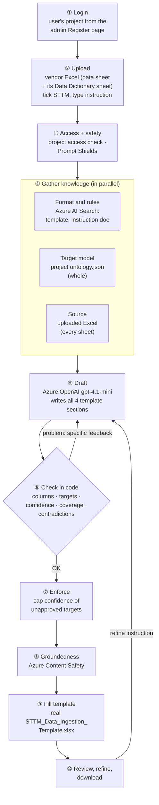

| # | Step | Who does it | What happens | Code |
|---|---|---|---|---|
| ① | **Login** | Backend + Cosmos DB | The user signs in. Their client and project (e.g. Excellus / Payment Integrity) come from the admin Register page; there's no project picker on the main page. | `auth_router.py`, `/v2/auth/me/projects` |
| ② | **Upload** | User | Uploads the vendor Excel, ticks STTM, types an instruction ("Create STTM for the attached vendor file layout"). The Excel holds the data sheet **and** its Data Dictionary sheet, e.g. *Total Paid Amount: Original amount paid for the claim*. | `RequestForm.jsx` → `POST /v2/generate` |
| ③ | **Access and safety** | Backend; Azure AI Content Safety | Rejects a user who isn't assigned to the project (403). **Prompt Shields** checks the instruction and the uploaded file for jailbreak / prompt-injection attempts. | `check_project_access`, `input_guardrail_node` |
| ④a | **Format and rules** | **Azure AI Search** | Hybrid (keyword + vector) search, filtered to the common root plus the project's own folder. Returns the 2 most relevant chunks of each document: the **STTM template** (sections, 22 columns) and the **instruction document's rules**. | `azure_search_service.retrieve_grounding` |
| ④b | **Target model** | Backend | Loads **this project's** `ontology.json`: Blob `sharepoint-docs/<client>/<project>/ontology.json` first (e.g. `excellus/payment-integrity/`), the repo copy if Blob is unavailable. Never another project's. | `ontology_service.get_ontology` |
| ④c | **Source** | Backend | Reads every sheet of the uploaded Excel: column names, sample rows, and the vendor's Data Dictionary descriptions. | `file_extraction.extract_text` |
| ⑤ | **Draft** | **Azure OpenAI (gpt-4.1-mini)**, orchestrated by LangGraph | One prompt combines everything. **System message:** the guardrails, the whole project ontology (target fields, aliases, relationships, rules, project guardrails), and the search results. **User message:** the instruction, the full vendor file, and the STTM format rules. The model writes all four sections: Summary, Mapping, Assumptions and Open Questions, SME Checklist. | `graph.generate_node` → `openai_service.generate_document` |
| ⑥ | **Check in code** | Backend (deterministic, no AI) | Every row is checked; any problem goes back to the model with a specific correction, then is re-checked (details below). | `draft_repair.py`, `ontology_service.find_violations`, `find_unmapped_source_columns` |
| ⑦ | **Enforce** | Backend | Whatever the model did, each of these gets a written-out open question:<br/>• a vendor column still missing after the retries is added as a **Needs SME Review** row with target `TBD`;<br/>• a column matched only by description (its name is neither the target's name nor an approved alias) is at most **Candidate**;<br/>• an unapproved (`proposed`) target is at most **Candidate**;<br/>• a target not in the ontology is at most **Needs SME Review**;<br/>• an invalid confidence value becomes **Needs SME Review**. | `ontology_service.add_unmapped_rows`, `enforce_confidence` |
| ⑧ | **Groundedness** | Azure AI Content Safety | Scores how traceable the draft is to its sources (search results + the ontology entities it uses). Recorded with the result; indicative only (it reads the first 7,000 characters). | `groundedness_node` |
| ⑨ | **Fill the template** | Backend | Opens the real `STTM_Data_Ingestion_Template.xlsx` and writes the summary next to its labels and every row under its headers, keeping its banner, styling and layout. Stamps today's date. | `template_service`, `xlsx_builder.fill_template` |
| ⑩ | **Review, refine, download** | User | Reviews on screen. A refine instruction (e.g. "add a validation rule to the Units row") goes back through ④–⑨ on the same session, editing only what was asked. **Download Excel** returns the filled template. | `/v2/refine/{session}`, `/v2/download/{session}` |

### Step ⑤ in detail: who plans and who drafts

There is **no separate planning agent**. The plan is a **fixed pipeline** written in code with LangGraph, the same for every request: safety → gather → draft → check → enforce → groundedness → fill. Only the drafting step uses AI.

| | Responsibility |
|---|---|
| **LangGraph (code)** | Decides the order of steps, runs the checks, decides when to send a draft back, saves each session (Cosmos DB) so it can be refined later |
| **Azure OpenAI gpt-4.1-mini** | Drafting only: reads the vendor columns and their descriptions, picks each column's target from the ontology **by meaning**, and writes the STTM rows, assumptions and open questions |
| **Code checks** | Judge the draft; the model never grades its own work |

**How the model picks a target:** it compares the vendor's description of a column with the definition of every target attribute in the ontology. Aliases help with well-known names but aren't required, so a column can be called anything. Tested live: "Total Paid Amount" renamed to "rajneesh" still mapped to `Claim Header.Total_Paid_Amount` through its description, marked Candidate for SME confirmation; with the description removed, it was raised as an open question instead of guessed.

**Why the code doesn't trust a description match:** matching by meaning means the AI can always find a field that *sounds* close, even for a column that means nothing. So the code decides the confidence ceiling, not the AI. A row can be "Confirmed" only when the code finds **evidence**: the source column's name is the target attribute's name, or an SME-approved alias of it. Anything matched by description alone is capped at "Candidate", and the open question says so (§5, "How a vendor column is matched").

### Step ⑥ in detail: the checks

| Order | Check | Catches | Retries |
|---|---|---|---|
| 1 | **Column count** | A row missing a `|`, which shifts every later column | up to 3 |
| 2 | **Ontology targets** | A target entity/attribute not in this project's ontology (with "did you mean"); a data type different from the ontology | up to 2 (shared with 3–5) |
| 3 | **Confidence values** | Anything other than Confirmed / Candidate / Needs SME Review | ″ |
| 4 | **Unapproved targets** | A `proposed` target marked Confirmed | ″ |
| 5 | **Coverage** | A column of any uploaded spreadsheet (2 or more columns; title rows above the header are skipped) neither mapped nor raised as an open question. First draft only; on a refine the analyst may drop a column on purpose. | ″, then **added in code** as a `TBD` / Needs SME Review row |
| 6 | **Contradictions** | A Confirmed row that also has an open question; a bare "Q004" instead of the actual question | up to 3 |
| 7 | **Evidence for Confirmed** | A row marked Confirmed whose source column is neither the target's name nor an approved alias, i.e. matched by description only | none (a retry can't add evidence); **capped at Candidate in code** |
| 8 | **Duplicates** | The same row emitted twice | fixed in code |

### What each project's ontology contains

`ontology.json` is the **Payer Data Dictionary, converted**, plus what the dictionary doesn't have:

| Part | Source | Example |
|---|---|---|
| 31 entities, 326 attributes (`approved`) | Payer Data Dictionary, row by row: entity, attribute, definition, type, length, PK/FK, nullable, privacy, example | `Claim Header.Total_Paid_Amount` DECIMAL, "Total paid amount" |
| Relationships | Derived from the dictionary's foreign keys | Claim Line → Claim Header (many-to-one) |
| Provider roles | Instruction document reporting standards | Billing vs Servicing provider |
| Project fields (`proposed`) | Fields the project needs that the dictionary lacks | PI Opportunity (from the Cotiviti file); `Claim_Line_Status` (from the vendor3 claim-line file) |
| Aliases | Vendor sample files | "Total Refund Amount" → `PI Opportunity.Identified_Overpayment_Amount` |
| Value sets | Vendor sample files | Audit Type: DRG Validation, Duplicate Claim Review … |
| Rules | Checked against vendor sample data | PI-R1: corrected paid = paid − overpayment |
| Guardrails | Copied from the instruction document | PI-G2: never invent source tables or fields |
| Known issues | Problems found in the dictionary or samples | Duplicate `Effective_Date` in Fee Schedule |

The Payer Data Dictionary stays the official source; the JSON is its machine-readable copy plus the project's extras. The glossary part of the workbook (term definitions such as Overpayment, Recovery, Recoupment) informed the definitions of the proposed PI fields; terms themselves aren't target fields.

### Results (live, 2026-10-03/04)

| | Before | Now |
|---|---|---|
| vendor3 claim-line file (37 vendor columns) | Hand-made reference STTM targets fields that don't exist in the dictionary (`Claim_Line.Claim_Number`, `Provider.Billing_Provider_NPI`) | **37/37** columns covered; **36/36** targets exist in the ontology (run 2026-10-03, when it was still a separate Medical Claims project; its fields are now in the Payment Integrity ontology) |
| Cotiviti overpayment file (14 vendor columns) | 6 columns had no target; first live run dropped 5 columns and put question text in Mapping Confidence | **14/14** covered, across PI Opportunity, Claim Header, Member, Provider; confidence values all valid |
| Template | Workbook rebuilt in the browser | The real template file, filled |
| Refine | "Add a rule to the Units row" left a duplicate row and reverted the edit | Edited in place |
| Renamed column ("rajneesh") | — | Mapped by description; raised as an open question when no description exists. Since 2026-10-05 a description-only match can't be "Confirmed" (capped at Candidate in code). |
| Tests | — | 50 ontology unit tests pass (70 across ontology, registry, template and draft-repair tests) |

⏳ **Not yet re-run live** after the 2026-10-05 changes: both vendor files under the single Payment Integrity ontology.

### Recommended changes still open

| # | Change | Why |
|---|---|---|
| 1 | **Stop retrieving the Payer Data Dictionary through search** | Today search still returns 2 chunks of it on every request, though the ontology already holds it complete. Excluding it saves prompt space and removes a second, partial copy. |
| 2 | **Shared `ontology-core.json` + small project files** (once a second project needs an ontology) | About 85% of a project file is the copied dictionary; with more than one project, a dictionary change would have to be repeated in each |
| 3 | **Project folder in Blob** (`excellus/payment-integrity/`) with its `ontology.json` | Today everything sits at the root and the ontology loads from the repo copy |
| 4 | **Indexer schedule and deletion detection** | New Blob files are only searchable after a manual run; deleted ones leave stale chunks |
| 5 | **FRD Word template (instruction doc §13 prefers Word)** | The FRD prompt now produces the 17 §19 sections with ontology-checked Data Requirements, and the Agile prompt adds §22 user stories to the Feature template; both still export as a plain workbook |
| 6 | **SMEs approve aliases** (`proposed` → `approved`) | All 45 aliases are still `proposed`, so today only columns named exactly like their target can be "Confirmed" |

---

## 2. Before: how STTM generation worked

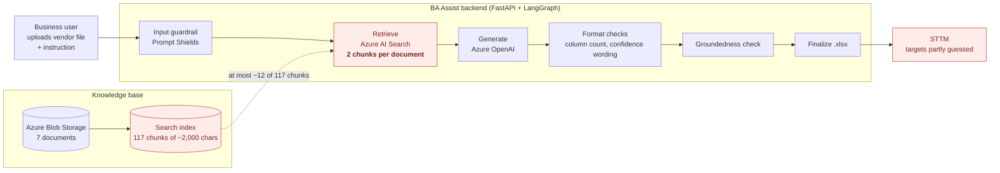

**Where it broke (red).** Search is good for narrative guidance, such as how an FRD should be structured. It fails for a **reference model**: to pick the right target, the AI has to see *every* candidate attribute, not the 2 best-matching chunks. Nothing after generation checked targets against the model either. The checks only covered format: column counts and confidence wording.

---

## 3. The gaps in detail

### Gap 1: No Payment Integrity entities in the canonical model

The Payer Data Dictionary has **31 entities and 327 attributes** across Member, Enrollment, Provider, Claims, Pricing, Prior Authorization, Clinical, Quality, Risk Adjustment, Utilization, Value-Based Contracting and Care Management. **None of them is a Payment Integrity entity.** There is no Opportunity, Overpayment Concept, Audit, Recovery or Vendor.

The enterprise instruction document *names* a PI "Opportunity" entity, but gives only a sentence of example fields: no attribute names, types or keys. The glossary defines 16 PI *terms*, such as Overpayment, Recovery and Recoupment, but terms are definitions, not target fields.

**Mapping coverage for the Cotiviti file (`Input.xlsx`, 14 columns, 30 rows):**

| # | Source column | Best target in the old dictionary | Before | With ontology |
|---|---|---|---|---|
| 1 | Claim Number | Claim Header · `Claim_ID` | ✅ | 🔵 Candidate until its alias is approved |
| 2 | Paid Date | Claim Header · `Paid_Date` | ✅ | ✅ Confirmed |
| 3 | Total Paid Amount | Claim Header · `Total_Paid_Amount` | ✅ | ✅ Confirmed |
| 4 | Total Allowed Amount | Claim Header · `Total_Allowed_Amount` | ✅ | ✅ Confirmed |
| 5 | Subscriber ID | Member · `Subscriber_ID` | ✅ | ✅ Confirmed |
| 6 | Member Unique ID | Member · `Member_ID` | ✅ likely | 🔵 Candidate until its alias is approved (rule PI-R3) |
| 7 | Servicing Provider NPI | Provider · `NPI` | ⚠️ no servicing role | 🔵 Candidate until its alias is approved (Servicing role) |
| 8 | Servicing Provider Name | Provider · `Provider_Name` | ⚠️ no servicing role | 🔵 Candidate until its alias is approved (Servicing role) |
| 9 | Dependent Number | — | ❌ | 🟡 Member · `Dependent_Sequence` (Candidate) |
| 10 | Source Adjustment Number | — | ❌ | 🟡 PI Opportunity · `Source_Adjustment_Number` (Candidate) |
| 11 | Total Refund Amount | — | ❌ | 🟡 PI Opportunity · `Identified_Overpayment_Amount` (Candidate) |
| 12 | Total Correct Amount | — | ❌ | 🟡 PI Opportunity · `Corrected_Paid_Amount` (Candidate) |
| 13 | Audit Type | — | ❌ | 🟡 PI Opportunity · `Audit_Type` (Candidate) |
| 14 | Overpayment Concept Name | — | ❌ | 🟡 Overpayment Concept · `Concept_Name` (Candidate) |

🟡 = the target exists in the ontology but is still `proposed`. It becomes "Confirmed" once SMEs approve it, with no code change.
🔵 = the target is approved, but the column name differs from it, and the alias linking them is still `proposed`. Since 2026-10-05 the code allows "Confirmed" only with name or approved-alias evidence, so approving the alias makes it "Confirmed".
✅ Confirmed = the column's name is the target's name ("Paid Date" → `Paid_Date`).

### Gap 2: Retrieval sends only a small slice of each document

Measured from the live index:

| Document | Chunks in index | Characters | Sent to the AI per request | Share seen |
|---|---|---|---|---|
| Payer Data Dictionary + Glossary (`.xlsx`) | 64 | ~123,000 | 2 | **~3%** |
| PI Enterprise Instruction Document | 39 | ~75,000 | 2 | ~5% |
| "Data Mapping Standards and Framework" | 6 | ~11,000 | 2 | ~33% |
| Feature Template | 4 | ~7,000 | 2 | ~50% |
| User Story Template | 2 | ~3,000 | 2 | 100% |
| STTM Data Ingestion Template | 1 | ~900 | 1 | 100% |
| Sample Adjudication Rules | 1 | ~1,900 | 1 | 100% |

The two documents that matter most for mapping are the ones the AI saw least of. Spreadsheet chunks also split rows away from their column headers, so a retrieved chunk can show `Total_Paid_Amount | DECIMAL | …` without saying which entity it belongs to.

### Gap 3: Relationships and roles aren't modelled

- **Provider roles:** Claim Header only has `Billing_Provider_Key`, although the vendor file supplies a *Servicing* provider and the Reporting Standards say *"Always identify: Billing / Rendering / Attending / Servicing Provider."*
- **Subscriber and dependent:** Member has no dependent sequence, so `Dependent Number` had nowhere to go.
- **Missing document:** the instruction document cites a **`Healthcare_Payer_Enterprise_Logical_Data_Model`** (relationships, grain, subject areas). It isn't in Blob Storage or the index.

### Gap 4: Document quality issues

| Issue | Where | Effect |
|---|---|---|
| The file is titled "Data Mapping Standards and Framework" but contains the **Reporting Standards** | Knowledge base | There are no actual mapping standards |
| The only example STTM is **Risk Adjustment** | Knowledge base | There's no Payment Integrity example to copy |
| `Effective_Date` is listed twice | Dictionary · Fee Schedule | Ambiguous attribute |
| Trailing spaces in names (`"First Name "`, `"Gender "`) | Dictionary · Member | Exact matching fails |
| Claim Line's FK is `Claim_Key`, but Claim Header's key is `Claim_Header_Key` | Dictionary · Claims | The join is unclear |
| 7 FKs point at entities that don't exist (Subscriber, Network Tier, Geography, Contract, Pricing Rule, Care Manager, Program) | Dictionary · various | Those joins can't be mapped |
| 2 attributes are marked as FKs with no target (`Member.Subscriber_ID`, `Patient.Enterprise_Person_ID`) | Dictionary · Member / Patient | The relationship is unclear |

All of these are recorded in the Payment Integrity ontology under `knownIssues` (15 open items), so they're tracked rather than lost.

### What these gaps caused

- **Invented targets** for the six overpayment columns, which the instruction document forbids.
- **Different answers on each run**, because a different 2-chunk slice could be retrieved each time.
- **Meaningless confidence labels:** "Confirmed / Candidate / Needs SME Review" can't be judged when the target model isn't visible.
- **SME rework:** reviewers fixed mappings instead of confirming them, which removes the value of a first draft.

---

## 4. What "ontology" means here

An **ontology** is a formal, machine-usable description of the business domain: what exists, what it's called, how things relate, and which rules apply. Each project's ontology has eight parts (counts are for Payment Integrity):

| Part | Question it answers | Example | Count (Payment Integrity) |
|---|---|---|---|
| **Entities** | What business objects exist? | Claim Header, Member, **PI Opportunity** | 35 (31 approved, 4 proposed) |
| **Attributes** | What fields, with what type? | `PI Opportunity.Identified_Overpayment_Amount` DECIMAL | 387 (326 approved, 61 proposed) |
| **Relationships** | How do entities connect? | PI Opportunity → Claim Header (many-to-one) | 44 |
| **Roles** | Which *kind* of link? | Claim → Provider as **Servicing** vs **Billing** | 5 |
| **Aliases** | What do vendors call this field? | "Total Refund Amount", "Refund Amt" → `Identified_Overpayment_Amount` | 45 groups (Cotiviti + vendor3) |
| **Value sets** | Which values are allowed? | Audit Type ∈ {Coordination of Benefits, DRG Validation, …} | 9 |
| **Rules** | What must always be true? | Corrected Paid = Paid − Overpayment | 11 (PI-R6 to R11 for claim-line files) |
| **Guardrails** | Which project rules must every output follow? | "Never invent source tables…"; "missing target column → Set as Default Value" | 18 (PI-G1 to G12 from the instruction document; G13 to G18 for claim-line files) |

Every item carries `"status": "approved"` (copied from the Payer Data Dictionary) or `"proposed"` (the draft PI extension). That status is what the pipeline enforces (§5).

---

## 5. After: how the ontology is applied now

### In plain words: one request, start to finish

Take a user assigned to **Payment Integrity** who uploads `vendor3_medical_claims_claim_line.xlsx` (or the Cotiviti file, or both at once) and ticks **STTM**.

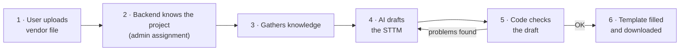

| Step | What happens | Where the information comes from |
|---|---|---|
| 1 | The user uploads the vendor file and gives an instruction | The user |
| 2 | The backend looks up which project the user belongs to: Payment Integrity | Admin Register page (Cosmos DB) |
| 3a | It reads the **template and the rules documents**: what an STTM looks like, how to write it | **Common** documents in Blob, found through **Azure AI Search** |
| 3b | It reads the **project's ontology**: which target fields exist for this project, what vendors call them, which rules apply | **`payment-integrity.json`**, read whole (the same file whichever vendor file is uploaded) |
| 3c | It reads the **vendor files**: every sheet, column and sample row of each | The upload |
| 4 | Azure OpenAI writes the STTM using all three | — |
| 5 | Code checks every row: does the target field exist in the ontology? Is every vendor column mapped? Is Mapping Confidence valid? Is an unapproved field, or a description-only match, marked "Confirmed"? Problems go back to the AI, up to 2 times; then the code adds any still-missing column as an SME row and caps confidence where needed. | The ontology |
| 6 | The backend writes the result into the real `STTM_Data_Ingestion_Template.xlsx` and the user downloads it | Common template |

**The one-line summary:** search supplies *how to write* the document (the shared templates and rules). The ontology supplies *what to map to* (this project's target fields). The vendor file supplies *what to map from*.

### Which document plays which role

| Document | Side | Role |
|---|---|---|
| `Payer_Data_Dictionary_Glossary_of_Terms.csv.xlsx` (common) | **Target** | The enterprise canonical model: entity, attribute, definition, type, keys, privacy. It's the source of every `approved` item in the project ontologies. |
| `Healthcare_Payer_Data_Reporting_PI_Enterprise_Instruction_Document.docx` (common) | **Rules** | The collection of guardrails and standards: STTM rules (§10, §20), FRD (§13, §19), Agile (§15, §22), data quality, security, guardrails. Search supplies parts of it; the STTM-relevant rules are also copied into each project ontology's `guardrails`, so none are missed. |
| `STTM_Data_Ingestion_Template.xlsx`, Feature and User Story templates (common) | **Format** | What the output looks like. The STTM template file itself is filled for download. |
| The vendor file the user uploads, including its own **Data Dictionary** sheet | **Source** | What each vendor column *means*, e.g. "Total Paid Amount: Original amount paid for the claim". |

### Where `ontology.json` comes from, and why RAG wasn't enough

The common templates collection in Blob Storage holds, next to the STTM, Feature and User Story templates, an Excel workbook with the enterprise **data dictionary and glossary of terms**: `Payer_Data_Dictionary_Glossary_of_Terms.csv.xlsx`. It is the canonical target model, with every entity and attribute, its definition, type, keys and privacy class.

At first that workbook reached the AI only through **RAG** (Azure AI Search), like every other document. RAG could not fill the need:

| What mapping needs | What RAG gave |
|---|---|
| **Every** candidate target field, so the AI can pick the right one | The 2 best-matching chunks of 64, about 3% of the workbook |
| Each attribute together with its entity | Spreadsheet chunks that split rows from their headers (`Total_Paid_Amount \| DECIMAL \| …` with no entity) |
| The same model on every run | A different slice per request, so the same file mapped differently |

So we **brought the same dictionary into `ontology.json`**:

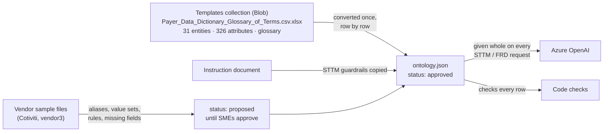

| Question | Answer |
|---|---|
| Is it built from AI Search results at run time? | **No.** It was curated once from the documents and is read whole. Search keeps doing what it's good at: the narrative documents (templates, instruction document). |
| Is it built from the uploaded files or the request? | **No.** The request only decides *which* project's ontology is loaded. Uploaded files are checked against it, never written into it. |
| Do we write a new one for each new input file? | **No.** One per project. A new vendor file is mapped against the same ontology, by meaning; columns it can't place become SME rows. SMEs may later add its column names as aliases. |
| What still comes through RAG? | The template structure, the instruction document's rules and the standards. The dictionary is also still indexed (see "Recommended changes still open" #1). |

### How hybrid search works, and what it gives us

Azure AI Search supplies the **common documents**: the templates, the instruction document's guardrails, and the standards. Every search is **hybrid**: the same query runs as a keyword search and as a vector search, and Azure merges the two rankings. (The ontology and the uploaded files are not searched; they are given whole.)

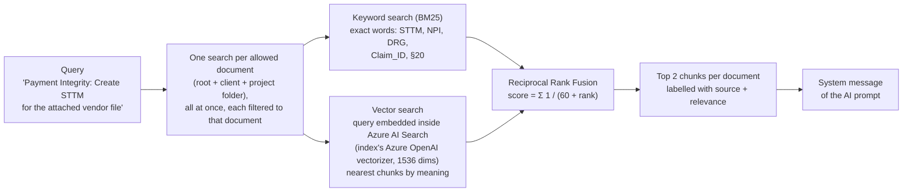

**Step by step** ([`azure_search_service.py`](app/services/azure_search_service.py)):

| # | Step | Detail |
|---|---|---|
| 1 | **Build the query** | The project name plus the user's instruction, e.g. `Payment Integrity: Create STTM for the attached vendor file layout` |
| 2 | **Pick the documents** | Only those in the container root, the client's folder and the project's folder; another project's files are never searched |
| 3 | **Search each document separately, in parallel** | Each search is filtered to one document's path, so every document contributes; a strongly matching document can't crowd the others out |
| 4 | **Keyword ranking** | Full-text (BM25) over the chunk text: rewards the exact words of the query |
| 5 | **Vector ranking** | Azure AI Search embeds the query with the same Azure OpenAI vectorizer that embedded the chunks at indexing time, and finds the nearest chunks by meaning. The backend never calls an embedding model or holds its key. |
| 6 | **Fuse** | Reciprocal Rank Fusion: each chunk scores `1/(60 + its keyword rank) + 1/(60 + its vector rank)`. A chunk that ranks well in **both** wins. |
| 7 | **Keep the top 2 per document** | Labelled `[Source: <document> \| relevance <score>]` and placed in the AI's system message. A failed search is retried once; a document that still returns nothing is logged. |

#### Example: why fusion picks better chunks

Illustrative ranks, not measured. Query: `Payment Integrity: Create STTM for the attached vendor file layout`, searched in the instruction document.

| Chunk of the instruction document | Keyword rank | Vector rank | Fused score (RRF) | Kept? |
|---|---|---|---|---|
| **A.** §10 STTM rules: "…Source-to-Target Mapping… if a target column has no source, Set as Default Value…" | 1 (contains "STTM") | 2 | 1/61 + 1/62 = **0.0325** | ✅ 1st |
| **B.** §20 Mapping confidence: "…Confirmed, Candidate, Needs SME Review… never invent source fields…" | 5 (few query words) | 1 (same meaning: mapping a vendor layout) | 1/65 + 1/61 = **0.0318** | ✅ 2nd |
| **C.** A section on Payment Integrity reporting KPIs: "…Payment Integrity recovery rate…" | 2 (repeats "Payment Integrity") | 9 (different topic) | 1/62 + 1/69 = **0.0306** | ❌ |

- **Keyword search alone** would keep A and **C**: C only *repeats the words* "Payment Integrity", and the mapping-confidence rules in B would be lost.
- **Vector search alone** finds A and B here, but misses exact terms in other requests (below).
- **Hybrid** keeps A and B, the two chunks that actually govern an STTM.

#### What we gain from hybrid search

| Request contains | Keyword search alone | Vector search alone | Hybrid |
|---|---|---|---|
| Exact codes and names: "NPI", "DRG", "COB", `Claim_ID`, "§20" | ✅ finds them exactly | ⚠️ may return text that is merely *about* providers or claims | ✅ |
| Paraphrase: "map the vendor layout" vs a document that says "source-to-target mapping" | ❌ different words, no match | ✅ same meaning | ✅ |
| A generic word repeated everywhere ("claim", "Payment Integrity") | ⚠️ over-ranks any chunk that repeats it | ✅ judges the topic | ✅ fusion demotes it |
| A refine instruction: "add a validation rule to the Units row" | ✅ "validation rule" | ✅ validation-standards text | ✅ both agree, high confidence |

Further benefits of how we run it:
- **Every document contributes**, through one filtered search per document instead of one blended top-k.
- **Project isolation**: the folder filter means another project's documents never ground this one.
- **Request-specific context**: chunks are chosen for *this* instruction and never cached across requests (only the list of documents is cached, for 15 minutes).
- **No embedding code in the backend**: the query is embedded inside Azure AI Search by the same vectorizer as the index, so the query and chunks always use the same model.

**Limits, and why the ontology isn't searched:** hybrid search still returns **2 chunks per document**. That is right for guidance, where the best two passages are enough, but wrong for the target model, where the AI must see all 387 fields. The semantic ranker is configured on the index but **not used**: when tested it added about 100 ms and ranked the STTM template lower than plain hybrid for an STTM query. There is no relevance floor yet (`MIN_RELEVANCE_SCORE = 0`), because fused scores aren't on a 0–1 scale; one can be set once typical scores for this index are known.

### How a vendor column is matched, even if it's renamed

Matching is done by **meaning, not by name**. The AI is given the vendor's description of each column (from the file's Data Dictionary sheet) **and** the definition of every target attribute (from the project ontology), and it pairs them up. Aliases only speed up the common, well-named cases; they aren't required.

**Tested live (2026-10-04):** "Total Paid Amount" in the Cotiviti file was renamed to **"rajneesh"**.

| Test | What the vendor file contained | Result |
|---|---|---|
| A | Column "rajneesh", and its Data Dictionary row: *"Original amount paid for the claim."* | Mapped to **`Claim Header.Total_Paid_Amount`**, marked **Candidate**, with the note *"Field named 'rajneesh' in source represents original paid amount per data dictionary"* and an open question for an SME to confirm |
| B | Column "rajneesh", **no** Data Dictionary sheet | **Not guessed.** Raised as an open question: *"'rajneesh' is numeric but no matching target attribute found; needs SME clarification"* |

That's the intended behaviour: map by meaning when the source explains itself, and never invent a mapping when it doesn't (guardrail PI-G2, "never invent"). **Practical rule for vendors:** a Data Dictionary sheet with a one-line description per column is what makes a mapping reliable, whatever the columns are called.

**The risk, and how the code now handles it (2026-10-05).** Matching by meaning means the AI can always find a field that *sounds* right, even for a meaningless column. In test A the AI chose "Candidate" itself, but nothing in code forced it to. Now the **code** decides whether "Confirmed" is allowed, from evidence the AI can't invent:

#### Mapping Confidence: every case, with examples

The comparison is between the **vendor column name** and the **ontology field name**. Names are compared ignoring case, spaces and underscores, so `Claim ID` = `Claim_ID`. The STTM template's 22 columns (Mapping ID, Source Field, Target Field Name…) are only the output layout and are never compared.

| # | Situation | Vendor column (example) | Target the system picks | Name same as field? | Approved alias? | Target field approved? | **Result** | What the SME does |
|---|---|---|---|---|---|---|---|---|
| 1 | Exact name | `Paid Date` | `Claim Header.Paid_Date` | ✅ Yes | — | ✅ Yes | **Confirmed** | Nothing |
| 2 | Different name, alias approved | `Clm Nbr` *(after SME approval)* | `Claim Header.Claim_ID` | ❌ No | ✅ Yes | ✅ Yes | **Confirmed** | Nothing |
| 3 | Different name, alias not yet approved | `Claim Number` | `Claim Header.Claim_ID` | ❌ No | ❌ Proposed | ✅ Yes | **Candidate** | Tick yes/no; approve the alias once |
| 4 | Different name, matched by description | `rajneesh` ("Original amount paid for the claim") | `Claim Header.Total_Paid_Amount` | ❌ No | ❌ None | ✅ Yes | **Candidate** | Tick yes/no |
| 5 | Target field itself not approved | `Total Refund Amount` | `PI Opportunity.Identified_Overpayment_Amount` | ❌ No | ❌ Proposed | ❌ Proposed | **Candidate** | Approve the PI field once |
| 6 | AI picked a field that doesn't exist | `Refund Amt` | `Overpayment_Fact.Refund_Amt` (invented) | — | — | ❌ Not in ontology | **Needs SME Review** | Name the right field |
| 7 | Column not mapped at all | `rajneesh` (no description) | `TBD` (added by the code) | — | — | — | **Needs SME Review** | Say where it goes, or "out of scope" |
| 8 | Target needs a value but the file has no column | *(none)* | e.g. `Claim Header.Source_System` | — | — | ✅ Yes | **Needs SME Review** | Confirm the default value |

**The rule in one line:**
- **Confirmed**: the code can prove the match (exact name or approved alias).
- **Candidate**: a real target exists, but the match can't be proven yet (different name, or the field or alias isn't approved).
- **Needs SME Review**: there is no real target (invented, missing, or no source column).

A different column name alone never sends a row to Needs SME Review. It only drops the row from Confirmed to Candidate.

| | Candidate | Needs SME Review |
|---|---|---|
| SME's job | **Verify** a proposed answer | **Supply** the answer |
| Effort | Seconds: a tick | Analysis, maybe a question to the vendor |
| After SME approval in the ontology | Becomes Confirmed automatically on the next run | Becomes Candidate or Confirmed once the target or alias is added |

Every Candidate and Needs SME Review row carries an Open Question that says why, for example "source column 'rajneesh' was matched to it by description only", or "Source column '…' in <file> has no target in this draft".

The result for any sheet, from any vendor:
- **every column** of every uploaded sheet appears in the STTM;
- **nothing matched by description alone** is ever presented as "Confirmed";
- the SME sees **why** each row needs review.

The code never renames a target itself; it only limits the confidence.

**Where Azure AI Search fits:** search doesn't do the column matching. It retrieves the **common documents** (template, instruction-document rules, standards) so the AI knows *how* to write the STTM. The *what maps to what* comes from the vendor descriptions plus the project ontology, both given in full.

### One JSON file per project, not per input file

**Why the ontology can't come from search like the templates do.** To choose the right target for a vendor column, the AI has to see **every** possible target field. Search returns only the 2 best-matching pieces of each document, about 3% of the data dictionary. That's fine for "what does an STTM look like", but not for "which of 387 fields is the right one". So the target model is given to the AI whole, as a JSON file.

**Why per project, not per file.** A project receives many vendor files, of different shapes, and the client can send several in one request. Writing an ontology for each file isn't workable, and isn't needed: the target model (where the data must land) is the same for all of them. Only the *source* differs, and the AI reads each source with its own Data Dictionary sheet. So:

| Changes when… | What to do |
|---|---|
| A new vendor file arrives for an existing project | **Nothing.** Upload it; columns are matched by meaning, and anything unplaced becomes an SME row. Optionally, SMEs add its column names as aliases afterwards. |
| SMEs confirm a mapping | Add or approve the alias in the project's file (`proposed` → `approved`); that column is "Confirmed" from then on. |
| A new **project** with different target fields or rules | Create one file for that project from `ontology/_template.json`. A project without one still works, without the target checks. |

**Example: Medical Claims was folded into Payment Integrity (2026-10-05).** The vendor3 claim-line file was first set up as its own "Medical Claims" project with its own `medical-claims.json`. It is really one more Payment Integrity input, so its content was merged into `payment-integrity.json` and the project removed:

| Merged from the claim-line file | Into `payment-integrity.json` v0.2.0 |
|---|---|
| 16 claim-line fields (`Claim_Line_Status`, `Billed_Date`, `Modifier_1`, `Place_of_Service_Code`, provider `Tax_ID`, `Specialty` …) | `proposed` attributes on Claim Line, Claim Header, Member, Provider |
| 36 column names | 31 new aliases. 3 clashed ("Paid Date", "Payment Date", "Check Date" already mean `Claim Header.Paid_Date`); guardrail PI-G18 sends line-level dates to Claim Line on claim-line files instead |
| 6 rules (grain, service dates, paid ≤ allowed, reversals, NPI format) | PI-R6 to PI-R11, each marked "Claim-line files:" |
| Privacy, Tax ID encryption, leading zeros, billing/servicing roles, grain | Guardrails PI-G13 to PI-G18 |
| 4 value sets, 2 sample-data conflicts | Value sets; `knownIssues` |

A test now fails if any column name ever maps to two different targets.

**The copied dictionary.** About 85% of the file is the enterprise dictionary. With one project that's fine. If a second project needs its own ontology, the cleaner design is **one shared core file plus a small file per project**, merged at load time:

```
sharepoint-docs/
├── ontology-core.json                        ← enterprise dictionary, once (31 entities, 326 attributes)
└── excellus/payment-integrity/ontology.json  ← only PI's 61 fields, 45 aliases, 11 rules, 18 guardrails
```

**Who maintains what:**

| File | Owner | Changes when |
|---|---|---|
| Common templates and documents (Blob root) | BA lead | The enterprise template or standards change |
| Enterprise dictionary (core) | Data architect | A canonical entity or attribute is added or changed |
| Project ontology | Project SMEs | SMEs approve a proposed field or alias (`proposed` → `approved`), or a rule changes |

### 5.0 End to end: one common template, many projects

BA Assist serves several projects, for example **Payment Integrity** (vendor overpayment and claim-line files) and **Correspondence mapping**. Every project uses **the same templates**: the STTM Data Ingestion template, Feature template and User Story template. What differs per project is the **vendor columns, the target fields, the mappings and the rules**. So the knowledge is split in two:

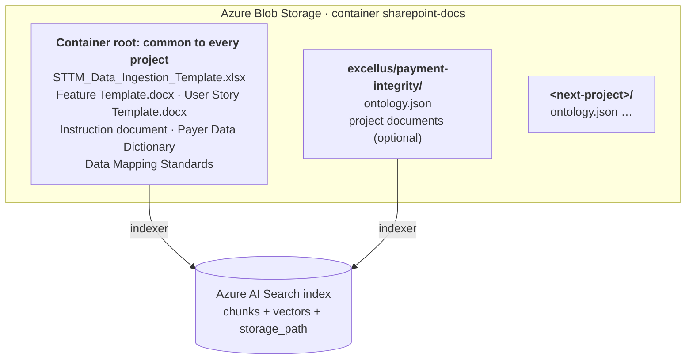

| Where | What lives there | How the backend reads it |
|---|---|---|
| **Container root** | The common templates and enterprise documents | **Azure AI Search**: hybrid keyword + vector search, filtered to the root plus the user's project folder |
| **`<client>/<project>/ontology.json`** | That project's target model: entities, attributes, aliases, value sets, rules, guardrails | **Read whole** by `ontology_service` (Blob first; repo `ontology/` copy as fallback) |
| **`<client>/<project>/` other files** | Any project-only documents | **Azure AI Search**, visible only to that project |
| **The upload** | The vendor file the user attaches | Parsed per request and given to the AI in full |

#### One request, end to end

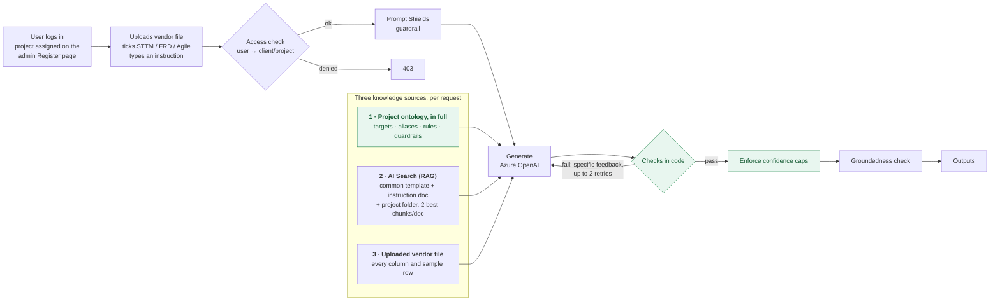

**The checks in code** run on every STTM draft:

| Check | Catches | Fix |
|---|---|---|
| Column count | A row with a missing `|` that shifts columns | Retry |
| Ontology targets | Entity or attribute not in the project's ontology (with "did you mean"), wrong data type | Retry |
| Confidence values | Anything other than Confirmed / Candidate / Needs SME Review (seen live: question text in that column) | Retry, then fixed in code |
| Proposed targets | A proposed (unapproved) target marked Confirmed | Retry, then capped at Candidate in code |
| Coverage | A vendor column that is neither mapped nor raised as an open question (seen live: 5 of 14 dropped) | Retry, then added in code as a `TBD` / Needs SME Review row |
| Evidence for Confirmed | A Confirmed row whose source column is neither the target's name nor an approved alias | Capped at Candidate in code |
| Contradictions | Confirmed rows that also carry an open question | Retry |

**Outputs, one per ticked format:**

| Format | Structure comes from | Delivered as |
|---|---|---|
| **STTM** | `STTM_Data_Ingestion_Template.xlsx`: its text via search tells the AI the sections and columns; targets come from the project ontology. | **The template file itself, filled**: the backend opens the template (Blob root, or the repo's `templates/` copy) and writes the summary next to its labels and the rows under its headers, keeping its banner, styling, banding, widths and frozen headers. Downloaded via `GET /v2/download/{session_id}?output_format=STTM` (the UI's Download Excel button). |
| **Agile Artifact** | `Feature Template.docx` / `User Story Template.docx`, via search | Word |
| **FRD** | The FRD structure in the prompt (no FRD template in the common folder yet) | Word |

#### Rules that keep projects apart

| Rule | Why |
|---|---|
| **The project comes from the user's admin assignment**, not a picker | A user can only generate for the project they're assigned to |
| **The ontology is chosen by that project** | Project A's targets and guardrails can never validate project B's STTM |
| **Search is filtered to the root plus the project's own folder** | A project never sees another project's documents |
| **No fallback to another project's ontology** | A project without one generates as before |
| **Ontologies in Blob are re-read every 15 minutes** | SMEs update a project's model with no redeploy. A slow Blob read gives up after 10 seconds and uses the repo copy. |
| **Guardrails live in the project's ontology** | The AI sees only ~5% of the instruction document through search. Copying each project's rules into its ontology means the AI gets all of them, every time. |

#### Live results (2026-10-03, same template, two vendor files)

Both runs used the real backend, Azure OpenAI and Azure AI Search, with the vendor sample files. At the time the claim-line file ran as a separate Medical Claims project; its ontology content is now part of Payment Integrity, so these results are the baseline for the re-run still to do.

| | Claim-line file (vendor3, 37 columns) | Overpayment file (Cotiviti, 14 columns) |
|---|---|---|
| Template sections and columns | ✅ all 4 sections; 22 columns exactly as the template | ✅ all 4 sections; 22 columns exactly as the template |
| Vendor columns covered | **37 of 37** (36 mapped; HCPCS raised as an open question) | **14 of 14** after the coverage check (first run: 9 of 14) |
| Targets that exist in the project's ontology | **36 of 36** | **25 of 25**, across PI Opportunity, Claim Header, Member and Provider |
| Mapping Confidence values valid | ✅ 15 Confirmed, 21 Candidate | ✅ after the new check (first run had question text in 5 rows) |
| Provider roles | Billing and Servicing both map to `Provider.NPI` / `Provider_Name` by role | Servicing role via `PI Opportunity.Servicing_Provider_Key` |

**Compared with the hand-made reference STTMs:** the reference claim-line STTM targets fields that don't exist in the enterprise data dictionary, such as `Claim_Line.Claim_Number`, `Provider.Billing_Provider_NPI` and `Claim_Line.CPT4_Code`, and its Mapping Confidence column is shifted. The ontology flags those targets (tested), and the generated STTM uses dictionary attributes instead, such as `Claim Header.Claim_ID` and `Provider.NPI` (Billing role).

#### Review findings and next steps

| # | Finding | Impact | Action |
|---|---|---|---|
| 1 | **All indexed files are at the container root**; there are no project folders in `sharepoint-docs` | Every project shares all documents; project-only documents aren't possible yet | Create `excellus/payment-integrity/` … and put each project's `ontology.json` and project-only files there. Keep common templates at the root. |
| 2 | **The indexer has no schedule** | New or changed Blob files aren't searchable until someone runs the indexer | Set a schedule, e.g. hourly |
| 3 | **No deletion detection** on the index | Deleted files leave stale chunks (e.g. `sample_adjudication_rules.docx`) | Enable soft-delete detection on the data source |
| 4 | **Semantic ranker is configured but not used** | Tested: works and adds ~100 ms, but ranked the STTM template lower than plain hybrid for an STTM query | Leave off; compare both in the Phase 5 measurement |
| 5 | **Blob reads time out from the dev machine** | Ontologies load from the repo copy locally | Check the storage account's network rules for the deployed backend; the 10-second fallback protects generation meanwhile |
| 6 | **No FRD template** in the common folder, and FRD output has no section headings | FRD structure depends on the prompt only | Add an FRD template to the common folder, like Feature / User Story |
| 7 | **Groundedness only scores the first 7,000 characters** of a draft | The score swings between runs (0.14–0.58 for the same file) and doesn't measure mapping quality | Treat it as indicative; use the ontology and coverage checks as the quality gate |
| 8 | **Refine turns split edited rows** (fixed 2026-10-03): "add a validation rule to the Units row" was treated as a new row, leaving the edit reverted plus a duplicate | Fixed: an edit to the same Target Field Name is kept in place (`draft_repair._same_subject`); verified live |
| 9 | **Vendor sample conflicts** (claim-line file): all denied lines carry a Paid Date; two lines carry both CPT and HCPCS codes | The STTM raises these as open questions | Recorded in `payment-integrity.json` `knownIssues` for SMEs |
| 10 | **Description-only matches could be marked Confirmed** (fixed 2026-10-05): a meaningless column could get a confident target | An SME could trust a wrong mapping | Fixed: Confirmed needs the column's name or an approved alias; otherwise capped at Candidate in code |
| 11 | **Columns dropped after the retries were only logged** (fixed 2026-10-05), and files with fewer than 5 columns weren't checked | A column could silently miss the STTM | Fixed: added as SME rows; any spreadsheet with 2+ columns is checked |

### 5.1 The pipeline with the ontology

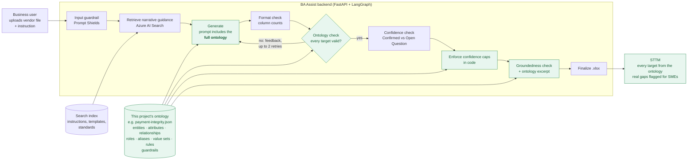

**Green = new or changed.** The ontology enters the pipeline at four points:

| # | Where | What happens | Code |
|---|---|---|---|
| 1 | **Prompt** | The whole ontology (~45,000 characters, ~11,000 tokens) is placed in the system message as a `CANONICAL ONTOLOGY` block, with binding instructions: use only these entity and attribute names, take types and definitions from them, never mark a `proposed` item "Confirmed", raise unmatched columns as Open Questions. Search still supplies the narrative documents. | `ontology_service.prompt_context()` → `prompt_templates.build_system_message()` |
| 2 | **Validation** | Each STTM mapping row is checked against the ontology (§5.3). Problems go back to the AI as specific feedback, up to 2 times. | `ontology_service.find_violations()` in `graph.generate_node` |
| 3 | **Enforcement** | Whatever the AI does, a proposed target or a description-only match ships as "Candidate" at most, a target not in the ontology as "Needs SME Review" at most, and a still-missing vendor column is added as a Needs SME Review row, each with a written-out Open Question. | `ontology_service.enforce_confidence()`, `add_unmapped_rows()` |
| 4 | **Groundedness** | The ontology entities the draft uses are added as a grounding source, so rows taken from the ontology aren't scored as "made up". | `ontology_service.grounding_excerpt()` in `graph.groundedness_node` |

It applies to **STTM and FRD**, on both `/v2/generate` and the older `/generate`. Agile artifacts don't name target fields, so they don't get it.

### 5.2 One request, step by step

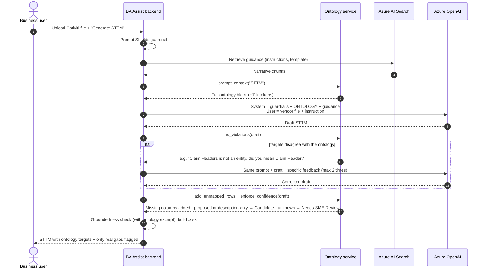

### 5.3 How each mapping row is checked

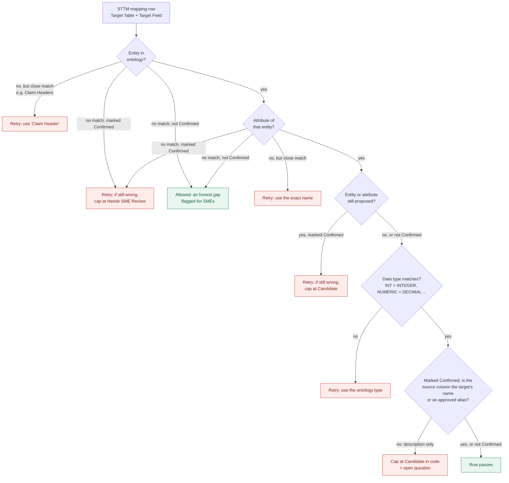

The code never renames a target by itself: guessing a replacement in code could silently map a field to the wrong place. It only asks the AI to correct names, and it only enforces confidence levels.

---

## 6. Before vs after

| | Before | After |
|---|---|---|
| What the AI sees of the target model | 2 chunks of the dictionary (~3%) | **100%**: every entity, attribute, relationship, role, alias, value set and rule |
| Payment Integrity targets | None | 4 proposed entities (PI Opportunity, Overpayment Concept, PI Vendor, Recovery) + 2 additions to existing entities |
| Cotiviti columns with a target | 6 of 14 | **14 of 14** (Confirmed only where the name matches; the rest Candidate until SMEs approve fields and aliases) |
| Columns dropped by the AI | Silently missing | **Impossible**: added as SME rows in code |
| "Confirmed" on a description-only match | Possible | **Impossible**: enforced in code |
| Vendor naming differences | AI guesses | 45 alias groups map vendor names to canonical fields; other names matched by description, as Candidate |
| Joins | AI guesses | 44 relationships + 5 provider roles given as Join Logic |
| Validation rules in the STTM | Generic | 11 business rules + 9 value sets, cited by ID (e.g. `PI-R1`) |
| Check that targets exist | None | Every row checked; up to 2 corrective retries |
| "Confirmed" on an unapproved target | Possible | **Impossible**: enforced in code |
| Onboarding a new vendor file | Prompt or code changes | Nothing required; SMEs approve its aliases to raise confidence |
| A new project | Same shared prompt for everyone | Its own ontology file (from `ontology/_template.json`): its own columns, rules and guardrails |
| Run-to-run consistency | Depends on which chunks are retrieved | The same full model every time |

### Worked example: one column

Source column **"Total Refund Amount"** from the Cotiviti file.

**Before** (illustrative, showing the failure the gaps lead to, not a captured output):

| Target Table | Target Field Name | Target Data Type | Mapping Confidence | Open Question |
|---|---|---|---|---|
| Overpayment_Fact | Refund_Amt | NUMBER | Confirmed | N/A |

The table and field are invented, the type isn't in the dictionary, and the row claims to be "Confirmed". An SME has to catch and fix all of this.

**After** (the ontology gives the target through the alias, and the code enforces the confidence cap):

| Target Table | Target Field Name | Target Data Type | Mapping Confidence | Open Question |
|---|---|---|---|---|
| PI Opportunity | Identified_Overpayment_Amount | DECIMAL | Candidate | Confirm PI Opportunity.Identified_Overpayment_Amount: it is a proposed ontology item awaiting SME approval. |

The target is real, the type is correct, and the confidence is honest. The SME's job becomes *approve the PI Opportunity entity once*, not *fix every file*.

---

## 7. Proof: what has been verified

| Claim | How it was verified | Result |
|---|---|---|
| The AI saw only ~3% of the dictionary | Chunk counts read from the live Azure AI Search index; `CHUNKS_PER_DOCUMENT = 2` in `azure_search_service.py` | ✅ Measured |
| 6 of 14 Cotiviti columns had no target | Each column of `Input.xlsx` compared with the 327 dictionary attributes | ✅ Measured |
| Business rules PI-R1 to PI-R4 hold | Checked against all 30 rows of `Input.xlsx` (synthetic sample) | ✅ 30/30 rows; 9/9 providers |
| The ontology reaches the prompt for STTM/FRD, and not for Agile | Unit tests | ✅ |
| Wrong names, unknown targets, proposed-but-Confirmed rows, invalid confidence values, type mismatches and dropped vendor columns are detected; description-only matches are capped; still-missing columns are added; each project uses only its own ontology | 50 unit tests in `tests/test_ontology_service.py`, run against the real Payment Integrity ontology and the real vendor3 file (37 columns detected), including per-project lookup, no cross-project fallback, invalid files and no alias mapping to two targets | ✅ 50/50 pass |
| Same template, two vendor files, live | Claim-line and overpayment STTMs generated through the real backend, Azure OpenAI and Azure AI Search (§5.0 live results, before the 2026-10-05 merge) | ✅ 37/37 and 14/14 vendor columns covered; every target in the ontology. ⏳ Re-run under the merged ontology pending |
| The retry and enforcement loop works end to end | `generate_node` run with a stubbed AI. The first draft had `Claim Headers` (misspelled) and a proposed target marked Confirmed. The retry fixed the name; the AI kept "Confirmed"; the code capped it at "Candidate", wrote the Open Question and logged telemetry | ✅ Verified (simulated AI) |
| Better STTMs on real generations | Phase 5 (§10): before/after on 3–5 vendor files | ⏳ **Not yet measured** |

**Telemetry for ongoing proof.** Each draft that still disagrees with the ontology, or still misses vendor columns, after the retries logs an `ontology_violations_unresolved` event to Azure Monitor, listing the type of each problem and the target it affects. Its rate over time is the production measure of how well the AI follows the ontology.

---

## 8. Ontology content (DRAFT Payment Integrity extension, needs SME approval)

> **Machine-readable version:** [`ontology/excellus/payment-integrity.json`](ontology/excellus/payment-integrity.json) holds all of this plus the full existing dictionary, the 18 project guardrails (PI-G1 to PI-G18), and the claim-line additions merged from the vendor3 file (16 fields, PI-R6 to PI-R11).
> ⚠️ Everything in this section is a **proposal**, worked out from `Input.xlsx` and the instruction document's "PI Canonical Entity" guidance. Until SMEs approve it, the pipeline caps it at "Candidate".

### 8.1 New Payment Integrity entities

**PI Opportunity**: one overpayment finding on one claim, from one vendor.

| Attribute | Type | Key | Description |
|---|---|---|---|
| Opportunity_Key | INTEGER | PK | Surrogate key |
| Opportunity_ID | VARCHAR(50) | | Business key |
| Vendor_Key | INTEGER | FK → PI Vendor | Vendor that identified the finding |
| Claim_Header_Key | INTEGER | FK → Claim Header | Claim the finding applies to |
| Member_Key | INTEGER | FK → Member | Member on the claim |
| Servicing_Provider_Key | INTEGER | FK → Provider | Servicing provider on the claim |
| Concept_Key | INTEGER | FK → Overpayment Concept | Why it's an overpayment |
| Audit_Type | VARCHAR(50) | | Audit category (value set 8.4) |
| Source_Adjustment_Number | VARCHAR(50) | | Vendor's own adjustment/recovery reference |
| Identified_Overpayment_Amount | DECIMAL(12,2) | | Amount identified for refund |
| Corrected_Paid_Amount | DECIMAL(12,2) | | Paid amount after correction |
| Opportunity_Status | VARCHAR(30) | | Identified, Validated, Disputed, Recovered, Closed |
| Confidence_Score | DECIMAL(5,2) | | Vendor or engine confidence |
| Source_System, Effective_Date, Termination_Date | | | Standard lineage and effective-dating fields |

**Overpayment Concept**: why a payment is wrong. Concept_Key (PK), Concept_ID, Concept_Name, Concept_Category, Default_Audit_Type, Description.

**PI Vendor**: the recovery or audit vendor. Vendor_Key (PK), Vendor_ID, Vendor_Name (e.g. Cotiviti), Audit_Program, File_Frequency.

**Recovery**: money actually recovered against an opportunity. Recovery_Key (PK), Recovery_ID, Opportunity_Key (FK), Recovery_Method (Refund, Offset, Recoupment), Recovered_Amount, Recovery_Date, Recovery_Status.

### 8.2 Changes to existing entities

| Entity | Proposed addition | Why |
|---|---|---|
| Member | `Dependent_Sequence` VARCHAR(2) (00 = subscriber) | Gives `Dependent Number` a target |
| Claim Header | `Servicing_Provider_Key` INTEGER FK → Provider | Records the servicing role the input supplies |
| Claim Line | Rename the FK `Claim_Key` → `Claim_Header_Key` | Matches the Claim Header key name |
| Fee Schedule | Remove the duplicate `Effective_Date` | Removes the ambiguity |
| All | Trim spaces from attribute names | Lets names match exactly |

### 8.3 Relationships (the graph)

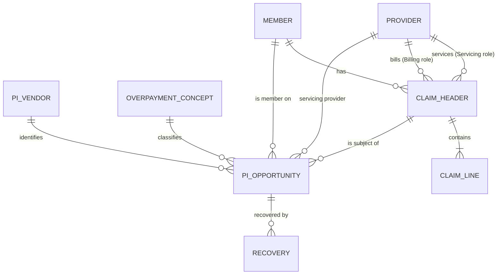

### 8.4 Value sets (values seen in `Input.xlsx`)

| Value set | Values |
|---|---|
| **Audit Type** (8) | Clinical Coding Review · Contract Compliance · Coordination of Benefits · DRG Validation · Duplicate Claim Review · Eligibility Review · Payment Policy Review · Post-Payment Audit |
| **Overpayment Concept** (11) | COB Primary Payer Identified · DRG Downcode Adjustment · Duplicate Payment · Incorrect Contract Rate · Incorrect Provider Specialty Pricing · Member Not Eligible on DOS · Overlapping Inpatient Stay · Place of Service Mismatch · Prior Authorization Not Found · Unbundled Procedure Code · Units Billed Exceed Policy Limit |
| **Dependent Sequence** | 00 (subscriber), 01, 02, 03 … |
| **Opportunity Status** | Identified · Validated · Disputed · Recovered · Closed |
| **Recovery Method** | Refund · Offset · Recoupment |

SMEs should also define **which concepts belong to which audit type**. In the sample the pairings vary; for example, "DRG Validation" appears with "Prior Authorization Not Found".

### 8.5 Aliases (vendor names → canonical fields)

| Vendor column (Cotiviti) | Other likely vendor names | Canonical target |
|---|---|---|
| Claim Number | Claim ID, Clm Nbr, ICN | Claim Header · `Claim_ID` |
| Source Adjustment Number | Adjustment ID, Recovery Ref | PI Opportunity · `Source_Adjustment_Number` |
| Total Refund Amount | Overpayment Amount, Refund Amt | PI Opportunity · `Identified_Overpayment_Amount` |
| Total Correct Amount | Corrected Paid, Revised Paid | PI Opportunity · `Corrected_Paid_Amount` |
| Audit Type | Audit Category, Review Type | PI Opportunity · `Audit_Type` |
| Overpayment Concept Name | Concept, Finding Reason | Overpayment Concept · `Concept_Name` |
| Servicing Provider NPI | Rendering NPI, Svc Prov NPI | Provider · `NPI` (role = Servicing) |
| Dependent Number | Dep Seq, Member Suffix | Member · `Dependent_Sequence` |

Each new vendor adds rows here, not code. This meets the Feature Template's "onboard new vendors without hard-coding" goal.

### 8.6 Business rules (checked against `Input.xlsx`)

| ID | Rule | Holds in sample | Use in STTM |
|---|---|---|---|
| PI-R1 | `Corrected_Paid_Amount = Total_Paid_Amount − Identified_Overpayment_Amount` (±0.01) | ✅ 30/30 rows | Validation rule |
| PI-R2 | `Identified_Overpayment_Amount ≤ Total_Paid_Amount` | ✅ 30/30 rows | Validation rule; reject if broken |
| PI-R3 | `Member_ID = "MUID-" + last 5 of Subscriber_ID + "-" + Dependent_Sequence` | ✅ 30/30 rows | Derivation and member-match check |
| PI-R4 | One NPI always has the same provider name | ✅ 9/9 providers | Reference consistency check |
| PI-R5 | Opportunity audit type matches the concept's default audit type | ⚠️ varies | SMEs to define the mapping |

> These rules hold in the **synthetic** sample. SMEs should confirm they're real business rules.

---

## 9. Options considered, and why no graph database

| Option | What it is | Fixes Gap 1 (no PI model) | Fixes Gap 2 (AI sees ~3%) | Effort | Decision |
|---|---|---|---|---|---|
| A. More search chunks | Raise 2 → 10 chunks per document | ❌ | Partly; still incomplete and costlier | Low | Not enough |
| **B. Lightweight ontology** | Dictionary + PI entities + relationships, roles, aliases, value sets, rules in JSON, **given to the AI in full** and validated in code | ✅ | ✅ | Medium | **Chosen, and built** |
| C. Knowledge graph | Ontology in a graph database (Neo4j, Cosmos DB Gremlin), queried at run time | ✅ | ✅ | High; new platform, skills, cost | Not needed at this scale |

**Why B is enough:** the whole model is ~11,000 tokens, a small part of `gpt-4.1-mini`'s context window. There's nothing to search, so the AI gets the complete model every time.

**Is it a graph? Yes.** Each project's ontology file already *is* a graph: the 35 entities are the nodes, and the 44 relationships and 5 roles are the edges. The AI receives the edges as a RELATIONSHIPS section and uses them for Join Logic. A graph **database** only adds run-time storage and querying of that graph. It becomes worth it if:

| Trigger | Why a graph database would then help |
|---|---|
| Hundreds of entities, or a separate model per client | The model no longer fits in the prompt and must be queried selectively |
| Multi-step questions at run time, e.g. "which reports break if `Paid_Date` changes?" | Graph queries handle chains of relationships |
| Lineage across many STTMs (source → Bronze → Silver → Gold → report) | Lineage is naturally a graph |
| Several teams editing at once, with versioning and access control per entity | A database handles this better than a file |

None of these apply today. The ontology files can be loaded into a graph database later without changes, so starting with the file costs nothing.

---

## 10. Governance: how the ontology is updated

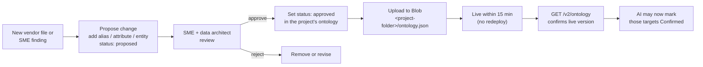

- **Proposed items are usable straight away**, but they're capped at "Candidate", so nothing unapproved is presented as final.
- **Approval is a one-word change** (`proposed` → `approved`) with no code change, made in that project's file only.
- **Audit trail:** keep the approved copy of each project's file in the repo (`ontology/<client>/<project>.json`) and change it through pull requests, then upload that file to Blob. Git then records who approved what.
- **Inspect what's live:** `GET /v2/ontology?client_id=…&project_id=…` returns where that project's ontology was loaded from, its version and counts by status. `&view=full` gives the JSON, and `&view=prompt` the exact text the AI receives.
- **New project:** copy `ontology/_template.json`, fill it from the project's own data dictionary, instruction document (guardrails) and a sample vendor file, mark everything `proposed`, register the project in `app/config/projects.json`, and upload the file as `<client>/<project>/ontology.json` (see ACCESS_AND_PROJECT_MAPPING.md §6).

### Implementation plan and status

| Phase | Work | Owner | Status |
|---|---|---|---|
| **1. Load in full** | Give the AI the whole model on every STTM/FRD request | Engineering | ✅ Built |
| **2. PI model** | Review and approve §8: PI entities, changes to existing entities, value sets, aliases, rules | PI SMEs + data architect | ⏳ Waiting on SMEs |
| **3. Validate + enforce** | Target check with retries, confidence caps, groundedness excerpt, `/v2/ontology` endpoint, telemetry | Engineering | ✅ Built |
| **4. Fill the knowledge base** | Add the Logical Data Model; add one approved PI example STTM; rename or replace "Data Mapping Standards and Framework"; fix the dictionary issues in Gap 4 | SMEs / BA lead | ⏳ Open |
| **5. Measure** | Same 3–5 vendor files before vs after: target coverage, run-to-run consistency, fields SMEs had to correct, `ontology_violations_unresolved` rate | BA lead + engineering | ⏳ Open; needs Phase 1 and 3 (done) |

---

## 11. Costs, risks and limits

| Item | Detail | Mitigation |
|---|---|---|
| **Token cost** | ~11,000 extra input tokens on each STTM/FRD AI call, repeated on each retry | No new infrastructure. Agile is excluded. Retries happen only when a violation is found. |
| **Latency** | Each corrective retry is one more AI call (other retries in this pipeline take ~20s each) | At most 2 ontology retries; the code cap guarantees the key outcome without more retries |
| **The AI may still use a wrong name** | The check catches it, but the code won't rename a target by itself | Logged in telemetry; the confidence cap stops it from shipping as "Confirmed" |
| **Shared entities are copied** | A project file carries its own copy of common entities (Member, Claim, Provider); with several projects, a dictionary change must be applied to each | Matches how each project folder already carries its own data dictionary; split into shared core + project overlay later if this becomes a burden |
| **No review gate on Blob uploads** | A file uploaded to Blob is live within 15 minutes | Limit write access to the container; keep the approved copy in the repo (`ontology/`) through pull requests |
| **The search indexer will also index `ontology.json`** | Its JSON chunks may show up in narrative grounding | Exclude `.json` in the indexer's `excludedFileNameExtensions` |
| **Validation covers the STTM mapping table** | FRDs get the ontology in the prompt but have no table to check | Acceptable: FRDs are narrative |
| **The PI content is a draft** | Built from two synthetic vendor samples (Cotiviti, vendor3) | SME approval (Phase 2); capped at "Candidate" until then |

---

## 11a. Ideas to take it further (not built yet)

The theme is a **closed loop**: SMEs approve or correct rows, approvals become reviewed ontology changes, and the next file maps with higher confidence.

| Idea | What it does | Why it matters |
|---|---|---|
| **One-click SME approval** | Approve a Candidate row in the UI; its alias or field goes to the ontology as a pull request | Turns SME review into ontology growth without anyone editing JSON |
| **Learning loop** | Every SME correction on a row becomes a `proposed` alias automatically | The next vendor file starts further ahead |
| **Check the data, not just names** | Profile sample values against the target's data type and value set (a "Paid Date" column holding text isn't Confirmed) | A second kind of evidence beside names; catches junk or mislabelled columns |
| **Quality dashboard** | Share of Confirmed / Candidate / Needs SME Review rows per vendor and project, plus the `ontology_violations_unresolved` rate | Shows progress and where SME time goes, from telemetry we already log |
| **Golden-set regression** | Re-run approved STTMs on every prompt, model or ontology change and compare | Quality can't silently drop after a change |
| **Scale across projects** | Shared dictionary core + small project files; a graph database only when lineage or impact questions need it | Keeps one copy of the dictionary as projects grow |

## 12. Decisions needed

1. **Approve the approach:** a lightweight ontology (built), not more search chunks or a graph database.
2. **Name the owner** of the canonical model and ontology: who approves new entities and aliases?
3. **Confirm the PI entities in §8.1**, especially whether *Recovery* should be separate from *PI Opportunity*.
4. **Confirm the business rules in §8.6**, and define which concepts belong to which audit type.
5. **Shared core + project files:** approve moving the enterprise dictionary into one `ontology-core.json`, so each project file holds only its own fields, aliases, rules and guardrails (§5, "One JSON file per project, not per input file"); needed only once a second project has an ontology.
6. **Supply the missing documents:** the Logical Data Model, and one approved PI example STTM.

---

## Appendix A: Evidence

| Source | What was checked |
|---|---|
| `Input.xlsx` (Cotiviti sample) | 14 columns, 30 rows; mapping coverage (§3); rules and value sets (§8.4, §8.6) |
| `Payer_Data_Dictionary_Glossary_of_Terms.csv.xlsx` | 31 entities / 327 attributes; 16 PI glossary terms; no PI entities |
| `Healthcare_Payer_Data_Reporting_PI_Enterprise_Instruction_Document.docx` | PI canonical entity guidance; "never invent" rule; required reference sources |
| `Data Mapping Standards and Framework.docx` | Contains the Reporting Standards, not mapping standards |
| `output_STTM_RA_VendorABC_DataLake_Ingestion_v1.0.xlsx` | The only example STTM is Risk Adjustment |
| `Feature Template.docx`, `User Story Template.docx` | Canonical mapping, confidence scoring and "no hard-coding" requirements |
| Azure AI Search index `rag-1788391708053` | Chunk counts and sizes per document (§3 Gap 2) |
| `app/services/azure_search_service.py` | `CHUNKS_PER_DOCUMENT = 2` |
| `tests/test_ontology_service.py` | 50 unit tests against the real Payment Integrity ontology |
| `vendor3_medical_claims_claim_line.xlsx` | 37 columns, 11 rows; claim-line fields, aliases and rules PI-R6 to PI-R11 |

## Appendix B: Where it lives in the code

| File | Role |
|---|---|
| Blob `<client>/<project>/ontology.json` | Each project's live ontology (container `ONTOLOGY_CONTAINER`, default `sharepoint-docs`) |
| [`ontology/`](ontology/) | Local copies: `excellus/payment-integrity.json`, and `_template.json` for new projects (override with `ONTOLOGY_DIR`) |
| [`app/services/ontology_service.py`](app/services/ontology_service.py) | Load, render the prompt block, validate, evidence for Confirmed (`Ontology.evidence`), enforce, add still-missing columns (`add_unmapped_rows`), grounding excerpt, summary |
| [`app/services/prompt_templates.py`](app/services/prompt_templates.py) | Adds the `CANONICAL ONTOLOGY` section to the system message |
| [`app/graph.py`](app/graph.py) | `generate_node`: ontology retry loop, missing-column rows and enforcement; `groundedness_node`: ontology excerpt |
| [`app/main.py`](app/main.py) | Older `/generate`: ontology in the prompt; loads the ontology at startup |
| [`app/routergenerator.py`](app/routergenerator.py) | `GET /v2/ontology?client_id=…&project_id=…` |

## Appendix C: Glossary

| Term | Meaning |
|---|---|
| **STTM** | Source-to-Target Mapping: which source field feeds which target field, and how it's transformed and validated. |
| **Canonical model** | The enterprise's single approved set of entities and attributes that every source is mapped into. |
| **Ontology** | The canonical model plus relationships, roles, aliases, allowed values and rules, in a form a machine can use. |
| **Knowledge graph** | An ontology stored in a graph database and queried at run time. Not needed at this scale (§9). |
| **Chunk** | A ~2,000-character piece of a document stored in the search index. |
| **Retrieval / RAG** | Looking up relevant chunks and giving them to the AI with the request. |
| **Grounding** | Making the AI's output rely on supplied source material instead of its general knowledge. |
| **Proposed / approved** | An ontology item's status. Only approved items can be mapped as "Confirmed", and only when the source column's name or an approved alias points at them. |
| **Description-only match** | A column the AI mapped by comparing descriptions, with no name or approved-alias evidence. Allowed, but at most "Candidate". |
