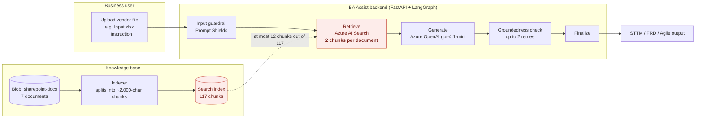
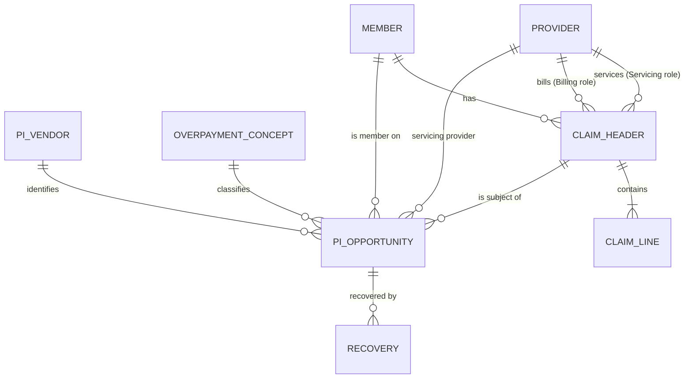
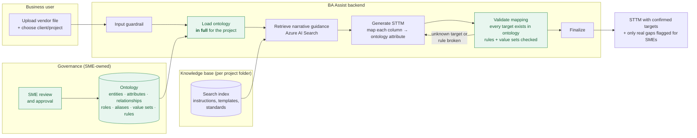

# BA Assist: STTM Knowledge Gap and the Ontology Fix

**Purpose:** Show where BA Assist's knowledge base falls short when it generates Source-to-Target Mappings (STTMs), why that happens, and how a lightweight ontology fixes it.
**Audience:** Product owner, Payment Integrity SMEs, data architects, engineering.
**Status:** For review. The ontology content in §6 is a **draft proposal** that SMEs must approve before use.
**Evidence base:** The documents in `Document/` plus the live Azure AI Search index `rag-1788391708053` (checked 2026-10-01).

---

## 1. Summary

BA Assist turns a vendor file into an STTM by mapping each source column to a field in the **enterprise canonical model**: the approved list of entities and attributes in the Payer Data Dictionary. Two problems stop it from doing that reliably:

1. **The canonical model has no Payment Integrity entities.** For the Cotiviti overpayment file (`Input.xlsx`), **6 of 14 source columns have no target to map to**, and they are the overpayment-specific columns: refund amount, corrected amount, audit type, overpayment concept, adjustment number and dependent number.
2. **The AI only sees a small slice of the model.** Retrieval sends **2 chunks per document**, so the AI sees about **3% of the data dictionary** (2 of 64 chunks) on each request. Usually the target entity it needs isn't in front of it.

The result is that the AI has to guess target tables and fields. The enterprise instruction document forbids exactly that: *"Never invent source tables, source fields, physical joins, exact calculations or physical database structures."*

**Recommendation:** Add a **lightweight ontology**: the existing data dictionary, extended with Payment Integrity entities, relationships, provider roles, vendor aliases, value sets and business rules. **Give it to the AI in full** for STTM requests instead of relying on search. This is a structured spreadsheet/JSON, not a graph database (§5).

---

## 2. How it works today

**Where it breaks (red):** The knowledge base is cut into chunks of about 2,000 characters, and each request retrieves only the 2 best-matching chunks per document. That works for narrative guidance, such as "how should an FRD be structured". It doesn't work for a **reference model**, where the AI needs to see *every* candidate target attribute in order to choose correctly.

---

## 3. The gaps

### Gap 1: No Payment Integrity entities in the canonical model

The Payer Data Dictionary has **31 entities and 327 attributes** across Member, Enrollment, Provider, Claims, Pricing, Prior Authorization, Clinical, Quality, Risk Adjustment, Utilization, Value-Based Contracting and Care Management. **None of them is a Payment Integrity entity.** There is no Opportunity, Overpayment Concept, Audit, Recovery or Vendor.

The enterprise instruction document *names* a PI "Opportunity" entity (opportunity ID, concept ID, vendor ID, claim key, member key, overpayment amount, recovery amount, reason, status, confidence score). It only gives a sentence of representative fields: no attribute names, data types or keys. The glossary defines 16 PI *terms* (Overpayment, Recovery, Recoupment, Offset …), but terms are definitions, not target fields.

**Mapping coverage for the Cotiviti file (`Input.xlsx`, 14 columns, 30 rows):**

| # | Source column | Best target in today's dictionary | Status |
|---|---|---|---|
| 1 | Claim Number | Claim Header · `Claim_ID` | ✅ Match |
| 2 | Paid Date | Claim Header · `Paid_Date` | ✅ Match |
| 3 | Total Paid Amount | Claim Header · `Total_Paid_Amount` | ✅ Match |
| 4 | Total Allowed Amount | Claim Header · `Total_Allowed_Amount` | ✅ Match |
| 5 | Subscriber ID | Member · `Subscriber_ID` | ✅ Match |
| 6 | Member Unique ID | Member · `Member_ID` | ✅ Likely match |
| 7 | Servicing Provider NPI | Provider · `NPI` | ⚠️ Partial: no *servicing* role on the claim |
| 8 | Servicing Provider Name | Provider · `Provider_Name` | ⚠️ Partial: same role gap |
| 9 | Dependent Number | — | ❌ No target |
| 10 | Source Adjustment Number | — | ❌ No target |
| 11 | Total Refund Amount | — | ❌ No target |
| 12 | Total Correct Amount | — | ❌ No target |
| 13 | Audit Type | — | ❌ No target |
| 14 | Overpayment Concept Name | — | ❌ No target |

**Coverage: 6 match, 2 partial, 6 missing.** The six missing columns are the ones that make this a Payment Integrity file.

### Gap 2: Retrieval sends only a small slice of each document

Measured from the live index:

| Document | Chunks in index | Characters | Sent to the AI per request | Share seen |
|---|---|---|---|---|
| Payer Data Dictionary + Glossary (`.xlsx`) | 64 | ~123,000 | 2 | **~3%** |
| PI Enterprise Instruction Document | 39 | ~75,000 | 2 | ~5% |
| "Data Mapping Standards and Framework" | 6 | ~11,000 | 2 | ~33% |
| Feature Template | 4 | ~7,000 | 2 | ~50% |
| User Story Template | 2 | ~3,000 | 2 | 100% |
| STTM Data Ingestion Template | 1 | ~900 | 1 | 100% |
| Sample Adjudication Rules | 1 | ~1,900 | 1 | 100% |

The two documents that matter most for mapping are the ones the AI sees least of. Spreadsheet chunks also split rows away from their column headers, so even a retrieved chunk may show `Total_Paid_Amount | DECIMAL | …` without making clear which entity it belongs to.

### Gap 3: Relationships and roles aren't modelled

- **Provider roles:** Claim Header only has `Billing_Provider_Key`. There's no servicing or rendering provider on the claim, although the input supplies a *Servicing* Provider and the Reporting Standards say *"Always identify: Billing / Rendering / Attending / Servicing Provider."* (Prior Authorization *does* have `Servicing_Provider_Key`, so there is a precedent.)
- **Subscriber and dependent:** The Member entity has no dependent sequence or relationship code, so `Dependent Number` has nowhere to go.
- **Missing source document:** The instruction document and the glossary both cite **`Healthcare_Payer_Enterprise_Logical_Data_Model`**, which defines relationships, grain and subject areas. It isn't in blob storage or the search index.

### Gap 4: Document quality issues

| Issue | Where | Effect |
|---|---|---|
| The file is titled "Data Mapping Standards and Framework" but contains the **Reporting Standards** | `Data Mapping Standards and Framework.docx` | There are no actual mapping standards in the knowledge base. |
| The only example STTM is **Risk Adjustment** | `output_STTM_RA_VendorABC_DataLake_Ingestion_v1.0.xlsx` | There's no Payment Integrity example to copy. |
| `Effective_Date` is listed twice | Dictionary · Fee Schedule | Ambiguous attribute |
| Trailing spaces in names (`"First Name "`, `"Gender "`) | Dictionary · Member | Exact matching fails |
| Claim Line's foreign key is `Claim_Key`, but Claim Header's key is `Claim_Header_Key` | Dictionary · Claims | The join is unclear |

### What these gaps cause

These are the expected effects, based on the gaps above and the instruction document's own rules:

- **Invented targets:** with no PI entity, the AI makes up table and field names for the six overpayment columns. The instruction document forbids this.
- **Different answers on each run:** a different 2-chunk slice can be retrieved each time, so the same file can map differently from one run to the next.
- **Confidence scores that mean little:** "Confirmed / Candidate / Needs SME Review" can't be judged reliably when the target model isn't visible.
- **More SME rework:** reviewers have to fix the mapping instead of just confirming it, which removes the value of a "first draft".

---

## 4. What an ontology means here

An **ontology** is a formal description of the business domain: what things exist, what they're called, how they relate, and which rules apply. For BA Assist, it means extending the data dictionary with seven parts:

| Part | Question it answers | Example |
|---|---|---|
| **Entities** | What business objects exist? | Claim Header, Member, Provider, **PI Opportunity** |
| **Attributes** | What fields does each have, with what type? | `PI Opportunity.Identified_Overpayment_Amount` DECIMAL(12,2) |
| **Relationships** | How do entities connect? | PI Opportunity → Claim Header (many-to-one) |
| **Roles** | Which *kind* of link is it? | Claim → Provider as **Servicing** vs **Billing** |
| **Aliases** | What do vendors call this field? | "Total Refund Amount", "Refund Amt", "Overpayment Amount" → `Identified_Overpayment_Amount` |
| **Value sets** | What values are allowed? | Audit Type ∈ {Coordination of Benefits, DRG Validation, …} |
| **Rules** | What must always be true? | Corrected Paid = Paid − Overpayment |

The data dictionary already covers the first two parts for 31 entities. The work is mostly **adding the Payment Integrity entities and the other five parts**, then **giving the result to the AI in full**.

---

## 5. Options compared

| Option | What it is | Fixes Gap 1 (no PI model) | Fixes Gap 2 (AI sees ~3%) | Effort | Recommendation |
|---|---|---|---|---|---|
| A. More search chunks | Raise 2 → 10 chunks per document | ❌ | Partly; still incomplete and costlier | Low | Not enough |
| **B. Lightweight ontology** | Dictionary + PI entities + relationships, roles, aliases, value sets, rules, kept as a spreadsheet/JSON and **given to the AI in full** | ✅ | ✅ | Medium | **Recommended** |
| C. Formal ontology / knowledge graph | OWL/RDF model in a graph database, queried at run time | ✅ | ✅ | High; new platform and skills | Not needed at this scale |

**Why B is enough:** in compact form (`Entity.Attribute (type)` plus aliases), the whole canonical model is about **8,000–10,000 tokens**. That fits easily in `gpt-4.1-mini`'s context window, so there's nothing to search. The AI gets the complete, approved model every time. Option C's advantages, such as reasoning across thousands of entities, don't apply to a model of about 35 entities.

---

## 6. Proposed ontology content (DRAFT, needs SME approval)

> ⚠️ Everything in this section is a **proposal**, worked out from `Input.xlsx` and the instruction document's "PI Canonical Entity" guidance. Names, types and keys must be confirmed by the Payment Integrity SMEs and the data architect before BA Assist uses them.

### 6.1 New Payment Integrity entities

**PI Opportunity**: one overpayment finding on one claim, from one vendor.

| Attribute | Type | Key | Description |
|---|---|---|---|
| Opportunity_Key | INTEGER | PK | Surrogate key |
| Opportunity_ID | VARCHAR(50) | | Business key |
| Vendor_Key | INTEGER | FK → PI Vendor | Vendor that identified the finding |
| Claim_Header_Key | INTEGER | FK → Claim Header | Claim the finding applies to |
| Member_Key | INTEGER | FK → Member | Member on the claim |
| Servicing_Provider_Key | INTEGER | FK → Provider | Servicing provider on the claim |
| Concept_Key | INTEGER | FK → Overpayment Concept | Why it's an overpayment |
| Audit_Type | VARCHAR(50) | | Audit category (value set 6.4) |
| Source_Adjustment_Number | VARCHAR(50) | | Vendor's own adjustment/recovery reference |
| Identified_Overpayment_Amount | DECIMAL(12,2) | | Amount identified for refund |
| Corrected_Paid_Amount | DECIMAL(12,2) | | Paid amount after correction |
| Opportunity_Status | VARCHAR(30) | | Identified, Validated, Disputed, Recovered, Closed |
| Confidence_Score | DECIMAL(5,2) | | Vendor or engine confidence |
| Source_System, Effective_Date, Termination_Date | | | Standard lineage and effective-dating fields (same as every dictionary entity) |

**Overpayment Concept**: the reason a payment is wrong. Concept_Key (PK), Concept_ID, Concept_Name, Concept_Category, Default_Audit_Type, Description.

**PI Vendor**: the recovery or audit vendor. Vendor_Key (PK), Vendor_ID, Vendor_Name (e.g. Cotiviti), Audit_Program, File_Frequency.

**Recovery**: money actually recovered against an opportunity. Recovery_Key (PK), Recovery_ID, Opportunity_Key (FK), Recovery_Method (Refund, Offset, Recoupment), Recovered_Amount, Recovery_Date, Recovery_Status.

### 6.2 Changes to existing entities

| Entity | Proposed addition | Why |
|---|---|---|
| Member | `Dependent_Sequence` VARCHAR(2) (00 = subscriber) | Gives `Dependent Number` a target |
| Claim Header | `Servicing_Provider_Key` INTEGER FK → Provider | Records the servicing role the input supplies |
| Claim Line | Rename the FK `Claim_Key` → `Claim_Header_Key` | Matches the Claim Header key name |
| Fee Schedule | Remove the duplicate `Effective_Date` | Removes the ambiguity |
| All | Trim spaces from attribute names | Lets names match exactly |

### 6.3 Relationships

### 6.4 Value sets (values seen in `Input.xlsx`)

| Value set | Values |
|---|---|
| **Audit Type** (8) | Clinical Coding Review · Contract Compliance · Coordination of Benefits · DRG Validation · Duplicate Claim Review · Eligibility Review · Payment Policy Review · Post-Payment Audit |
| **Overpayment Concept** (11) | COB Primary Payer Identified · DRG Downcode Adjustment · Duplicate Payment · Incorrect Contract Rate · Incorrect Provider Specialty Pricing · Member Not Eligible on DOS · Overlapping Inpatient Stay · Place of Service Mismatch · Prior Authorization Not Found · Unbundled Procedure Code · Units Billed Exceed Policy Limit |
| **Dependent Sequence** | 00 (subscriber), 01, 02, 03 … |

SMEs should also define **which concepts belong to which audit type**. In the sample file the pairings vary; for example, "DRG Validation" appears with "Prior Authorization Not Found". The ontology can flag pairings like that.

### 6.5 Aliases (how vendor names map to canonical fields)

| Vendor column (Cotiviti) | Other likely vendor names | Canonical target |
|---|---|---|
| Claim Number | Claim ID, Clm Nbr, ICN | Claim Header · `Claim_ID` |
| Source Adjustment Number | Adjustment ID, Recovery Ref | PI Opportunity · `Source_Adjustment_Number` |
| Total Refund Amount | Overpayment Amount, Refund Amt | PI Opportunity · `Identified_Overpayment_Amount` |
| Total Correct Amount | Corrected Paid, Revised Paid | PI Opportunity · `Corrected_Paid_Amount` |
| Audit Type | Audit Category, Review Type | PI Opportunity · `Audit_Type` |
| Overpayment Concept Name | Concept, Finding Reason | Overpayment Concept · `Concept_Name` |
| Servicing Provider NPI | Rendering NPI, Svc Prov NPI | Provider · `NPI` (role = Servicing) |
| Dependent Number | Dep Seq, Member Suffix | Member · `Dependent_Sequence` |

Each new vendor adds a row here, not a new code change. This is how the Feature Template's "onboard new vendors without hard-coding" goal is met.

### 6.6 Business rules (checked against `Input.xlsx`)

| Rule | Holds in sample data | Use in STTM |
|---|---|---|
| `Corrected_Paid_Amount = Total_Paid_Amount − Identified_Overpayment_Amount` | ✅ 30 of 30 rows | Validation rule on the mapping |
| `Identified_Overpayment_Amount ≤ Total_Paid_Amount` | ✅ 30 of 30 rows | Validation rule; reject if broken |
| `Member Unique ID = "MUID-" + last 5 digits of Subscriber ID + "-" + Dependent Number` | ✅ 30 of 30 rows | Derivation and member-match check |
| One NPI always has the same provider name | ✅ 9 of 9 providers | Reference consistency check |

> These rules hold in the **synthetic** sample. SMEs should confirm they're real business rules and not just how the sample was built.

### 6.7 Coverage once the ontology is in place

| | Today | With ontology (proposed) |
|---|---|---|
| Columns with a confirmed target | 6 of 14 | **14 of 14** |
| Partial (role unclear) | 2 | 0 |
| No target | 6 | 0 |
| Validation rules available | 0 | 4 |

---

## 7. Target architecture

**What changes (green):**
1. **The ontology is loaded in full** for STTM requests instead of being searched in fragments. It's stored per project in the client/project folder structure BA Assist already uses, so Payment Integrity, Correspondence Mapping and other projects can each extend the shared model.
2. **Search still handles narrative documents** (the instruction document, templates, reporting standards), where 2 chunks per document is reasonable.
3. **A new validation step** checks every generated target against the ontology. An unknown entity or attribute, a broken rule or a value outside its value set sends the draft back for another attempt. This uses the same retry loop the groundedness check already has.
4. **SMEs own the ontology.** New vendors and fields are added as rows and approved by SMEs, with no code change.

---

## 8. Implementation plan

| Phase | Work | Owner | Depends on |
|---|---|---|---|
| **1. Quick win** | Give the AI the **existing** data dictionary in full (compact form) for every STTM request. Helps immediately with the 8 columns that already have targets. | Engineering | — |
| **2. PI model** | Review and approve §6: PI entities, changes to existing entities, value sets, aliases and rules. | PI SMEs + data architect | — |
| **3. Load the ontology** | Store the approved ontology per project, load it in place of the plain dictionary, and add the validation step. | Engineering | Phase 2 |
| **4. Fill the knowledge base** | Add the Logical Data Model document. Add one approved PI example STTM. Rename or replace "Data Mapping Standards and Framework". Fix the dictionary errors listed in Gap 4. | SMEs / BA lead | — |
| **5. Measure** | Run the same 3–5 vendor files before and after, and compare target coverage, run-to-run consistency and how many fields SMEs had to correct. | BA lead + engineering | Phases 1–4 |

Phases 1, 2 and 4 can run at the same time.

---

## 9. Decisions needed from stakeholders

1. **Approve the approach:** a lightweight ontology (option B) rather than more search chunks or a graph database.
2. **Name the owner** of the canonical model and ontology. Who approves new entities and aliases?
3. **Confirm the PI entities in §6.1**, especially whether *Recovery* should be separate from *PI Opportunity* or merged into it.
4. **Confirm the business rules in §6.6**, and define which concepts belong to which audit type.
5. **Supply the missing documents:** the Logical Data Model, and one approved PI example STTM.
6. **Shared vs per-project:** which parts of the ontology are enterprise-wide (Member, Claim, Provider) and which are specific to one project (PI concepts)?

---

## Appendix A: Evidence

| Source | What was checked |
|---|---|
| `Document/Input.xlsx` | 14 columns, 30 rows; mapping coverage (§3); rules and value sets (§6.4, §6.6) |
| `Document/Payer_Data_Dictionary_Glossary_of_Terms.csv.xlsx` | 31 entities / 327 attributes; 16 PI glossary terms; no PI entities |
| `Document/Healthcare_Payer_Data_Reporting_PI_Enterprise_Instruction_Document.docx` | PI canonical entity guidance; "never invent" rule; required reference sources |
| `Document/Data Mapping Standards and Framework.docx` | Contains the Reporting Standards, not mapping standards |
| `Document/output_STTM_RA_VendorABC_DataLake_Ingestion_v1.0 (1).xlsx` | The only example STTM is Risk Adjustment |
| `Document/Feature Template.docx`, `User Story Template.docx` | Canonical mapping, confidence scoring and "no hard-coding" requirements |
| Azure AI Search index `rag-1788391708053` | Chunk counts and sizes per document (§3 Gap 2) |
| `app/services/azure_search_service.py` | `CHUNKS_PER_DOCUMENT = 2` |

## Appendix B: Glossary

| Term | Meaning |
|---|---|
| **STTM** | Source-to-Target Mapping: a spreadsheet saying which source field feeds which target field, and how it's transformed and validated. |
| **Canonical model** | The enterprise's single approved set of entities and attributes that every source is mapped into. |
| **Ontology** | The canonical model plus relationships, roles, aliases, allowed values and rules: a description of the domain a machine can use. |
| **Chunk** | A ~2,000-character piece of a document stored in the search index. |
| **Retrieval / RAG** | Looking up relevant chunks and giving them to the AI along with the request. |
| **Grounding** | Making the AI's output rely on supplied source material instead of its general knowledge. |
